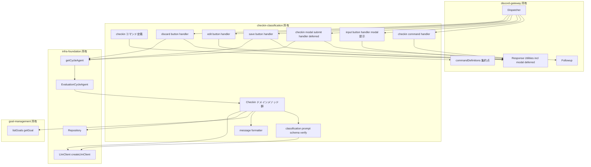
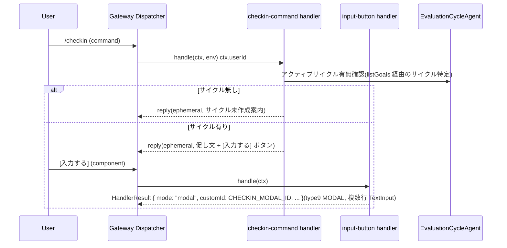
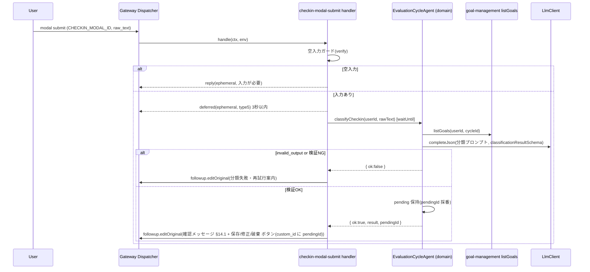
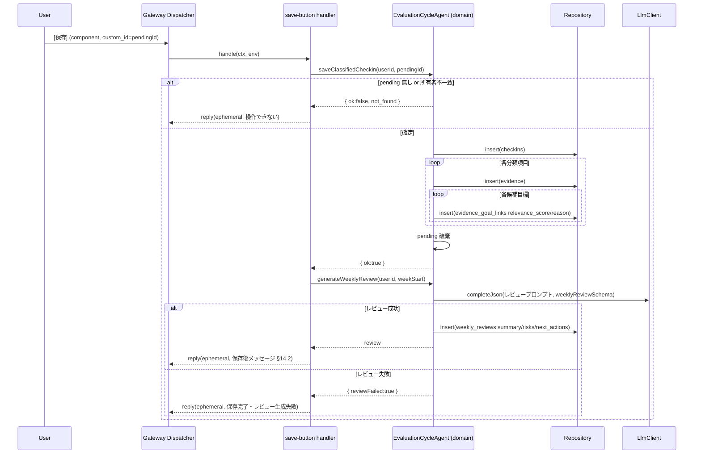

# Design Document: checkin-classification

## Overview

**Purpose**: 本スペックは評価目標フォロー Agent の中心仮説(「毎週聞いてくれるチャット Agent なら継続する」)の核心である `/checkin` フローを提供する。ユーザーの雑な週次自由文を受け取り、Workers AI で各評価目標に関連度スコア付き分類(§13.1)を行い、保存前確認(§15)を経て証跡(evidence)・目標リンク(evidence_goal_links)・チェックイン(checkins)として保存し、保存後に週次レビュー(weekly_reviews)を生成・提示する。

**Users**: 直接の利用者は半期評価目標を持つ個人ユーザー(`/checkin` を実行し、雑メモを入力、分類案を確認して保存/修正/破棄)である。下流スペック(status-and-draft / notifications)は本フローが蓄積した証跡・週次レビューと、本フローの起動点を利用する。

**Impact**: グリーンフィールド。infra-foundation(Repository・Agent 権威・LlmClient)、discord-gateway(検証・ディスパッチ・modal/deferred/follow-up/ephemeral)、goal-management(目標一覧 + 達成条件・所有者スコープ・対象サイクル決定)が確立した契約の上に、分類プロンプト/構造化出力・`/checkin` 系ハンドラ・証跡化と週次レビュー生成のドメインメソッドを追加する。永続化スキーマ・Agent クラス骨格・LLM クライアント実装・Discord I/O 規約は再定義せず消費する。

### Goals
- `/checkin` が雑入力を促し、自由文を modal 経由で受け取る会話フローを確立する(Req 1)。
- Workers AI で §13.1 形式の構造化分類(項目分解・候補目標の関連度スコア/理由・usefulness・推奨タイトル)を取得し検証する(Req 2)。
- 分類案を §14.1 形式で確認提示し、保存前まで確定しない [保存]/[修正]/[破棄] UX を提供する(Req 3、§15)。
- 確定時に checkins / evidence / evidence_goal_links を所有者スコープで一括保存する(Req 4)。
- 保存後に週次レビュー(summary/risks/next_actions)を生成・保存し §14.2 形式で提示する(Req 5)。

### Non-Goals
- 評価サイクル/目標/証跡の定義 CRUD(goal-management)。
- ステータス Green/Yellow/Red 判定ルール(status-and-draft。見立ては参照のみ)。
- 評価文ドラフト生成(status-and-draft)。
- 定期チェックイン通知・アラートのスケジューリング(notifications。本フローを起動する側)。
- 永続化スキーマ DDL・Agent クラス宣言・LlmClient 実装・Discord 署名検証/ディスパッチ/登録手段(infra-foundation / discord-gateway)。

## Boundary Commitments

### This Spec Owns
- `/checkin` 系ハンドラ: `/checkin` コマンドハンドラ(促し + [入力する] ボタンの ephemeral 応答)、[入力する] ボタンハンドラ(checkin modal を開く)、checkin modal submit ハンドラ(分類実行 = deferred + follow-up)、[保存]/[修正]/[破棄] ボタンハンドラ。各ハンドラを discord-gateway レジストリへ登録する規約適合処理。
- コマンド定義の供給: `/checkin` の application command 定義を discord-gateway の集約点へ追加。checkin modal の custom_id・各ボタンの custom_id 規約を定義。
- 分類 LLM 仕様: §13.1 準拠の分類プロンプト本体、zod 構造化出力スキーマ(`classificationResultSchema` / `ClassificationResult = z.infer<...>`)、`LlmClient.completeJson(req, schema)` の検証後ドメイン判定(goalId 実在性)、空入力ガード。
- 証跡化ビジネスロジック: checkin 保存・各項目の evidence 作成・候補目標ごとの evidence_goal_links 作成(relevance_score/reason 付き)・所有者識別子付与・部分失敗時の整合保持。EvaluationCycleAgent のドメインメソッドとして実装。
- 週次レビュー生成: weekly_reviews(summary/risks/next_actions)の LLM 生成と保存、保存後メッセージ(§14.2)整形。
- pending 分類の揮発的作業状態: 分類完了から確定操作までの分類結果保持と custom_id 紐付け。

### Out of Boundary
- 永続化スキーマ DDL・`schema_migrations`・`Repository` 実装(infra-foundation 所有。本スペックは `Repository` を呼ぶのみ)。
- Agent クラス宣言・ルーティングヘルパー・ID 規約・`LlmClient`/`createLlmClient` 実装(infra-foundation 所有。本スペックは骨格メソッドの中身を実装し `getCycleAgent`・`createLlmClient` を呼ぶのみ)。
- Discord 署名検証・interaction ディスパッチ・modal/button 振り分け機構・応答ボディ生成・deferred/follow-up 配線・コマンド登録スクリプト(discord-gateway 所有。本スペックはハンドラ登録規約・応答ユーティリティ・`Followup` を利用)。
- 目標/サイクル/証跡の定義 CRUD(goal-management。本スペックは `listGoals`/`getGoal` を呼ぶのみ)。
- ステータス判定ルール・評価文ドラフト生成・通知スケジューリング(status-and-draft / notifications)。

### Allowed Dependencies
- infra-foundation 公開契約: `Repository`(insert/getById/listBy/update/remove)、`getCycleAgent`、`createLlmClient`/`LlmClient`(`complete`/`completeJson`)・`LlmError`、共有ドメイン型(`EntityRow<'checkins'|'evidence'|'evidence_goal_links'|'weekly_reviews'|'goals'>`、`Usefulness`、`RelevanceScore`)、`Env`。
- discord-gateway 公開契約: `registerHandler`、`InteractionContext`、`HandlerResult`(reply/ephemeral/deferred/modal)、modal を開く応答(`HandlerResult { mode: "modal", customId, title, components }` = Discord interaction response type9 MODAL)、`Followup`、コマンド定義集約点(`commandDefinitions`)。
- goal-management 公開契約: `CycleDomainOperations.listGoals`/`getGoal`(目標一覧 + 達成条件取得)、対象サイクル決定規約(実行ユーザーの最新サイクル)。
- 依存方向: `commands(定義) → handlers → agents(ドメインメソッド) → infra Repository / LlmClient`。`classification(プロンプト/スキーマ/検証)`・`messages(整形)`・`ownership` は handlers/domain から参照される横断ヘルパー。各層は左方向のみ import する。

### Revalidation Triggers
- infra-foundation の `Repository`/`LlmClient`/`createLlmClient` シグネチャ・§11 スキーマ(checkins/evidence/evidence_goal_links/weekly_reviews)・共有型・Agent ルーティングの変更。
- discord-gateway の `InteractionContext`/`HandlerResult`/`Followup`/`registerHandler`/コマンド定義集約点のシグネチャ変更、または discord-gateway が modal を開く契約(`HandlerResult { mode: "modal", ... }` = type9 MODAL)を変更した場合。
- goal-management の `listGoals`/`getGoal`・対象サイクル決定規約の変更。
- §13.1 分類出力形式・§14.1/§14.2 メッセージ仕様・§15 プライバシー要件の変更。
- `/checkin` コマンド名・checkin modal/ボタンの custom_id 規約の変更(本スペック内ハンドラ照合に波及)。
- status-and-draft のステータス見立て参照契約(保存後メッセージの見立て取得手段)の確定/変更。

## Architecture

### Existing Architecture Analysis
- infra-foundation: EvaluationCycleAgent がサイクル単位 DO SQLite の単一権威。GoalAgent はステートレスで親へ委譲。`Repository` が型付き行アクセス、`LlmClient` がプロバイダ非依存の `complete`/`completeJson` を提供。
- discord-gateway: 薄いエントリー + ハンドラレジストリ。`(kind, name)` で command/component/modal を振り分け、`HandlerResult` の `deferred` で type5 即返 + `Followup` 継続。応答は ephemeral 可。
- goal-management: 薄いハンドラ層 + Agent ドメインメソッドのパターン。`listGoals`/`getGoal` と所有者スコープ・対象サイクル決定を確立。
- 本スペックはこれらのパターン・契約を尊重し、分類/証跡化/週次レビューの責務のみを追加する。

### Architecture Pattern & Boundary Map

採用パターンは goal-management と同型の「**薄いハンドラ層 + Agent ドメインメソッド**」。ハンドラは discord-gateway から渡る `InteractionContext` を解釈し、`getCycleAgent` で Agent を取得し、ドメインメソッド(分類/証跡化/週次レビュー)を呼び、`HandlerResult` を返す薄層に徹する。分類プロンプト/スキーマ/検証は `classification` ヘルパー、メッセージ整形は `messages` ヘルパーに分離する(research.md の Decision 参照)。



**Architecture Integration**:
- Selected pattern: 薄いハンドラ層 + Agent ドメインメソッド。Discord I/O と分類/証跡化ロジックを分離し、データ権威(EvaluationCycleAgent)と所有者強制を尊重。
- Domain/feature boundaries: ハンドラは入出力変換のみ。分類プロンプト/スキーマ/検証は `classification`、メッセージ整形は `messages` に集約。証跡化・週次レビュー・pending 保持は Cycle ドメインメソッド。
- New components rationale: 各ハンドラ・ドメインメソッド・ヘルパーは Req 1〜5 に直接対応。投機的抽象は導入しない。
- Steering compliance: roadmap の「分類は本スペック所有・スキーマ/Agent/LLM は基盤・Discord 規約はゲートウェイ・目標定義は goal-management」に準拠。§15 を保存前確認・ephemeral・所有者強制で満たす。

### Technology Stack

| Layer | Choice / Version | Role in Feature | Notes |
|-------|------------------|-----------------|-------|
| Frontend / CLI | Discord slash command / modal / button(`discord-api-types` 型) | `/checkin` 促し・自由文入力・分類確認・確定操作 | 定義は discord-gateway 集約点へ追加 |
| Backend / Services | Cloudflare `agents`(EvaluationCycleAgent のドメインメソッド) | 分類・証跡化・週次レビューのビジネスロジック | infra 骨格メソッドを実装 |
| AI / LLM | Cloudflare Workers AI(`LlmClient.completeJson`/`complete` 経由) | 分類(§13.1)・週次レビュー生成 | プロンプト/スキーマは本スペック所有。モデル差し替えは factory |
| Data / Storage | Durable Object SQLite(infra `Repository` 経由) | checkins/evidence/evidence_goal_links/weekly_reviews 保存 | スキーマは infra §11、本スペックは読み書きのみ |
| Infrastructure / Runtime | Cloudflare Workers + `ExecutionContext.waitUntil` | deferred 後の分類/保存処理継続 | gateway の deferred 経路が `Followup` を供給 |
| Language / Build | TypeScript(strict) | 型・ビルド | `any` 禁止。共有型を import |

## File Structure Plan

### Directory Structure
```
src/
└── checkin-classification/
    ├── commands.ts                 # /checkin の application command 定義(Req 1.1)
    ├── register.ts                 # 全ハンドラを discord-gateway レジストリへ登録 + コマンド定義を集約点へ追加(Req 1.1, 6.4)
    ├── custom-ids.ts               # custom_id 規約(本スペック所有): CHECKIN_MODAL_ID / EDIT_MODAL_ID(編集 modal)/ INPUT_BTN / SAVE_BTN / EDIT_BTN / DISCARD_BTN(pending ID 埋め込み)。discord-gateway の modal を開く応答(mode:"modal")の customId として供給(Req 3.2, 3.5, 3.7)
    ├── handlers/
    │   ├── checkin-command.ts      # /checkin: サイクル有無確認 → 促し + [入力する] ボタン(ephemeral 即時応答)(Req 1.1, 1.2, 1.5)
    │   ├── input-button.ts         # [入力する] ボタン: checkin modal を開く応答(Req 1.3)
    │   ├── checkin-modal-submit.ts # modal submit: 空入力ガード → deferred → classifyCheckin → 確認メッセージ follow-up(Req 1.3, 1.4, 2.*, 3.1, 3.2)
    │   ├── save-button.ts          # [保存]: saveClassifiedCheckin → generateWeeklyReview → 保存後メッセージ(Req 3.3, 4.*, 5.*)
    │   ├── edit-button.ts          # [修正]: 修正 modal 再提示(分類内容編集)(Req 3.5)
    │   └── discard-button.ts       # [破棄]: pending 破棄 + 破棄通知(Req 3.4)
    ├── classification/
    │   ├── schema.ts               # zod スキーマ classificationResultSchema + 型 ClassificationResult = z.infer<...> §13.1(Req 2.2, 2.3, 2.4)
    │   ├── prompt.ts               # 目標一覧 + 達成条件 + 入力からプロンプト組立(Req 2.1, 2.2)
    │   └── verify.ts               # zod 検証後のドメイン固有判定(未分類抽出・goalId 実在性)・空入力ガード(Req 2.4, 2.5, 2.6, 1.4)
    ├── weekly-review/
    │   ├── schema.ts               # zod スキーマ weeklyReviewSchema + 型(summary/risks/next_actions)(Req 5.1)
    │   └── prompt.ts               # 週次レビュー生成プロンプト(Req 5.1)
    ├── messages.ts                 # 促し文・確認メッセージ(§14.1)・保存後メッセージ(§14.2)・各種通知の整形(Req 1.1, 3.1, 5.3)
    └── domain/
        └── checkin-operations.ts   # EvaluationCycleAgent ドメインメソッド: classifyCheckin / saveClassifiedCheckin / generateWeeklyReview / pending 保持・取得・破棄(Req 2.*, 3.3, 3.7, 4.*, 5.1, 5.2, 5.5)
```

### Modified Files
- `src/agents/evaluation-cycle-agent.ts`(infra 所有の骨格)— 本スペックは分類/証跡化/週次レビュー/pending 保持の責務メソッドの中身を `domain/checkin-operations.ts` の実装で埋める(クラス宣言・ルーティング・onStart は変更しない)。
- `src/discord/commands/definitions.ts`(discord-gateway 所有の集約点)— `register.ts` 経由で `/checkin` のコマンド定義を集約配列へ追加(配列への追加のみ、機構は変更しない)。

> 依存方向: `commands.ts`・`custom-ids.ts` → `register.ts` → `handlers/*` → `domain/checkin-operations.ts` → infra `Repository`/`LlmClient` & goal-management `listGoals/getGoal`。`classification/*`・`weekly-review/*`・`messages.ts` は domain から参照される横断ヘルパー。各層は左方向のみ import する。

## System Flows

### `/checkin` 開始 → 自由文入力(modal)

LLM 非依存の起点処理は即時(type4 ephemeral)で完結する。サイクル未作成時は分類フローを開始しない(Req 1.2)。

### 分類(deferred)→ 確認提示

deferred は 3 秒以内に type5 を返し、分類は `waitUntil` で継続して follow-up で本応答(確認メッセージ)を送る(Req 2.7)。未分類項目も確認メッセージに含める(Req 2.5)。

### 保存 → 週次レビュー生成

保存は単一権威(DO SQLite)上で checkin → evidence → links を一括処理し不整合を残さない(Req 4.6)。レビュー失敗時も証跡保存は保持(Req 5.5)。

## Requirements Traceability

| Requirement | Summary | Components | Interfaces | Flows |
|-------------|---------|------------|------------|-------|
| 1.1 | `/checkin` 促し | commands.ts, handlers/checkin-command.ts, messages.ts, register.ts | `CheckinCommandHandler` | 開始 |
| 1.2 | サイクル無しで開始しない | handlers/checkin-command.ts, domain/checkin-operations.ts | `resolveActiveCycle` | 開始 |
| 1.3 | 自由文入力受領(modal) | handlers/input-button.ts, handlers/checkin-modal-submit.ts, custom-ids.ts | `InputButtonHandler`, `CheckinModalSubmitHandler` | 開始/分類 |
| 1.4 | 空入力ガード | classification/verify.ts, handlers/checkin-modal-submit.ts | `guardEmptyInput` | 分類 |
| 1.5 | 本人限定文脈 | handlers/*, messages.ts | `HandlerResult` (ephemeral) | all |
| 2.1 | 目標 + 達成条件取得 | domain/checkin-operations.ts, classification/prompt.ts | `classifyCheckin`, `listGoals` | 分類 |
| 2.2 | 項目分解 + 関連度スコア/理由 | classification/prompt.ts, classification/schema.ts | `ClassificationResult` | 分類 |
| 2.3 | usefulness + 推奨タイトル | classification/schema.ts | `ClassificationResult` | 分類 |
| 2.4 | §13.1 構造化形式 | classification/schema.ts | `classificationResultSchema`, `ClassificationResult` | 分類 |
| 2.5 | 未分類保持・提示 | classification/verify.ts, messages.ts | `verifyClassification`, `formatConfirmation` | 分類/確認 |
| 2.6 | 解釈不能で保存しない | classification/verify.ts, handlers/checkin-modal-submit.ts | `classifyCheckin` (result) | 分類 |
| 2.7 | 3秒応答 + 後追い | handlers/checkin-modal-submit.ts | `deferred`, `Followup` | 分類 |
| 3.1 | 確認メッセージ(§14.1) | messages.ts, handlers/checkin-modal-submit.ts | `formatConfirmation` | 確認 |
| 3.2 | 保存/修正/破棄ボタン | custom-ids.ts, messages.ts | custom_id 規約 | 確認 |
| 3.3 | 保存まで確定しない | domain/checkin-operations.ts | pending 保持 / `saveClassifiedCheckin` | 確認/保存 |
| 3.4 | 破棄処理 | handlers/discard-button.ts, domain/checkin-operations.ts | `discardPending` | 確認 |
| 3.5 | 修正手段 | handlers/edit-button.ts | `EditButtonHandler` | 確認 |
| 3.6 | 本人限定文脈(確認/操作) | handlers/*, messages.ts | `HandlerResult` (ephemeral) | 確認 |
| 3.7 | pending 不在/別人で保存しない | domain/checkin-operations.ts, custom-ids.ts | `saveClassifiedCheckin` (not_found) | 保存 |
| 4.1 | checkin 保存 | domain/checkin-operations.ts | `saveClassifiedCheckin` | 保存 |
| 4.2 | evidence 作成 | domain/checkin-operations.ts | `saveClassifiedCheckin` | 保存 |
| 4.3 | evidence_goal_links 作成 | domain/checkin-operations.ts | `saveClassifiedCheckin` | 保存 |
| 4.4 | 所有者付与・非混在 | domain/checkin-operations.ts, ownership | `saveClassifiedCheckin` | 保存 |
| 4.5 | 複数目標で複数リンク | domain/checkin-operations.ts | `saveClassifiedCheckin` | 保存 |
| 4.6 | 部分失敗で不整合残さない | domain/checkin-operations.ts | `saveClassifiedCheckin` (result) | 保存 |
| 5.1 | 週次レビュー生成 | domain/checkin-operations.ts, weekly-review/prompt.ts | `generateWeeklyReview` | 保存 |
| 5.2 | weekly_reviews 保存 | domain/checkin-operations.ts | `generateWeeklyReview` | 保存 |
| 5.3 | 保存後メッセージ(§14.2) | messages.ts, handlers/save-button.ts | `formatPostSave` | 保存 |
| 5.4 | 見立ては status-and-draft 参照 | handlers/save-button.ts, messages.ts | `formatPostSave` (optional status) | 保存 |
| 5.5 | レビュー失敗でも証跡保持 | domain/checkin-operations.ts, handlers/save-button.ts | `generateWeeklyReview` (result) | 保存 |
| 6.1-6.6 | 境界・プライバシー維持 | (Boundary Commitments) | — | — |

## Components and Interfaces

| Component | Domain/Layer | Intent | Req Coverage | Key Dependencies (P0/P1) | Contracts |
|-----------|--------------|--------|--------------|--------------------------|-----------|
| Command Definitions + Register | commands | `/checkin` 定義供給とハンドラ登録 | 1.1, 6.4 | discord-gateway registry/definitions (P0) | Service |
| Checkin Command Handler | handlers | `/checkin` 起点・促し・サイクル確認 | 1.1, 1.2, 1.5 | getCycleAgent (P0), messages (P0), response (P0) | Service |
| Input Button Handler | handlers | checkin modal を開く(`HandlerResult { mode: "modal", ... }`) | 1.3 | response modal (P0), custom-ids (P0) | Service |
| Checkin Modal Submit Handler | handlers | 空入力ガード・deferred・分類・確認提示 | 1.3, 1.4, 2.6, 2.7, 3.1, 3.2 | getCycleAgent (P0), Followup (P0), verify (P0), messages (P0) | Service |
| Save / Edit / Discard Button Handlers | handlers | 確定・修正・破棄 | 3.3, 3.4, 3.5, 3.7, 4.*, 5.* | getCycleAgent (P0), response (P0), messages (P0) | Service |
| Classification Prompt + Schema + Verify | classification | §13.1 分類の組立・型・検証 | 1.4, 2.1-2.6 | LlmClient (P0), goal types (P1) | Service |
| Weekly Review Prompt + Schema | weekly-review | 週次レビュー生成プロンプト + zod スキーマ(weeklyReviewSchema) | 5.1 | LlmClient (P0) | Service |
| Message Formatter | messages | §14.1/§14.2/通知の整形 | 1.1, 2.5, 3.1, 5.3, 5.4 | classification schema (P1) | Service |
| Checkin Domain Operations | domain | 分類/証跡化/週次レビュー/pending 保持 | 2.*, 3.3, 3.7, 4.*, 5.1, 5.2, 5.5 | Repository (P0), LlmClient (P0), listGoals/getGoal (P0), ownership (P0) | Service, State |

### handlers

#### Checkin Command / Input Button / Modal Submit / Save / Edit / Discard Handlers

| Field | Detail |
|-------|--------|
| Intent | discord-gateway 規約に従い、入力解釈 → ドメイン呼び出し → 応答整形を行う薄層 |
| Requirements | 1.1, 1.2, 1.3, 1.4, 1.5, 2.6, 2.7, 3.1-3.7, 4.6, 5.3, 5.4, 5.5 |

**Responsibilities & Constraints**
- `InteractionContext` から `userId`・modal フィールド(raw_text)・custom_id(pendingId 埋め込み)を取り出す。
- LLM 非依存の起点(`/checkin`・[入力する])は即時応答。分類を伴う modal submit は `deferred` を宣言し `Followup` で本応答。
- 結果を `HandlerResult`(`reply`/`deferred`、`ephemeral: true`)へ整形。[入力する] は modal を開く応答を返す。
- ビジネスルール(分類・証跡化・所有者強制・pending 検証)はハンドラに持たず、ドメイン層へ委譲する。

**Dependencies**
- Inbound: discord-gateway Dispatcher — `handle(ctx, env)`(P0)
- Outbound: Checkin Domain Operations(P0)、Message Formatter(P0)、Classification Verify(空入力ガード)(P0)、Response/Followup ユーティリティ(P0)
- External: `getCycleAgent`(infra)(P0)

**Contracts**: Service [x]

##### Service Interface
```typescript
import type { InteractionContext, HandlerResult } from "../discord/types";
import type { Env } from "../env";

interface CheckinCommandHandler {
  handle(ctx: InteractionContext, env: Env): Promise<HandlerResult>; // 促し + 入力ボタン / サイクル無し案内
}
interface InputButtonHandler {
  handle(ctx: InteractionContext, env: Env): HandlerResult; // [入力する] → checkin modal を開く HandlerResult { mode: "modal", customId: CHECKIN_MODAL_ID, title, components }(type9 MODAL)
}
interface CheckinModalSubmitHandler {
  handle(ctx: InteractionContext, env: Env): Promise<HandlerResult>; // deferred: 分類 → 確認メッセージ follow-up
}
interface SaveButtonHandler {
  handle(ctx: InteractionContext, env: Env): Promise<HandlerResult>; // 保存 → 週次レビュー → 保存後メッセージ
}
interface EditButtonHandler {
  handle(ctx: InteractionContext, env: Env): HandlerResult; // [修正] → 編集 modal を再提示する HandlerResult { mode: "modal", customId: EDIT_MODAL_ID, title, components }(type9 MODAL)
}
interface DiscardButtonHandler {
  handle(ctx: InteractionContext, env: Env): Promise<HandlerResult>; // pending 破棄 + 通知
}
```
- Preconditions: `ctx` は署名検証済み・種別判定済みで `ctx.userId` が供給されている(discord-gateway 保証)。
- Postconditions: 個人評価データを含む応答は ephemeral(Req 1.5, 3.6)。確定は [保存] 操作時のみ(Req 3.3)。
- Invariants: ハンドラはビジネスルールを持たず、所有者強制と pending 検証はドメイン層に委譲。

**Implementation Notes**
- Integration: `register.ts` が `registerHandler('command','checkin',...)`、`registerHandler('component', INPUT_BTN, ...)`、`registerHandler('modal', CHECKIN_MODAL_ID, ...)`、`registerHandler('component', SAVE_BTN+pending, ...)` 等を登録。pendingId はボタン custom_id に埋め、保存/破棄時に抽出。
- Validation: 空入力は `classification/verify.ts` の `guardEmptyInput`。pending 存在/所有者はドメイン層。
- Risks: modal を開く応答(`HandlerResult { mode: "modal", customId, title, components }` = type9 MODAL)と deferred(type5)は discord-gateway の確立済み応答契約として提供される充足済み依存。custom_id 体系(`CHECKIN_MODAL_ID` 等)は本スペックが所有・照合する。discord-gateway が modal を開く契約を変更した場合のみ revalidation trigger としてゲートウェイへ差し戻す。

### classification

#### Classification Prompt + Schema + Verify

| Field | Detail |
|-------|--------|
| Intent | §13.1 準拠の分類プロンプト組立・zod 構造化出力スキーマ・検証後のドメイン判定 |
| Requirements | 1.4, 2.1, 2.2, 2.3, 2.4, 2.5, 2.6 |

**Responsibilities & Constraints**
- `buildClassificationPrompt`: 目標一覧(id/title/description/success_criteria)とユーザー入力からプロンプトを組み立てる(Req 2.1)。
- `classificationResultSchema`(zod v4): §13.1 の `items[].text` / `candidateGoals[].goalId/relevanceScore/reason` / `usefulness` / `suggestedEvidenceTitle` を **zod スキーマ**として定義。構造・型・値域(relevanceScore `z.number().min(0).max(1)`、usefulness `z.enum`)を宣言的に表現し、`ClassificationResult = z.infer<typeof classificationResultSchema>` で型を導出(Req 2.2-2.4)。これを `completeJson(req, classificationResultSchema)` に渡し、構造/型/値域検証は LLM クライアントの `safeParse` に委ねる。
- `verifyClassification`: **zod 検証済みの** `ClassificationResult` を受け取り、ドメイン固有判定のみ行う — goalId が実在目標か照合し、実在しない候補を落とした結果、候補が無い項目を「未分類」として保持(Req 2.5)。値域/構造は zod が保証済みなので再検証しない。
- `guardEmptyInput`: 空/空白のみ入力を分類前に弾く(Req 1.4)。
- 機能固有プロンプト/zod スキーマのみ所有。LLM 呼び出し機構・JSON パース + スキーマ検証基盤は `LlmClient.completeJson` に委譲。

**Dependencies**
- Inbound: Checkin Domain Operations(P0)、Modal Submit Handler(空入力ガード)(P0)
- Outbound: `LlmClient.completeJson`(zod スキーマ引数)(infra)(P0)
- External: 共有型(`Usefulness`、`RelevanceScore`、`EntityRow<'goals'>`)、`zod`(P1)

**Contracts**: Service [x]

##### Service Interface
```typescript
import { z } from "zod"; // v4
import { usefulnessSchema } from "../types/enums"; // 共有 enum の zod スキーマ

export const classificationResultSchema = z.object({
  items: z.array(z.object({
    text: z.string(),
    candidateGoals: z.array(z.object({
      goalId: z.string(),
      relevanceScore: z.number().min(0).max(1),
      reason: z.string(),
    })),                               // 空配列 = 未分類
    usefulness: usefulnessSchema,      // low | medium | high
    suggestedEvidenceTitle: z.string(),
  })),
});
export type ClassificationResult = z.infer<typeof classificationResultSchema>;

declare function buildClassificationPrompt(
  goals: ReadonlyArray<{ id: string; title: string; description: string; successCriteria: string | null }>,
  rawText: string,
): { system: string; prompt: string };

declare function guardEmptyInput(rawText: string): { ok: true } | { ok: false; reason: "empty_input" };

// zod 検証済み結果を受け、goalId 実在性のみ照合して未分類を確定する(構造/値域は検証済み)
declare function verifyClassification(
  result: ClassificationResult,
  validGoalIds: ReadonlySet<string>,
): ClassificationResult;
```
- Preconditions: `goals` は所有者スコープ済み(goal-management)。`verifyClassification` の入力は `completeJson(req, classificationResultSchema)` が `safeParse` 済みの `ClassificationResult`。
- Postconditions: 未分類項目は `candidateGoals: []` で保持(Req 2.5)。実在しない goalId を持つ候補は除去される。
- Invariants: 構造・値域不正は `completeJson` が `invalid_output` として弾く(zod)。本コンポーネントは実在 goalId 判定のみ担い、誤証跡を作らない(Req 2.6)。

**Implementation Notes**
- Integration: `classifyCheckin` が `buildClassificationPrompt` → `LlmClient.completeJson(req, classificationResultSchema)` → 成功時 `verifyClassification` を順に呼ぶ。`completeJson` が `{ ok:false }`(`invalid_output`)を返したら証跡を作らず再試行案内へ。
- Validation: relevanceScore 0..1・usefulness enum・型/構造は zod スキーマが保証。goalId の `validGoalIds` 照合のみドメイン責務。
- Risks: Workers AI の日本語/JSON 品質。スキーマ不一致は `invalid_output` で確実に弾ける。再試行案内を follow-up し、モデル差し替えは infra factory(Req 6.6)。

### domain

#### Checkin Domain Operations(EvaluationCycleAgent メソッド実装)

| Field | Detail |
|-------|--------|
| Intent | 分類・証跡化・週次レビュー・pending 保持を権威上で実装 |
| Requirements | 2.1, 2.6, 3.3, 3.7, 4.1-4.6, 5.1, 5.2, 5.5 |

**Responsibilities & Constraints**
- `resolveActiveCycle`: 実行ユーザーの最新サイクルを特定(goal-management 規約)。無ければ `null`(Req 1.2)。
- `classifyCheckin`: 目標取得(`listGoals`)→ プロンプト → `completeJson` → 検証 → pending 保持(pendingId 採番)。検証失敗は `{ ok:false }`(Req 2.1, 2.6, 3.3)。
- `saveClassifiedCheckin`: pendingId と所有者を検証(不在/別人は `not_found`、Req 3.7)→ checkins insert → 各項目 evidence insert(source_type=manual_checkin、usefulness、suggestedEvidenceTitle を title へ)→ 各候補目標 evidence_goal_links insert(relevance_score/reason)→ pending 破棄。部分失敗で不整合を残さない(Req 4.1-4.6)。
- `generateWeeklyReview`: 保存済み内容から summary/risks/next_actions を `completeJson(req, weeklyReviewSchema)` で LLM 生成 → weekly_reviews insert。`{ ok:false }`(`invalid_output`)は `{ reviewFailed:true }`(証跡保存は保持、Req 5.1, 5.2, 5.5)。
- `discardPending`: pending を破棄(Req 3.4)。
- すべて `Repository` 経由で単一権威(サイクル単位 SQLite)へ反映。所有者強制を強制。

**Dependencies**
- Inbound: handlers(P0)
- Outbound: infra `Repository`(P0)、`LlmClient`(P0)、goal-management `listGoals`/`getGoal`(P0)、Classification helpers(P0)、ownership(P0)
- External: 共有型(`EntityRow<...>`、`Usefulness`、`RelevanceScore`)(P1)

**Contracts**: Service [x] / State [x]

##### Service Interface
```typescript
import type { EntityRow } from "../persistence/repository";
import type { ClassificationResult } from "../classification/schema";

type ClassifyResult =
  | { ok: true; pendingId: string; result: ClassificationResult }
  | { ok: false; reason: "no_cycle" | "empty_input" | "classification_failed" };

type SaveResult =
  | { ok: true; checkinId: string; evidenceIds: string[]; weekStartDate: string }
  | { ok: false; reason: "not_found" | "save_failed" }; // pending 不在/別人 = not_found

type WeeklyReviewResult =
  | { ok: true; review: EntityRow<"weekly_reviews"> }
  | { ok: false; reason: "review_failed" };

interface CheckinDomainOperations {
  resolveActiveCycle(userId: string): EntityRow<"evaluation_cycles"> | null;
  classifyCheckin(userId: string, rawText: string): Promise<ClassifyResult>;
  saveClassifiedCheckin(userId: string, pendingId: string): SaveResult;
  generateWeeklyReview(userId: string, cycleId: string, weekStartDate: string): Promise<WeeklyReviewResult>;
  discardPending(userId: string, pendingId: string): { ok: true } | { ok: false; reason: "not_found" };
}
```
- Preconditions: マイグレーション適用済み(infra `onStart`)。`userId` は実行ユーザー。
- Postconditions: 書き込みは単一権威に反映。保存は checkins/evidence/evidence_goal_links を整合的に作成(Req 4.6)。`saveClassifiedCheckin` 成功で pending は破棄。
- Invariants: 全操作で `user_id` 一致を強制し、不一致は不存在として扱う(Req 4.4)。確定は [保存] 経由のみで、`classifyCheckin` は永続化しない(Req 3.3)。

##### State Management
- State model: 確定データ = §11(checkins/evidence/evidence_goal_links/weekly_reviews、DO SQLite)。pending 分類 = Agent インスタンスメモリ(揮発、pendingId→{userId, rawText, result, cycleId, weekStartDate})。
- Persistence & consistency: 確定書き込みは単一権威 DO SQLite に一括反映。pending は永続化しない(DO 再起動で消失 → 再実行、確定済みデータに影響なし)。
- Concurrency strategy: DO の per-instance シリアライズに依拠。

**Implementation Notes**
- Integration: EvaluationCycleAgent の骨格メソッドの実体として実装(infra 骨格は変更しない)。week_start_date は実行時点の週開始日を採用。
- Validation: source_type は `manual_checkin`、usefulness は分類結果(既定 medium)。evidence_date は週開始日または当日。
- Risks: pending 揮発による再実行(MVP 許容)。LLM 生成のばらつきは確認 UX と検証で吸収。

### shared

#### Message Formatter / Ownership 利用

| Field | Detail |
|-------|--------|
| Intent | §14.1/§14.2/通知の整形と所有者強制の利用 |
| Requirements | 1.1, 2.5, 3.1, 4.4, 5.3, 5.4 |

**Responsibilities & Constraints**
- `formatPrompt`: §8.3 の促し文を返す(Req 1.1)。
- `formatConfirmation`: `ClassificationResult` を §14.1 形式(目標ごとグルーピング + 未分類)へ整形(Req 2.5, 3.1)。
- `formatPostSave`: §14.2 形式(保存完了 + 見立て + 来週やるとよいこと)へ整形。見立て(ステータス)は status-and-draft 提供分があれば含め、無ければ省略(Req 5.3, 5.4)。
- 所有者強制は goal-management と同様の方針(`user_id` 一致、不一致=不存在)をドメイン層で適用(Req 4.4)。本スペックは infra/goal-management の所有者規約を消費し独自定義しない。

**Contracts**: Service [x]

##### Service Interface
```typescript
import type { ClassificationResult } from "../classification/schema";
import type { EntityRow } from "../persistence/repository";

declare function formatPrompt(): string;
declare function formatConfirmation(result: ClassificationResult, goalTitles: ReadonlyMap<string, string>): string;
declare function formatPostSave(
  review: EntityRow<"weekly_reviews">,
  status?: { goalLabel: string; status: string; reason: string },
): string;
```
- Postconditions: 確認/保存後メッセージは仕様 §14 の構造を満たす。
- Invariants: 個人評価データを含む文言は ephemeral 応答にのみ使われる(呼び出し側ハンドラが保証、Req 1.5, 3.6)。

## Data Models

### Domain Model
- 本スペックは infra-foundation §11 の `checkins` / `evidence` / `evidence_goal_links` / `weekly_reviews` を書き込み、`goals`(+ `evaluation_cycles`)を読み取る。新規エンティティ・新規列は導入しない(Req 6.4)。
- 集約: EvaluationCycle が権威。Checkin/Evidence/WeeklyReview は Cycle に属し、Evidence は EvidenceGoalLink で Goal と N:N(Req 4.5)。
- 不変条件: `evidence.source_type='manual_checkin'`、`evidence.usefulness` は `Usefulness` enum(既定 medium)、`evidence_goal_links.relevance_score` は 0..1 の REAL。全行に `user_id`(所有者)を付与(Req 4.4)。pending 分類は永続モデルに含めない(揮発状態)。

### Physical Data Model (DO SQLite)
infra-foundation 定義済みの §11 スキーマをそのまま利用する(本スペックは DDL を所有しない)。操作する主な列:

| Table | 本スペックの操作 | 関連列 |
|-------|------------------|--------|
| checkins | insert | id, cycle_id, user_id, raw_text, week_start_date, created_at |
| evidence | insert | id, cycle_id, user_id, source_type(manual_checkin), title(suggestedEvidenceTitle), body(item.text), evidence_date, usefulness, created_at, updated_at |
| evidence_goal_links | insert | id, evidence_id, goal_id, relevance_score, reason, created_at |
| weekly_reviews | insert | id, cycle_id, user_id, week_start_date, summary, risks, next_actions, created_at |
| goals / evaluation_cycles | listBy / getById(読取) | id, cycle_id, user_id, title, description, success_criteria, start_date, end_date |

### Data Contracts & Integration
- 共有型は infra の `src/types/` から import(`EntityRow<E>`、`Usefulness`、`RelevanceScore`)。本スペックは型を再定義しない(Req 6.4)。
- 分類の構造化出力は §13.1 準拠の機能固有 **zod スキーマ**(`classificationResultSchema`)として `classification/schema.ts` に所有し、型は `z.infer` で導出。`completeJson` に渡して検証する(infra の §13 共通基本型/enum zod スキーマを組み合わせて構築)。
- 目標一覧 + 達成条件は goal-management の `listGoals`/`getGoal` から取得(本スペックは取得 API を再実装しない)。
- `/checkin` コマンド定義は discord-gateway の `commandDefinitions` 集約点へ追加。checkin modal(`CHECKIN_MODAL_ID`)・編集 modal(`EDIT_MODAL_ID`)・各ボタン custom_id(pendingId 埋め込み)は本スペックが所有・定義し照合キーとする。これらは discord-gateway の modal を開く応答(`HandlerResult { mode: "modal", customId, ... }` = type9 MODAL)へ `customId` として渡す。modal を開く機構自体は discord-gateway 所有。

## Error Handling

### Error Strategy
- 空入力: 分類前に `guardEmptyInput` で弾き ephemeral 通知(Req 1.4)。
- 分類失敗: `completeJson(req, classificationResultSchema)` の `invalid_output`(JSON 不整合 or zod スキーマ不一致)を `classification_failed` に正規化し、follow-up で再試行案内。証跡は作らない(Req 2.6)。
- pending 不在/所有者不一致: `not_found` に正規化し、保存せず操作不可を通知(他ユーザーデータを露出しない、Req 3.7)。
- 保存失敗: checkins/evidence/links を単一権威上で処理し、部分失敗時は不整合レコードを残さず `save_failed` を通知(Req 4.6)。
- 週次レビュー失敗: 証跡保存は確定済みとして保持し `review_failed` のみ通知(Req 5.5)。

### Error Categories and Responses
- User Errors: 空入力・サイクル未作成・別人/不在 pending → ephemeral でガイダンス(Req 1.2, 1.4, 3.7)。
- System Errors: Workers AI 障害 → `LlmError(provider_error)`/`invalid_output` を分類/レビュー失敗として通知。Repository/DO 例外は infra ポリシーに従い処理し、保存系は不整合を残さない。
- Business Logic Errors: 分類解釈不能・保存整合性違反 → 状態を説明する ephemeral 応答(Req 2.6, 4.6)。

### Monitoring
- Workers ログ(`console`)へ分類失敗・保存失敗・レビュー失敗・pending 不在を記録(steering baseline 準拠)。本スペック固有の追加監視要件はない。

## Testing Strategy

### Unit Tests
- `guardEmptyInput`: 空/空白のみで `empty_input`、内容ありで `ok`(1.4)。
- `classificationResultSchema`(zod): relevanceScore 値域外/usefulness 非列挙/構造不正/JSON 不整合を `completeJson` が `invalid_output` として弾く(2.4, 2.6)。
- `verifyClassification`: zod 検証済み結果に対し、実在しない goalId の候補を除去し、候補無し項目を未分類として保持(2.5)。
- `buildClassificationPrompt`: 目標一覧 + 達成条件 + 入力がプロンプトに反映される(2.1, 2.2)。
- `formatConfirmation`: 目標ごとグルーピング + 未分類セクションを含む §14.1 形式(2.5, 3.1)。
- `formatPostSave`: 見立てありで含め、無しで省略する §14.2 形式(5.3, 5.4)。
- `saveClassifiedCheckin`: pending 不在/別人で `not_found`、複数目標で複数 links、保存内容に user_id 付与(3.7, 4.4, 4.5)。

### Integration Tests
- `/checkin` → [入力する] → modal: サイクル有りで促し + ボタン、[入力する] で modal 応答、サイクル無しで案内(1.1, 1.2, 1.3)。
- modal submit(deferred): 入力ありで type5 即返 → `waitUntil` 後に確認メッセージ(§14.1 + 保存/修正/破棄)が follow-up される。空入力で ephemeral 通知(1.4, 2.7, 3.1, 3.2)。
- 分類失敗経路: `completeJson` が `invalid_output` を返すと再試行案内が follow-up され、証跡が保存されない(2.6)。
- [保存]: checkins/evidence/evidence_goal_links が所有者スコープで作成され、複数目標で複数 links、保存後に weekly_reviews 作成 + §14.2 メッセージ(4.1-4.5, 5.1-5.3)。
- [破棄]/[修正]: 破棄で確定されず通知、修正で編集 modal 提示(3.4, 3.5)。
- レビュー失敗: 週次レビュー生成失敗時も証跡保存が保持され、失敗のみ通知される(5.5)。

### E2E / Smoke Tests
- サイクル + 目標登録済み状態で `/checkin` → modal 入力 → 分類 → [保存] → 保存後メッセージまで通し、証跡・リンク・週次レビューが単一権威に揃うこと(critical path)。
- `/checkin` コマンド定義が discord-gateway の集約点へ追加され、登録対象に含まれること(1.1, 6.4)。

## Security Considerations
- プライバシー(§15、Req 6): 自動分類結果は [保存] 操作なしに確定しない(保存前確認必須)。確認・保存後を含む個人評価データの全応答は ephemeral(または DM/個人用非公開チャンネル文脈)に限定。全データアクセスは実行ユーザーの所有スコープに限定し、pending も userId に紐付け別人操作を `not_found` に正規化(他ユーザーデータ非露出)。
- 本スペックはプロンプト/構造化出力のみを所有し、モデル/プロバイダ差し替えは infra-foundation の LLM 抽象化レイヤ(`createLlmClient`)に委ねる(Req 6.6)。日本語分類品質不足時の対応は実装/検証で確認する。
- 評価データは平文で DO SQLite に保持(infra 設計準拠、暗号化は MVP スコープ外)。
