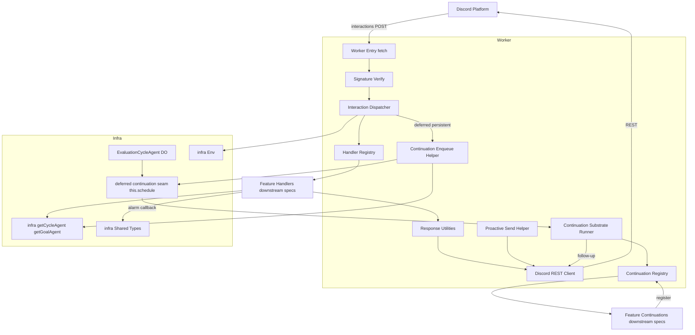
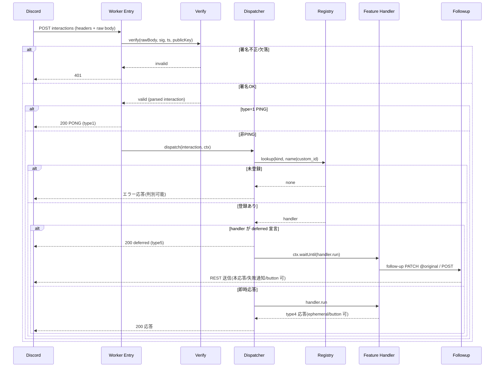
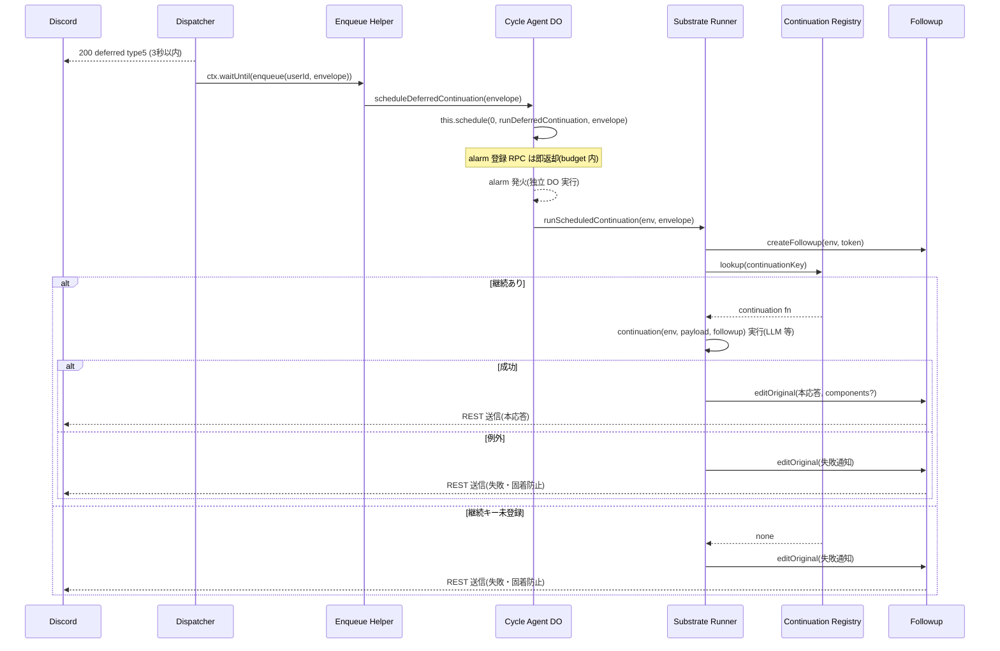
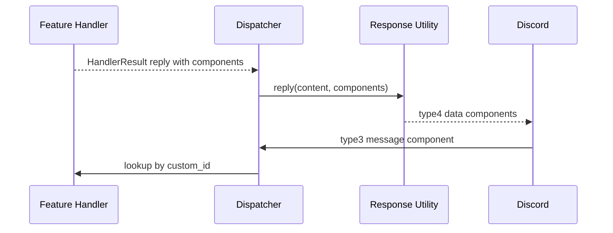
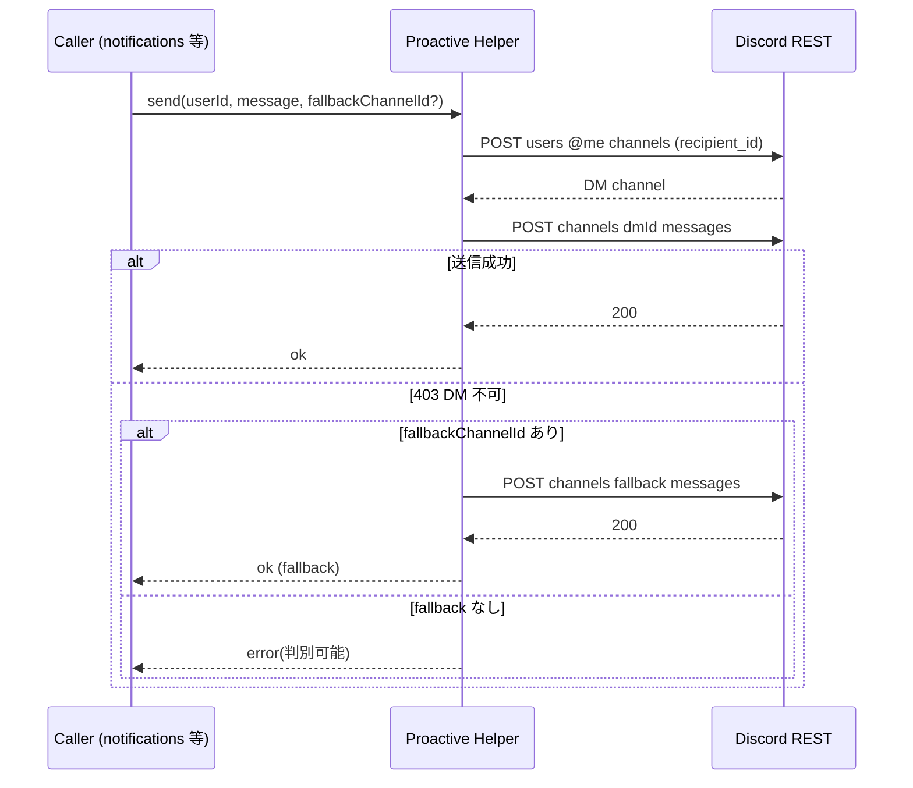

# Design Document: discord-gateway

## Overview

**Purpose**: 本スペックは評価目標フォロー Agent の全機能が共有する Discord 入出力ゲートウェイを提供する。Discord の slash command / modal submit / message component(button)はすべて HTTP POST で Cloudflare Worker に届くため、Ed25519 署名検証・PING/PONG・3秒以内の deferred 応答・button 付き reply/follow-up webhook・プロアクティブ REST 送信という「Discord I/O 規約」を単一の共通基盤として確立し、各機能スペックがコマンド処理だけに集中できるようにする。

**Users**: 直接の利用者は下位スペック(goal-management, checkin-classification, status-and-draft, notifications)の実装者と、Discord アプリ/コマンドを登録・運用する運用者である。本ゲートウェイはエンドユーザー向けのコマンド内容そのものを持たず、コマンドが乗る I/O 規約のみを提供する。

**Impact**: 既存 discord-gateway 契約を拡張する。infra-foundation が確立した Worker エントリー(`src/index.ts`)・`Env`・Agent ルーティングヘルパー・共有型の上に、Discord interactions パス、message component button 付き応答、プロアクティブ送信経路を統合する。加えて、deferred 後の重い継続を初期 HTTP 応答の `waitUntil` budget から切り離す DO-backed 永続的継続 substrate を追加する(現行は ~24s の LLM 推論で budget 超過し follow-up が届かず「考え中…」が固着するため・Req 8)。永続化スキーマ・Agent トポロジ・LLM クライアント・`this.schedule()` 実行基盤は再定義せず消費する。

### Goals
- Ed25519 署名検証と PING→PONG を正しく処理し、Discord エンドポイント登録が通る interactions エントリを確立する(Req 1)。
- 各機能スペックがコマンド定義を供給して登録できる slash command 登録手段を提供する(Req 2)。
- interaction を種別(command / message component / modal submit)で登録ハンドラへ振り分けるディスパッチ規約を提供する(Req 3)。
- 3秒以内 deferred + follow-up の共通パターン、ephemeral/即時応答手段、message component button 付き応答、modal を開く応答(type9)を提供する(Req 4)。
- DM open → 送信 → 失敗時フォールバックのプロアクティブ送信ヘルパーを提供する(Req 5)。
- プライバシー前提(DM/個人用非公開限定)を構造的に強制する(Req 6)。
- deferred 後の重い継続を初期応答ライフタイム(`waitUntil` budget)から切り離して実行する DO-backed 永続的継続 substrate を、LLM を伴う全 deferred フローの共通契約として提供する(Req 8)。

### Non-Goals
- 個別 slash command のビジネスロジック・引数の意味・UX 文言(各機能スペック)。
- 通知・アラートのスケジューリング判定(notifications。送信ヘルパーのみ本スペック)。
- 永続化スキーマ・Agent トポロジ・LLM クライアント実装・`this.schedule()` 実行基盤(infra-foundation。永続的継続はこれを消費するのみで新スケジューラを再定義しない・Req 8.2)。
- 永続的継続内で実行される各機能の業務ロジック(分類・判定・生成の内容)・pending 状態の保持媒体(各機能スペックが既存規約で所有・Req 8.7, 8.8)。
- レート制限の高度な制御・複数 bot/複数アプリ対応(MVP スコープ外)。

## Boundary Commitments

### This Spec Owns
- Discord interactions エントリ: raw body 取得、Ed25519 署名検証、PING→PONG、署名済み非 PING の種別判定とディスパッチ。
- ディスパッチ規約: コマンド名 / custom_id をキーにしたハンドラレジストリと、ハンドラへ渡す `InteractionContext`(実行ユーザー・コマンド名・引数・custom_id・チャンネル/DM 文脈)の契約。
- 応答ユーティリティ: 即時応答(type4)・deferred 応答(type5)・modal を開く応答(type9)・ephemeral・message component button・follow-up webhook(PATCH @original / POST follow-up)の生成と送信。
- プロアクティブ送信ヘルパー: DM チャンネル open → メッセージ送信 → 403 時の個人用フォールバックチャンネル送信、失敗の判別可能な返却。
- slash command 登録手段: 各機能が供給するコマンド定義集合を Discord API へ登録するスクリプト/エントリ(グローバル/ギルド単位)。
- Discord 用 `Env` 拡張: `DISCORD_PUBLIC_KEY` / `DISCORD_APPLICATION_ID` / `DISCORD_BOT_TOKEN`(+ 任意のフォールバックチャンネル設定)の型宣言。
- **DO-backed 永続的継続 substrate(Req 8)**: deferred 後の継続を初期応答ライフタイムから切り離す実行 substrate。具体的には (a) 継続レジストリ(継続キー → 業務継続関数)、(b) `HandlerResult` の DO-backed deferred 変種、(c) ユーザーの primary cycle agent へ即時ワンショット alarm を登録する enqueue ヘルパー、(d) alarm 上で envelope(interaction token + application id + 継続キー + 業務 payload)から Followup を再構築し継続を実行 → 本応答 follow-up 送出 → 失敗時フォールバック follow-up を行う substrate runner。

### Out of Boundary
- 個別コマンドの処理本体・引数スキーマの意味・UX 文言(下位機能スペック)。
- `this.schedule()` による通知トリガ(notifications)。
- §11 永続化スキーマ・Agent クラス本体・`LlmClient` 実装・`this.schedule()` 実行基盤そのもの(infra-foundation。永続的継続は消費するのみ・Req 8.2)。
- 永続的継続内で実行される各機能の業務ロジック(分類・判定・生成の内容)。ゲートウェイは継続キーで登録された関数を呼ぶ substrate のみを所有し、その中身を実装しない(Req 8.8)。
- pending 状態(確認ボタンが参照する分類保持データ等)の保持媒体・スキーマ。継続関数の内部で各機能が既存の揮発 KV 規約のまま保持する。substrate は保持先に触れない(Req 8.7)。
- 各ハンドラ内での Agent 取得ロジック(ハンドラが infra-foundation のルーティングヘルパーを直接利用する。ゲートウェイはコンテキスト供給のみ)。

### Allowed Dependencies
- infra-foundation の公開契約: `Env`(拡張して利用)、`getCycleAgent`/`getGoalAgent`/`parseAgentName`、**ユーザー単位データホーム鍵 `PRIMARY_CYCLE_KEY`(infra `agents/routing.ts` 所有)**、共有ドメイン型。
  - 補足(所有権の昇格): 永続的継続の enqueue は「ユーザーごとに決定的に定まる単一ホーム Agent(`evaluation:{userId}:primary`)」へ着地する必要がある。この `"primary"` 鍵は現状 goal-management(下位スペック)が `PRIMARY_CYCLE_KEY` として所有するが、複数スペック(gateway / goal-management / status-and-draft)が共有するユーザー単位データホーム規約であるため、本スペックは **鍵を infra-foundation の `agents/routing.ts` へ昇格**し、gateway はそこから consume する。gateway はリテラル `"primary"` を再定義せず、下位スペックも import しない(依存方向を上流のみに保つ)。
- **infra-foundation の `EvaluationCycleAgent` 上の汎用 deferred-continuation seam(Req 8.2)**: enqueue ヘルパーが呼ぶ scheduled-continuation 登録メソッドと、alarm callback。callback 本体はゲートウェイ substrate へ委譲する薄い配線で、`fireWeeklyCheckin`(既存の infra Agent → notifications 委譲)と同型。`this.schedule()` 自体は infra 所有で再定義しない。
- 外部ライブラリ: `discord-interactions`(`verifyKey` と type 定数)、`discord-api-types`(型のみ)。
- Cloudflare Workers / Agents ランタイム: `fetch` ハンドラ、`ExecutionContext.waitUntil`、Web Crypto、Agents SDK の `this.schedule()`(DO alarm)。
- 依存方向: `discord types → env(拡張) → verify → response/rest helpers → followup/proactive → continuation registry/substrate → registry/dispatch → worker entry 統合`。各層は左方向のみ import する。continuation substrate は infra ルーティング(`getCycleAgent`)を消費するが goal-management 等の下位スペックは import しない。full `discord.js` は使用しない。

### Revalidation Triggers
- `InteractionContext` / `InteractionHandler` 登録規約のシグネチャ変更(全下位ハンドラが影響)。
- 応答ユーティリティ(deferred/follow-up/ephemeral/message component button)のインターフェイス変更。
- プロアクティブ送信ヘルパーの引数/返却型・フォールバック契約の変更。
- Discord 用 `Env` バインディング名・secret 名の変更。
- コマンド登録手段が受け取るコマンド定義集合の形の変更。
- infra-foundation の `Env`・ルーティングヘルパーのシグネチャ変更(上流変更の波及)。
- message component button の public contract(`MessageActionRow` / `MessageButton` / `MessageOptions`)の形、または button style の許容範囲の変更。
- **永続的継続契約の変更(Req 8)**: `HandlerResult` の DO-backed deferred 変種の形、継続レジストリの登録シグネチャ(`registerContinuation`)、envelope(continuation envelope)の形 — 変更は全 LLM deferred フロー(checkin 分類 / status 判定 / draft 生成)に波及する。
- **infra-foundation の `EvaluationCycleAgent` 上の deferred-continuation seam メソッド名・シグネチャの変更**(上流変更の波及。本スペックは enqueue ヘルパーで参照する)。
- **ユーザー単位データホーム鍵 `PRIMARY_CYCLE_KEY` の所有層・名称の変更**(infra `agents/routing.ts` へ昇格。gateway の enqueue と goal-management / status-and-draft が共有 consume するため、移動・改名は全 consumer に波及する)。

## Architecture

### Architecture Pattern & Boundary Map

採用パターンは「Worker エントリー層 + ハンドラレジストリ」。Worker エントリーが署名検証と種別判定を一手に担い、種別と識別子でレジストリを引いて各機能が登録したハンドラへ委譲する薄い層に徹する(research.md の Decision 参照)。



**Architecture Integration**:
- Selected pattern: 薄いエントリー層 + レジストリ。署名検証・種別判定をゲートウェイに集約し、コマンド本体は各機能ハンドラへ委譲することで責務重複を排除。
- Domain/feature boundaries: ゲートウェイは「検証・ディスパッチ・応答・送信」と、message component button を Discord payload として表現する共通契約を所有する。button の custom_id・表示文言・押下後の業務判断は各機能ハンドラが所有し、ゲートウェイはその内容を保持しない。
- Persistent continuation boundary(Req 8): ゲートウェイは「継続を初期応答ライフタイムから切り離す substrate(enqueue → DO alarm → Followup 再構築 → 継続実行 → follow-up → 失敗フォールバック)」を所有する。継続の業務内容(分類・判定・生成)は継続キーで登録された各機能の関数が所有し、substrate はその中身を実装しない。`this.schedule()` 実行基盤は infra 所有で、`EvaluationCycleAgent` 上の薄い seam メソッド(`fireWeeklyCheckin` と同型の委譲配線)経由で利用する。
- New components rationale: 全コンポーネントは Discord I/O 規約の共通化、および LLM 継続を budget から切り離す共通化に必要。投機的抽象(汎用イベントバス・外部キュー等)は導入しない。
- Steering compliance: roadmap の「Discord deferred 応答はゲートウェイが提供し各機能が従う」「永続化/Agent/LLM/`this.schedule()` は基盤が所有」に準拠。継続の所有者スコープは structure.md の「Agent 名に userId」に従い、ユーザー自身の primary cycle agent 上で実行する。

### Technology Stack

| Layer | Choice / Version | Role in Feature | Notes |
|-------|------------------|-----------------|-------|
| Backend / Services | Cloudflare Workers(`fetch` ハンドラ) | interactions 受信・ディスパッチ・REST 送信 | infra-foundation の `src/index.ts` に統合 |
| Auth / Verify | `discord-interactions`(`verifyKey`) | Ed25519 署名検証・type 定数 | Workers/Web Crypto 互換。自前実装は不採用 |
| Types | `discord-api-types` | interaction payload / REST body の型 | ランタイムコストゼロ(型のみ) |
| Messaging | `fetch` ベース薄い Discord REST クライアント | follow-up webhook・message components・プロアクティブ送信 | `@discordjs/rest`・full `discord.js` は不使用 |
| Runtime | `ExecutionContext.waitUntil` | budget 内で収まる軽量 deferred 継続 + 永続的継続の enqueue | 3秒応答後の短い処理 / alarm 登録 RPC を吸収 |
| Scheduling | Agents SDK `this.schedule(0, cb, payload)`(DO alarm) | budget 超過しうる LLM 継続を初期応答ライフタイムから切り離して実行(Req 8) | infra `this.schedule()` を消費。新スケジューラは作らない |

## File Structure Plan

### Directory Structure
```
src/
├── index.ts                         # (Modified) infra のエントリーに Discord interactions パス統合を追加
└── discord/
    ├── env.ts                       # Discord 用 Env 拡張型: DISCORD_PUBLIC_KEY/APPLICATION_ID/BOT_TOKEN/フォールバックチャンネル(Req 1.5, 2.2, 5.4, 6.3)
    ├── types.ts                     # InteractionContext / InteractionHandler / HandlerResult / MessageOptions / MessageActionRow / MessageButton / 種別判別(Req 3.5, 3.6, 4.1, 4.8-4.11)
    ├── verify.ts                    # raw body + 署名ヘッダの Ed25519 検証、欠落/失敗の判別(Req 1.1-1.3, 1.5)
    ├── response.ts                  # PONG/即時(type4)/deferred(type5)/modal(type9)/ephemeral/button 応答ボディ生成(Req 1.4, 4.1, 4.5-4.8, 4.10, 6.2)
    ├── rest.ts                      # fetch ベース Discord REST クライアント: webhook 編集/送信(components 対応)・DM open・channel 送信(Req 4.2, 4.9, 5.1, 5.4)
    ├── followup.ts                  # follow-up 送信ユーティリティ(@original PATCH / 追加 POST、components 対応、失敗判別)(Req 4.2, 4.4, 4.9)
    ├── proactive.ts                 # プロアクティブ送信ヘルパー: DM open→送信→403 フォールバック→失敗返却(Req 5.1-5.5, 6.3, 6.4)
    ├── continuation.ts              # (New) 永続的継続 substrate: 継続レジストリ(register/lookup)・envelope 型・enqueue ヘルパー(primary cycle agent へ schedule(0,...))・substrate runner(envelope→Followup 再構築→継続実行→follow-up→失敗フォールバック)(Req 8.1, 8.3-8.6, 8.8)
    ├── registry.ts                  # コマンド名/custom_id をキーにしたハンドラレジストリと登録規約(Req 3.1-3.4, 3.6, 7.4)
    ├── dispatch.ts                  # (Modified) 種別判定→照合→実行→reply/deferred/modal/button 配線 + DO-backed deferred 変種の enqueue 配線(Req 1.6, 3.1-3.5, 4.1-4.3, 4.7-4.10, 8.1)
    └── commands/
        ├── definitions.ts           # 各機能が自分のコマンド定義を追加する単一集約点(空の集約配列)(Req 2.1, 2.5, 7.4)
        └── register.ts              # コマンド登録スクリプト: 認証情報検証→Discord API 登録(グローバル/ギルド)(Req 2.2-2.4)
```

### Modified Files
- `src/index.ts` — infra-foundation が確立した `fetch` 委譲点に Discord interactions パス(例: `POST /interactions`)を追加し、検証→ディスパッチへ委譲する。既存の Agent 配線・ルーティングは変更しない。
- `src/discord/types.ts` — `HandlerResult` に DO-backed deferred 変種(`mode: "deferred-persistent"`)を追加し、継続キー + シリアライズ可能 payload を宣言できるようにする(Req 8.1)。継続関数型 `Continuation` と envelope 型 `DeferredContinuationEnvelope` を公開する。
- `src/discord/dispatch.ts` — `deferred-persistent` 変種を受けた際に type5 を即返し、`ctx.waitUntil` 内で `continuation.ts` の enqueue ヘルパー(primary cycle agent への alarm 登録)を呼ぶ。enqueue 自体が失敗した場合は失敗 follow-up へフォールバックする(Req 8.1, 8.5)。
- `src/agents/evaluation-cycle-agent.ts`(**infra-foundation 所有 / 本スペックが要求する seam 追加**)— 汎用 deferred-continuation seam を 2 メソッド追加する: `@callable` の登録メソッド(envelope を受け `this.schedule(0, "runDeferredContinuation", envelope)`)と、alarm callback `runDeferredContinuation(envelope)`(本体はゲートウェイ substrate runner へ委譲)。`fireWeeklyCheckin` と同型の薄い委譲で、業務ロジックを持たない(Req 8.2, 8.8)。この変更は infra-foundation への revalidation trigger。
- `src/agents/routing.ts`(**infra-foundation 所有 / 本スペックが要求する昇格**)— ユーザー単位データホーム鍵 `PRIMARY_CYCLE_KEY`(`"primary"`)を本層へ昇格・export する。現状 goal-management `routing.ts` が所有するが、gateway の継続 enqueue が上流からこの鍵を必要とするため、所有者を infra へ移す。goal-management / status-and-draft は import 元を本層へ差し替える(規約の意味は不変・追加的変更)。この昇格は infra-foundation への revalidation trigger。

> 依存方向: `discord/env`・`discord/types` → `discord/verify` → `discord/response`・`discord/rest` → `discord/followup`・`discord/proactive` → `discord/continuation`(infra `getCycleAgent` を消費) → `discord/registry` → `discord/dispatch` → `src/index.ts`。`commands/` は登録専用で `env`/`types` のみ参照。`evaluation-cycle-agent.ts`(infra)の seam callback はゲートウェイ `continuation.ts` の substrate runner を import する(`fireWeeklyCheckin` が notifications を import するのと同型の wiring-root 例外)。各層はそれ以外で左方向のみ import する。

## System Flows

### interactions 受信フロー(検証 → ディスパッチ → deferred)

deferred 宣言の有無で初期応答(type5 vs type4)が分岐する。deferred の初期応答(type5)には loading/ephemeral 以外の message body を載せず、button は `editOriginal` または追加 follow-up の message payload として送る。即時応答(type4)では `data.components` に action row/button を含められる。deferred には 2 系統あり、budget 内で収まる軽量継続は `mode:"deferred"`(`waitUntil` で `run` を継続)、budget 超過しうる LLM 継続は `mode:"deferred-persistent"`(次フロー)を宣言する。

### DO-backed 永続的 deferred 継続フロー(Req 8)

継続は元 HTTP 応答の `waitUntil` budget から切り離され、DO alarm の独立実行で走る(Req 8.1)。envelope は interaction token と application id を継続実行コンテキストへ運ぶ(Req 8.3)。alarm は数秒内発火し token 15 分窓内に follow-up を送る(Req 8.4)。継続キー未登録・例外・失効は必ず失敗 follow-up を送り「考え中…」固着を防ぐ(Req 8.5)。継続関数内の pending KV 保持は各機能が既存規約のまま行い substrate は触れない(Req 8.7)。

### message component button 応答フロー(reply / follow-up → component interaction)

button は message 用 Action Row(type1)内の Button(type2)として表現する。非 Link/Premium の button だけを扱い、押下時に Discord が `custom_id` を持つ message component interaction(type3)を送る。custom_id の意味と押下後の処理は下位機能ハンドラが所有する。

### プロアクティブ送信フロー(DM → フォールバック)

フォールバック先は個人用非公開チャンネルを前提とし、公開チャンネルへの任意送信経路は提供しない(Req 5.5, 6.3)。

## Requirements Traceability

| Requirement | Summary | Components | Interfaces | Flows |
|-------------|---------|------------|------------|-------|
| 1.1, 1.2, 1.3, 1.5 | 署名検証・欠落/失敗で 401・公開鍵参照 | verify.ts, env.ts | `verifyInteraction` | 受信フロー |
| 1.4 | PING→PONG | response.ts, index.ts | `pong` | 受信フロー |
| 1.6 | 検証済み非 PING をディスパッチへ | dispatch.ts, index.ts | `dispatchInteraction` | 受信フロー |
| 2.1, 2.5 | コマンド定義の単一集約点 | commands/definitions.ts | `commandDefinitions` | — |
| 2.2, 2.3, 2.4 | 登録手段・認証検証・ギルド指定 | commands/register.ts, env.ts | `registerCommands` | — |
| 3.1, 3.2, 3.3 | command/component/modal を振り分け | dispatch.ts, registry.ts | `dispatchInteraction`, `lookup` | 受信フロー |
| 3.4 | 未登録の判別可能エラー | dispatch.ts | `dispatchInteraction` | 受信フロー |
| 3.5 | ハンドラへ文脈供給 | types.ts, dispatch.ts | `InteractionContext` | 受信フロー |
| 3.6, 7.4 | ハンドラ登録規約 | registry.ts, types.ts | `registerHandler`, `InteractionHandler` | — |
| 4.1, 4.3 | 3秒以内 deferred・budget 内は waitUntil 継続/超過は Req 8 へ委譲 | response.ts, dispatch.ts | `deferred`, `dispatchInteraction` | 受信フロー |
| 4.2, 4.4 | follow-up 本応答/失敗送信 | followup.ts, rest.ts | `sendFollowup`, `editOriginal` | 受信フロー |
| 4.5 | 即時応答手段 | response.ts | `reply` | 受信フロー |
| 4.6, 6.2 | ephemeral 応答 | response.ts | `reply`/`deferred` (ephemeral flag) | 受信フロー |
| 4.7 | modal を開く応答(type9) | response.ts, dispatch.ts, types.ts | `modal`, `HandlerResult({mode:"modal"})`, `dispatchInteraction` | 受信フロー |
| 4.8 | 即時応答に button を含める | types.ts, response.ts, dispatch.ts | `MessageActionRow`, `MessageButton`, `reply` | button 応答フロー |
| 4.9 | deferred 後の本応答/追加 follow-up に button を含める | types.ts, followup.ts, rest.ts | `MessageOptions`, `Followup.editOriginal`, `Followup.send` | button 応答フロー |
| 4.10 | button 押下を同じ custom_id ディスパッチ規約へ戻す | dispatch.ts, registry.ts, types.ts | `InteractionKind:"component"`, `lookupHandler` | button 応答フロー |
| 4.11 | button の業務判断を下位機能が所有 | types.ts, registry.ts, Boundary Commitments | `MessageButton.custom_id`, `InteractionHandler` | — |
| 5.1, 5.4 | DM open→送信・bot token/REST | proactive.ts, rest.ts | `sendDirectMessage` | 送信フロー |
| 5.2 | 403 フォールバック | proactive.ts | `sendDirectMessage` | 送信フロー |
| 5.3 | フォールバック無しの失敗返却 | proactive.ts | `sendDirectMessage` | 送信フロー |
| 5.5, 6.3, 6.4 | DM/非公開限定・公開送信拒否 | proactive.ts | `sendDirectMessage` | 送信フロー |
| 6.1 | 実行ユーザー ID の一貫供給 | types.ts, dispatch.ts | `InteractionContext` | 受信フロー |
| 7.1, 7.2, 7.3 | 境界維持(中身/通知判定/上流を持たない) | (Boundary Commitments) | — | — |
| 8.1 | budget 超過しうる継続を切り離す手段 | dispatch.ts, continuation.ts, types.ts | `HandlerResult({mode:"deferred-persistent"})`, `enqueueDeferredContinuation` | 永続的継続フロー |
| 8.2 | Agent scheduled 実行・infra `this.schedule()` 利用 | continuation.ts, evaluation-cycle-agent.ts (infra seam) | `scheduleDeferredContinuation`, `this.schedule` | 永続的継続フロー |
| 8.3 | token + application id を継続コンテキストへ受け渡し | continuation.ts | `DeferredContinuationEnvelope` | 永続的継続フロー |
| 8.4 | 完了時 follow-up を 15 分窓内に送出 | continuation.ts, followup.ts | `runScheduledContinuation`, `Followup.editOriginal` | 永続的継続フロー |
| 8.5 | 失敗時 follow-up で固着防止 | continuation.ts | `runScheduledContinuation` | 永続的継続フロー |
| 8.6 | LLM 全 deferred フローの共通契約 | continuation.ts, types.ts | `registerContinuation`, `HandlerResult({mode:"deferred-persistent"})` | 永続的継続フロー |
| 8.7 | pending 保持先を変更しない | (Boundary Commitments / continuation.ts non-ownership) | — | — |
| 8.8 | substrate のみ所有・業務ロジック非実装 | continuation.ts, evaluation-cycle-agent.ts (infra seam) | `registerContinuation`, `runDeferredContinuation` | 永続的継続フロー |

## Components and Interfaces

| Component | Domain/Layer | Intent | Req Coverage | Key Dependencies (P0/P1) | Contracts |
|-----------|--------------|--------|--------------|--------------------------|-----------|
| Discord Env 拡張 | env | Discord secrets/設定の型宣言 | 1.5, 2.2, 5.4, 6.3 | infra Env (P0) | State |
| Interaction 型・ハンドラ規約 | types | 文脈・ハンドラ・結果型・button 契約 | 3.5, 3.6, 4.1, 4.8-4.11, 6.1, 7.4 | discord-api-types (P1) | Service, State |
| Signature Verify | verify | Ed25519 検証 | 1.1, 1.2, 1.3, 1.5 | discord-interactions (P0), env (P0) | Service |
| Response Utilities | response | 応答ボディ生成(PONG/type4/type5/type9 modal/ephemeral/button) | 1.4, 4.1, 4.5-4.8, 4.10, 6.2 | types (P1) | Service |
| Discord REST Client | rest | webhook/channel/DM REST 呼び出し | 4.2, 4.9, 5.1, 5.4 | env (P0), fetch (P0) | Service |
| Followup Utility | followup | follow-up 本応答/失敗送信/button 付き送信 | 4.2, 4.4, 4.9 | rest (P0), env (P0) | Service |
| Proactive Send Helper | proactive | DM→フォールバック送信 | 5.1-5.5, 6.3, 6.4 | rest (P0), env (P0) | Service |
| Handler Registry | registry | 識別子→ハンドラ対応付け | 3.1-3.4, 3.6, 4.10, 7.4 | types (P0) | Service, State |
| Interaction Dispatcher | dispatch | 種別判定→照合→実行→reply/deferred/modal/button + 永続継続 enqueue 配線 | 1.6, 3.1-3.5, 4.1-4.3, 4.7-4.10, 8.1 | registry (P0), response (P0), continuation (P0), types (P0) | Service |
| Persistent Continuation Substrate | continuation | 継続レジストリ + enqueue(schedule 登録) + alarm 上の Followup 再構築→継続実行→follow-up→失敗フォールバック | 8.1, 8.3-8.6, 8.8 | infra getCycleAgent (P0), followup (P0), types (P0) | Service, State |
| Deferred Continuation Seam (infra) | agents | `EvaluationCycleAgent` の薄い登録/alarm callback。substrate へ委譲 | 8.2, 8.8 | continuation (P0), agents this.schedule (P0) | Service |
| Command Definitions | commands | コマンド定義の単一集約点 | 2.1, 2.5, 7.4 | types (P1) | State |
| Command Register | commands | 登録スクリプト | 2.2, 2.3, 2.4 | env (P0), definitions (P0) | Service, Batch |
| Worker Entry 統合 | worker | interactions パス統合 | 1.4, 1.6 | verify (P0), dispatch (P0), infra index (P0) | API |

### types

#### Interaction 型・ハンドラ規約

| Field | Detail |
|-------|--------|
| Intent | ハンドラへ渡す文脈と登録規約・結果型を定義 |
| Requirements | 3.5, 3.6, 4.1, 4.8-4.11, 6.1, 7.4 |

**Responsibilities & Constraints**
- 実行ユーザー ID・コマンド名・引数・custom_id・チャンネル/DM 文脈を含む `InteractionContext` を定義(Req 3.5, 6.1)。
- ハンドラは「即時応答型(reply)」「deferred 型(waitUntil)」「DO-backed 永続継続型(deferred-persistent)」「modal を開く型(modal)」のいずれかを宣言できる(Req 4.1, 4.7, 8.1)。`deferred-persistent` はクロージャでなく継続キー + シリアライズ可能 payload を宣言し、業務本体は継続レジストリに登録された `Continuation` が担う(Req 8.6, 8.8)。
- `reply` と `Followup` は同じ `MessageOptions` を用い、ephemeral と message component button を同じ契約で表現する(Req 4.6, 4.8, 4.9)。
- `MessageButton` は押下後に interaction を返す非 Link/Premium button(style 1-4)のみを扱う。URL button / premium button は custom_id ディスパッチに戻らないため本契約に含めない(Req 4.10, 4.11)。
- ゲートウェイはコマンドの中身を持たず、ハンドラは外部供給物として型で受ける(Req 7.4)。

**Dependencies**
- Inbound: registry/dispatch — 型参照(P0)
- External: `discord-api-types` — interaction payload 型(P1)

**Contracts**: Service [x] / State [x]

##### Service Interface
```typescript
type InteractionKind = "command" | "component" | "modal";

interface InteractionContext {
  readonly kind: InteractionKind;
  readonly name: string;          // command 名 / component・modal の custom_id
  readonly userId: string;        // 実行ユーザー(Req 6.1)
  readonly channelId: string | null;
  readonly isDm: boolean;         // DM 文脈か
  readonly interactionId: string;
  readonly token: string;         // follow-up 用 token
  readonly raw: unknown;          // 元 interaction(型は discord-api-types で絞り込み)
}

type MessageButtonStyle = 1 | 2 | 3 | 4; // Primary, Secondary, Success, Danger

interface MessageButton {
  type: 2;                         // Button
  custom_id: string;                // 1-100 chars; 下位機能が所有
  label: string;                    // max 80 chars; 下位機能が所有
  style: MessageButtonStyle;
  disabled?: boolean;
}

interface MessageActionRow {
  type: 1;                         // ActionRow
  components: MessageButton[];      // Discord 上限は最大 5 buttons per row
}

interface MessageOptions {
  ephemeral?: boolean;
  components?: MessageActionRow[];
}

interface Followup {
  editOriginal(content: string, opts?: MessageOptions): Promise<SendResult>;
  send(content: string, opts?: MessageOptions): Promise<SendResult>;
}

// JSON シリアライズ可能な継続 payload(DO alarm 経由で運ぶため。any は使わない)。
type JsonValue =
  | string | number | boolean | null
  | { readonly [key: string]: JsonValue }
  | readonly JsonValue[];
type ContinuationPayload = { readonly [key: string]: JsonValue };

type HandlerResult =
  | { mode: "reply"; ephemeral?: boolean; content: string; components?: MessageActionRow[] } // 即時(type4)
  | { mode: "deferred"; ephemeral?: boolean; run: (followup: Followup) => Promise<void> }    // budget 内継続(waitUntil)
  | { mode: "deferred-persistent"; ephemeral?: boolean;                                       // budget 超過しうる継続(DO alarm / Req 8.1)
      continuation: { key: string; payload: ContinuationPayload } }
  | { mode: "modal"; customId: string; title: string; components: ModalActionRow[] };         // modal を開く(type9)

// 継続レジストリに登録する業務継続関数(Req 8.6, 8.8)。`this` ではなく env + payload から
// authority を再取得して走り、Followup で本応答を送る。中身は各機能スペックが所有する。
type Continuation = (
  env: DiscordEnv,
  payload: ContinuationPayload,
  followup: Followup,
) => Promise<void>;

// DO alarm へ運ぶ封筒(JSON シリアライズ可能 / Req 8.3)。
interface DeferredContinuationEnvelope {
  readonly interactionToken: string;   // follow-up 用 token(Req 8.3, 8.4)
  readonly applicationId: string;      // follow-up webhook URL 構築用(Req 8.3)
  readonly continuationKey: string;    // 継続レジストリのキー(Req 8.6)
  readonly payload: ContinuationPayload; // 業務入力(再生成不能な確定前データを含みうる)
}

// Discord modal payload に準拠(discord-api-types: APIActionRowComponent<APIModalActionRowComponent>)。
// action row が text input(TEXT_INPUT, type4 component)を内包する。
interface ModalActionRow {
  type: 1;                         // ActionRow
  components: ModalTextInput[];
}

interface ModalTextInput {
  type: 4;                         // TextInput(component type4)
  custom_id: string;
  label: string;
  style: 1 | 2;                    // 1=Short, 2=Paragraph
  required?: boolean;
  min_length?: number;
  max_length?: number;
  placeholder?: string;
  value?: string;                  // 再オープン時の既存値(checkin の [修正] 等)
}

interface InteractionHandler {
  handle(ctx: InteractionContext, env: DiscordEnv): Promise<HandlerResult> | HandlerResult;
}
```
- Preconditions: `ctx` は署名検証済み interaction から構築される。
- Postconditions: `deferred` の場合 `run` が follow-up を用いて本応答を送る責務を持つ。button は deferred 初期応答ではなく `Followup.editOriginal` または `Followup.send` の `MessageOptions.components` で送る(Req 4.9)。`modal` の場合ディスパッチャが Discord interaction response type9(MODAL)を初期応答として返す(Req 4.7)。
- Invariants: `userId` は常に供給される(Req 6.1)。`modal` は command / component interaction の初期応答としてのみ有効(modal submit への再 modal 応答は行わない)。同一 message 内で `custom_id` が重複しないことは button を定義する下位機能の責務だが、ゲートウェイの型は custom_id を必須にする。

### response

#### Response Utilities

| Field | Detail |
|-------|--------|
| Intent | Discord interaction response body を生成する純粋関数群 |
| Requirements | 1.4, 4.1, 4.5-4.8, 4.10, 6.2 |

**Responsibilities & Constraints**
- PONG(type1)、即時応答(type4)、deferred(type5)、modal(type9)の response body を生成する。
- `reply` は `content` / `flags` / `components` を `data` に含められる。`components` は `MessageActionRow[]` をそのまま Discord message component payload として送出する(Req 4.8)。
- `deferred` は Discord の制約に従い初期応答では ephemeral flag だけを扱う。button は deferred 後の webhook edit/send に載せる(Req 4.1, 4.9)。
- `modal` は既存の `ModalActionRow[]` を modal payload として扱い、message button 用の `MessageActionRow[]` と混同しない。

**Dependencies**
- Inbound: dispatch — 応答生成(P0)
- Outbound: types — `MessageOptions` / `ModalActionRow`(P0)
- External: `discord-api-types` — response body 型(P1)

**Contracts**: Service [x]

##### Service Interface
```typescript
interface ResponseOptions extends MessageOptions {}

declare function pong(): APIInteractionResponsePong;
declare function reply(
  content: string,
  opts?: ResponseOptions,
): APIInteractionResponseChannelMessageWithSource;
declare function deferred(
  opts?: Pick<ResponseOptions, "ephemeral">,
): APIInteractionResponseDeferredChannelMessageWithSource;
declare function modal(input: ModalInput): APIModalInteractionResponse;
```
- Preconditions: `reply` に渡す `components` は message 用 action row/button であり、modal 用 action row ではない。
- Postconditions: `reply` は components 指定時に `data.components` を含む。`deferred` は components を受け取らない。
- Invariants: button style は 1-4 に限定し、押下後に `custom_id` を持つ message component interaction(type3)へ戻る。

### verify

#### Signature Verify

| Field | Detail |
|-------|--------|
| Intent | raw body と署名ヘッダの Ed25519 検証 |
| Requirements | 1.1, 1.2, 1.3, 1.5 |

**Responsibilities & Constraints**
- `X-Signature-Ed25519` / `X-Signature-Timestamp` と raw body を `DISCORD_PUBLIC_KEY` で検証(Req 1.1)。
- ヘッダ欠落・検証失敗を判別し、呼び出し元が 401 を返せる結果を返す(Req 1.2, 1.3)。
- raw body は JSON パース前に取得済みであることを前提とする。

**Dependencies**
- Inbound: Worker Entry — 検証呼び出し(P0)
- External: `discord-interactions` `verifyKey`(P0)、`DISCORD_PUBLIC_KEY`(P0)

**Contracts**: Service [x]

##### Service Interface
```typescript
type VerifyResult =
  | { ok: true; interaction: unknown }            // 検証成功(parsed)
  | { ok: false; reason: "missing_headers" | "invalid_signature" };

declare function verifyInteraction(
  rawBody: string,
  signature: string | null,
  timestamp: string | null,
  publicKey: string,
): Promise<VerifyResult>;
```
- Preconditions: `rawBody` は受信した生のボディ文字列。
- Postconditions: `ok:false` のとき呼び出し元は 401 を返す(Req 1.2, 1.3)。
- Invariants: 検証は raw body に対して行い、パース後の再シリアライズは使わない。

### dispatch / registry

#### Handler Registry

| Field | Detail |
|-------|--------|
| Intent | 種別 + 識別子をキーにハンドラを登録・照合 |
| Requirements | 3.1-3.4, 3.6, 4.10, 7.4 |

**Responsibilities & Constraints**
- `(kind, name)` をキーにハンドラを登録/照合(Req 3.6)。button 押下後の message component interaction は `kind:"component"` と button `custom_id` で照合する(Req 4.10)。
- 同一キーの重複登録は検出可能(後勝ち禁止)。
- ゲートウェイ自身はコマンドの中身を保持しない(Req 7.4)。

**Contracts**: Service [x] / State [x]

##### Service Interface
```typescript
declare function registerHandler(
  kind: InteractionKind, name: string, handler: InteractionHandler,
): void;
declare function lookupHandler(
  kind: InteractionKind, name: string,
): InteractionHandler | null;
```

#### Interaction Dispatcher

| Field | Detail |
|-------|--------|
| Intent | 検証済み interaction を種別判定し、照合・実行・reply/deferred/deferred-persistent/modal/button 配線 |
| Requirements | 1.6, 3.1-3.5, 4.1-4.3, 4.7-4.10, 8.1 |

**Responsibilities & Constraints**
- type2/3/5 を `command`/`component`/`modal` に判定し `InteractionContext` を構築(Req 3.1-3.3, 3.5, 6.1)。
- レジストリ未ヒット時は判別可能なエラー応答(Req 3.4)。
- `deferred` ハンドラは type5 を即返し、`ctx.waitUntil(run(followup))` で継続(Req 4.1, 4.3)。`reply` は type4 を返し、`components` があれば `response.reply` へ渡す(Req 4.5, 4.8)。`modal` ハンドラは Discord interaction response type9(MODAL)を初期応答として返す(`customId`/`title`/`components` を modal payload に整形)(Req 4.7)。
- `deferred-persistent` ハンドラは type5 を即返し、`ctx.waitUntil(enqueueDeferredContinuation(env, ctx.userId, envelope))` で primary cycle agent へ継続を登録する。envelope は `ctx.token`・`env.DISCORD_APPLICATION_ID`・継続キー・payload から組み立てる。enqueue 自体の失敗は失敗 follow-up へフォールバック(Req 8.1, 8.5)。
- message component interaction(type3)は `data.custom_id` を `InteractionContext.name` として扱い、button 押下後も既存の custom_id ディスパッチ規約を使う(Req 4.10)。

**Dependencies**
- Inbound: Worker Entry(P0)
- Outbound: Registry(P0)、Response Utilities(P0)、Followup(P0)、Continuation Substrate(P0 / `enqueueDeferredContinuation`)
- External: `ExecutionContext.waitUntil`(P0)

**Contracts**: Service [x]

##### Service Interface
```typescript
declare function dispatchInteraction(
  interaction: unknown,
  env: DiscordEnv,
  ctx: ExecutionContext,
): Promise<Response>;
```
- Preconditions: `interaction` は署名検証済み・非 PING。
- Postconditions: `deferred` 経路は follow-up 処理を `waitUntil` に登録。`deferred-persistent` 経路は DO alarm の登録(enqueue)を `waitUntil` に登録し、本処理は alarm 側へ切り離す(Req 8.1)。
- Invariants: 初期応答は 3 秒以内に返る(重い処理は waitUntil / DO alarm 側)。

#### Persistent Continuation Substrate

| Field | Detail |
|-------|--------|
| Intent | 継続を初期応答ライフタイムから切り離して実行する substrate(Req 8) |
| Requirements | 8.1, 8.3-8.6, 8.8 |

**Responsibilities & Constraints**
- 継続レジストリ: 継続キー → `Continuation` を登録/照合する。各機能スペックが自分の業務継続を登録し、ゲートウェイは中身を実装しない(Req 8.6, 8.8)。
- enqueue ヘルパー: `getCycleAgent(env, userId, PRIMARY_CYCLE_KEY)`(`PRIMARY_CYCLE_KEY` は infra `agents/routing.ts` から import。リテラル `"primary"` を gateway 内で再定義しない)でユーザー自身のホーム Agent(= `evaluation:{userId}:primary`)を取得し、その seam メソッドを呼んで `DeferredContinuationEnvelope` を `this.schedule(0, ...)` へ登録する(Req 8.1, 8.2)。所有者スコープは Agent 名の userId で構造的に閉じる。なおゲートウェイがこのホーム Agent を選ぶのは「ユーザーごとに決定的な単一 DO」であれば十分なためで、data-authority であること自体には依存しない(継続関数が内部で `getUserCycleAuthority` 等により権威を再取得する)。
- substrate runner: alarm 実行時に envelope の `interactionToken`/`applicationId` から `Followup` を再構築(Req 8.3, 8.4)→ 継続キーで `Continuation` を照合・実行 → 成功で本応答 follow-up を送出。継続キー未登録・継続例外・token 失効はいずれも失敗 follow-up を送り deferred 固着を防ぐ(Req 8.5)。
- pending KV 保持には触れない。継続関数の内部で各機能が既存規約のまま保持する(Req 8.7)。

**Dependencies**
- Inbound: Interaction Dispatcher — `enqueueDeferredContinuation`(P0)。Deferred Continuation Seam(infra)— `runScheduledContinuation`(P0)。
- Outbound: Followup — `createFollowup`(P0)。
- External: infra `getCycleAgent`(P0)、`EvaluationCycleAgent` の seam メソッド(P0)。

**Contracts**: Service [x] / State [x](継続レジストリは module スコープの登録状態)

##### Service Interface
```typescript
declare function registerContinuation(key: string, fn: Continuation): void;
declare function lookupContinuation(key: string): Continuation | null;

// dispatch が deferred-persistent 受信時に呼ぶ。primary cycle agent へ alarm を登録する。
declare function enqueueDeferredContinuation(
  env: DiscordEnv,
  userId: string,
  envelope: DeferredContinuationEnvelope,
): Promise<void>;

// infra Agent の alarm callback が委譲する substrate 本体。
declare function runScheduledContinuation(
  env: DiscordEnv,
  envelope: DeferredContinuationEnvelope,
): Promise<void>;
```
- Preconditions: `enqueueDeferredContinuation` は署名検証済み interaction の文脈から呼ばれ、`userId` は実行ユーザー。`runScheduledContinuation` は DO alarm 実行内で呼ばれる。
- Postconditions: 継続成功時のみ本応答 follow-up が送られる。失敗時は失敗 follow-up が送られ「考え中…」が固着しない(Req 8.5)。
- Invariants: 継続業務は継続レジストリ登録関数が所有し、substrate は中身を実装しない(Req 8.8)。継続実行はユーザー自身の Agent 上で行われ、他ユーザー文脈へ越境しない。

**Implementation Notes**
- Integration: 既存の LLM deferred ハンドラ(checkin 分類 modal submit / `/status` / `/draft`)は `mode:"deferred"` から `mode:"deferred-persistent"` へ移行し、現行 `run` 本体を継続キー付きの `Continuation` として登録する(下位機能スペックの adoption)。週次レビュー生成は既に `fireWeeklyCheckin`(cron scheduled callback)上で DO 実行されるため本 substrate の対象外で、Req 8.6 の共通契約は 3 経路 + 将来の LLM deferred フローに適用される。
- Registration(DO isolate 上での存在保証 / 重要): substrate runner は `EvaluationCycleAgent` の alarm(DO isolate)上で `lookupContinuation(key)` を引くため、継続登録(`registerContinuation`)は **DO を export するモジュールグラフから到達可能な起動時副作用** でなければならない。本プロジェクトの既存 handler registry は `src/index.ts` 冒頭の `registerGoalManagement()` 等の top-level 副作用で登録され、同 `index.ts` が `export { EvaluationCycleAgent }` するため Worker fetch isolate と DO isolate の双方で登録が反映される。継続登録もこの同一機構に従い、`index.ts` 起動時の各機能 `registerXxx()`(adoption 側)で `registerContinuation` を呼ぶ。lazy/fetch 経路限定の登録は **禁止**(DO isolate で lookup-miss → Req 8.5 の失敗 follow-up が毎回誤発火し「考え中…失敗」が常態化するため)。テストは DO 実行コンテキスト相当で lookup 成功を確認する(下記 Testing 参照)。
- Validation: envelope は JSON シリアライズ可能な型に限定(`ContinuationPayload`)。token は alarm 数秒内発火で 15 分窓内に収まる。
- Risks: `options.retry` の採否は実装時判断(MVP は単発 + 失敗 follow-up)。enqueue RPC 失敗時は dispatch 側で失敗 follow-up にフォールバック。

### messaging

#### Discord REST Client / Followup / Proactive Send Helper

| Field | Detail |
|-------|--------|
| Intent | follow-up とプロアクティブ送信の REST 呼び出し |
| Requirements | 4.2, 4.4, 4.9, 5.1-5.5, 6.3, 6.4 |

**Responsibilities & Constraints**
- `rest.ts`: `fetch` + `Authorization: Bot {token}` の薄いラッパ。webhook 編集/送信・DM open・channel 送信(Req 4.2, 4.9, 5.1, 5.4)。
- `followup.ts`: `editOriginal`(PATCH @original)と `sendFollowup`(POST)。`MessageOptions.components` を webhook body の `components` に含め、失敗を判別可能に返す(Req 4.2, 4.4, 4.9)。
- `proactive.ts`: DM open→送信→403 で個人用フォールバックチャンネル→未指定時は失敗返却。公開チャンネル宛任意送信を公開しない(Req 5.1-5.5, 6.3, 6.4)。

**Dependencies**
- Outbound: `rest.ts`(P0)
- External: `DISCORD_BOT_TOKEN`・`DISCORD_APPLICATION_ID`(P0)、Discord REST(P0)

**Contracts**: Service [x]

##### Service Interface
```typescript
interface Followup {
  editOriginal(content: string, opts?: MessageOptions): Promise<SendResult>;
  send(content: string, opts?: MessageOptions): Promise<SendResult>;
}

type SendResult =
  | { ok: true }
  | { ok: false; reason: "forbidden" | "not_found" | "rest_error"; status?: number };

declare function sendDirectMessage(
  env: DiscordEnv,
  userId: string,
  content: string,
  fallbackChannelId?: string,
): Promise<SendResult>;
```
- Preconditions: token/application id は env から供給。`components` は message 用 Action Row/Button であり、modal 用 component を渡さない。
- Postconditions: follow-up 送信は `MessageOptions.components` 指定時に JSON body の `components` を含める(Req 4.9)。DM 403 かつ `fallbackChannelId` 指定時はフォールバック送信(Req 5.2)。未指定時は `forbidden` を返す(Req 5.3)。
- Invariants: 送信先は DM または指定された個人用フォールバックチャンネルに限定(Req 5.5, 6.3)。

**Implementation Notes**
- Integration: `followup` は dispatch の deferred 経路が `Followup` を生成して `run` に渡す。button 付き本応答は `followup.editOriginal("...", { components })`、追加 follow-up は `followup.send("...", { components })` で送る。`sendDirectMessage` は notifications 等の呼び出し元が利用。
- Validation: 403 を `forbidden` に正規化。その他非 2xx は `rest_error`。
- Risks: 429(レート制限)は MVP では `rest_error` として伝播(高度なリトライは対象外)。

### commands

#### Command Definitions / Register

| Field | Detail |
|-------|--------|
| Intent | コマンド定義の単一集約点と Discord 登録手段 |
| Requirements | 2.1-2.5, 7.4 |

**Responsibilities & Constraints**
- `definitions.ts`: 各機能スペックが自分のコマンド定義(`discord-api-types` の application command 形)を追加する集約配列。本スペックは空の集約点を確立(Req 2.1, 2.5, 7.4)。
- `register.ts`: 認証情報(application id / bot token)検証→不足時はエラー(Req 2.3)→グローバルまたは指定ギルドへ登録(Req 2.2, 2.4)。

**Contracts**: Service [x] / Batch [x]

##### Batch / Job Contract
- Trigger: 運用者が登録スクリプトを実行。
- Input / validation: `DISCORD_APPLICATION_ID`・`DISCORD_BOT_TOKEN`(欠落時は何も登録せずエラー)・任意の `guildId`。
- Output / destination: Discord API のグローバル/ギルドコマンド登録。
- Idempotency & recovery: Discord の bulk overwrite(PUT)で冪等に上書き登録。

### worker

#### Worker Entry 統合

| Field | Detail |
|-------|--------|
| Intent | infra のエントリーに interactions パスを統合 |
| Requirements | 1.4, 1.6 |

**Contracts**: API [x]

##### API Contract
| Method | Endpoint | Request | Response | Errors |
|--------|----------|---------|----------|--------|
| POST | `/interactions` | raw body + 署名ヘッダ | PONG / 応答 JSON | 401 |

- raw body を `text()` で一度だけ取得 → `verifyInteraction` → PING なら PONG、非 PING は `dispatchInteraction` へ委譲。
- 既存の infra ルーティング(Agent 配線)は維持し、Discord パスを追加するのみ。

## Data Models

本スペックは永続化スキーマを所有しない(infra-foundation 所有)。扱うのは Discord interaction の入出力契約(`InteractionContext` / `HandlerResult` / `MessageOptions` / `MessageActionRow` / `MessageButton` / `SendResult` / `DeferredContinuationEnvelope` / `Continuation`)のみで、これらは Components の Service Interface に定義済み。永続的継続の DO alarm 行は infra の `this.schedule()` が管理する SQLite に短命保存され、本スペックは独自テーブルを定義しない。継続レジストリは module スコープの登録状態(永続化なし)。pending 状態の保持先も各機能スペック所有で変更しない(Req 8.7)。

## Error Handling

### Error Strategy
- 署名検証: 失敗・欠落は副作用なく 401(Req 1.2, 1.3)。検証前にハンドラを実行しない。
- ディスパッチ: 未登録ハンドラは判別可能なエラー応答(Req 3.4)。例外は ephemeral エラー応答に正規化し、個人データを露出しない。
- 送信: REST 失敗は `SendResult`(`forbidden`/`not_found`/`rest_error`)として返し、例外を投げない(Req 4.4, 5.3)。
- deferred 後処理失敗: `run` 内で `followup.send`/`editOriginal` を用いて利用者へ失敗を伝える手段を提供(Req 4.4)。
- 永続的継続失敗(Req 8.5): substrate runner は継続キー未登録・継続例外・token 失効のいずれでも失敗 follow-up(`editOriginal`)を送り、deferred 表示(「考え中…」)を固着させない。dispatch 側の enqueue RPC 失敗も同様に失敗 follow-up へフォールバックする。
- 固着防止の保証境界(Req 8.5 の残存経路): 上記は (a) enqueue 前/中の失敗、(b) substrate runner 内の失敗 を follow-up でカバーする。残る経路は「enqueue 成功(alarm 登録済)だが alarm が substrate runner へ到達/完了しない」もの。これは DO alarm の **自動リトライ**(alarm callback が throw すると指数バックオフで再実行される)を一次緩和とし、再実行時に substrate runner が走れば失敗 follow-up までは到達する。総 alarm 喪失(プラットフォーム起因で alarm 行自体が消失する稀ケース)は本スペックでは **残存リスク**として受容し、`console` ログのみ(別途 watchdog は MVP 対象外)。token 15 分窓内にリトライが収束しなかった場合は固着しうる点を保証境界として明記する。

### Error Categories and Responses
- User/Protocol Errors: 署名不正→401。未登録 interaction→判別可能エラー応答。
- System Errors: REST 非 2xx→判別可能 `SendResult`。deferred token 失効→`not_found`。
- Business Logic Errors: 本スペックはドメインルールを持たないため該当なし(下位スペック所有)。

### Monitoring
- Workers ログ(`console`)へ検証失敗・未登録・REST 失敗を記録。本スペック固有の追加監視要件はない(steering baseline 準拠)。

## Testing Strategy

### Unit Tests
- `verifyInteraction`: 正しい署名で `ok:true`、改竄署名で `invalid_signature`、ヘッダ欠落で `missing_headers`(1.1, 1.2, 1.3)。
- `response`: PING→PONG(type1)、`reply` が type4、`deferred` が type5、`modal` が type9(customId/title/action row 内 text input を含む payload)、ephemeral flag(64)付与、`reply` の `components` が `data.components` に入ること(1.4, 4.1, 4.5-4.8)。
- `registry`: `(kind,name)` の登録/照合往復、未登録で `null`、重複登録検出(3.6, 7.4)。
- `followup`: `editOriginal` / `send` が `MessageOptions.components` を webhook body に含めること、deferred 初期応答では components を送らないこと(4.1, 4.2, 4.9)。
- `sendDirectMessage`: DM 成功で `ok`、403+fallback でフォールバック送信、403+fallback 無しで `forbidden`(5.1, 5.2, 5.3)。
- `register`: 認証情報欠落時に登録せずエラー(2.3)。
- `continuation` レジストリ: `registerContinuation`/`lookupContinuation` の登録/照合往復、未登録キーで `null`(8.6)。
- 継続登録の isolate 存在保証: `src/index.ts` を import(= DO を export するモジュールグラフを評価)した後、adoption 対象キー(checkin 分類 / `/status` / `/draft`)が `lookupContinuation` で解決できること。lazy 経路に頼らず top-level 登録で DO isolate にも反映される回帰を固定する(8.5, 8.6)。
- `runScheduledContinuation`: 継続成功で `editOriginal`(本応答)が呼ばれる、継続例外で失敗 follow-up が送られる、継続キー未登録で失敗 follow-up が送られる(8.4, 8.5)。envelope の token/applicationId から Followup が構築されること(8.3)。

### Integration Tests
- 検証→ディスパッチ: 署名済み command interaction が対応ハンドラへ振り分けられ type4 が返る(1.6, 3.1, 3.5)。
- deferred 経路: deferred 宣言ハンドラで type5 が即返り、`waitUntil` 完了後に follow-up REST(@original PATCH)が呼ばれる(4.1, 4.2, 4.3)。
- component/modal ディスパッチ: custom_id で各ハンドラへ振り分け(3.2, 3.3)。
- button 付き即時応答: handler が `mode:"reply"` と `components` を返すと type4 応答に action row/button が含まれ、同じ button custom_id の type3 interaction が component handler へ振り分けられる(4.8, 4.10, 4.11)。
- button 付き follow-up: deferred handler が `followup.editOriginal` / `send` に `components` を渡すと webhook body に action row/button が含まれる(4.9)。
- modal を開く経路: command/component ハンドラが `mode:"modal"` を返すと type9(MODAL)応答が返り、payload に customId/title/text input が含まれる(4.7)。
- 未登録 interaction: 判別可能なエラー応答が返る(3.4)。
- 永続的継続 enqueue: ハンドラが `mode:"deferred-persistent"` を返すと type5 が即返り、`waitUntil` で primary cycle agent の seam メソッドが envelope 付きで呼ばれる(8.1, 8.2, 8.3)。
- 永続的継続実行: seam の alarm callback が `runScheduledContinuation` へ委譲し、継続成功で本応答 follow-up、継続失敗/キー未登録で失敗 follow-up が送られる(8.4, 8.5)。infra Agent の seam メソッドが業務ロジックを持たず substrate へ委譲するだけであること(8.8)。

### E2E / Smoke Tests
- PING リクエストに対し Worker が PONG を返し、Discord エンドポイント登録の検証が通ること(1.4)。
- 登録スクリプト実行で `definitions` 集約のコマンドがギルドに bulk overwrite 登録されること(2.1, 2.2, 2.4)。

## Security Considerations
- 署名検証(Ed25519)を全 interaction の前段に置き、未検証リクエストの処理を構造的に排除(Req 1、§15)。
- プライバシー(§15、Req 6): 応答は ephemeral 手段を提供し、プロアクティブ送信は DM/個人用非公開チャンネルに限定。公開チャンネル宛の任意送信 API を公開しない。実行ユーザー ID をコンテキストへ必須供給し、各ハンドラが他ユーザーデータへアクセスしない前提を保つ(強制はハンドラ側のデータアクセスにも依存)。
- message component button は custom_id を持つ非 Link/Premium button に限定する。外部 URL 遷移や purchase button は本ゲートウェイの custom_id ディスパッチ/プライバシー境界に戻らないため扱わない。
- secrets(`DISCORD_PUBLIC_KEY`/`DISCORD_BOT_TOKEN`)は Worker 環境変数として管理し、コードに埋め込まない。
