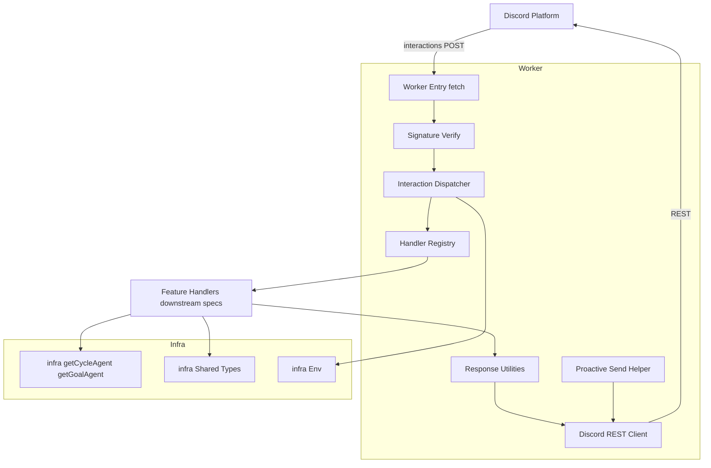
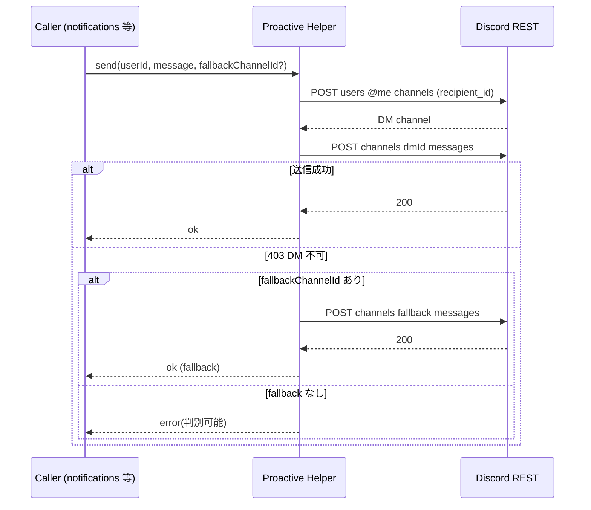

# Design Document: discord-gateway

## Overview

**Purpose**: 本スペックは評価目標フォロー Agent の全機能が共有する Discord 入出力ゲートウェイを提供する。Discord の slash command / modal submit / message component(button)はすべて HTTP POST で Cloudflare Worker に届くため、Ed25519 署名検証・PING/PONG・3秒以内の deferred 応答・follow-up webhook・プロアクティブ REST 送信という「Discord I/O 規約」を単一の共通基盤として確立し、各機能スペックがコマンド処理だけに集中できるようにする。

**Users**: 直接の利用者は下位スペック(goal-management, checkin-classification, status-and-draft, notifications)の実装者と、Discord アプリ/コマンドを登録・運用する運用者である。本ゲートウェイはエンドユーザー向けのコマンド内容そのものを持たず、コマンドが乗る I/O 規約のみを提供する。

**Impact**: グリーンフィールド。infra-foundation が確立した Worker エントリー(`src/index.ts`)・`Env`・Agent ルーティングヘルパー・共有型の上に、Discord interactions パスとプロアクティブ送信経路を統合する。永続化スキーマ・Agent トポロジ・LLM クライアントは再定義せず消費する。

### Goals
- Ed25519 署名検証と PING→PONG を正しく処理し、Discord エンドポイント登録が通る interactions エントリを確立する(Req 1)。
- 各機能スペックがコマンド定義を供給して登録できる slash command 登録手段を提供する(Req 2)。
- interaction を種別(command / message component / modal submit)で登録ハンドラへ振り分けるディスパッチ規約を提供する(Req 3)。
- 3秒以内 deferred + follow-up の共通パターンと ephemeral/即時応答手段、modal を開く応答(type9)を提供する(Req 4)。
- DM open → 送信 → 失敗時フォールバックのプロアクティブ送信ヘルパーを提供する(Req 5)。
- プライバシー前提(DM/個人用非公開限定)を構造的に強制する(Req 6)。

### Non-Goals
- 個別 slash command のビジネスロジック・引数の意味・UX 文言(各機能スペック)。
- 通知・アラートのスケジューリング判定(notifications。送信ヘルパーのみ本スペック)。
- 永続化スキーマ・Agent トポロジ・LLM クライアント実装(infra-foundation)。
- レート制限の高度な制御・複数 bot/複数アプリ対応(MVP スコープ外)。

## Boundary Commitments

### This Spec Owns
- Discord interactions エントリ: raw body 取得、Ed25519 署名検証、PING→PONG、署名済み非 PING の種別判定とディスパッチ。
- ディスパッチ規約: コマンド名 / custom_id をキーにしたハンドラレジストリと、ハンドラへ渡す `InteractionContext`(実行ユーザー・コマンド名・引数・custom_id・チャンネル/DM 文脈)の契約。
- 応答ユーティリティ: 即時応答(type4)・deferred 応答(type5)・modal を開く応答(type9)・ephemeral・follow-up webhook(PATCH @original / POST follow-up)の生成と送信。
- プロアクティブ送信ヘルパー: DM チャンネル open → メッセージ送信 → 403 時の個人用フォールバックチャンネル送信、失敗の判別可能な返却。
- slash command 登録手段: 各機能が供給するコマンド定義集合を Discord API へ登録するスクリプト/エントリ(グローバル/ギルド単位)。
- Discord 用 `Env` 拡張: `DISCORD_PUBLIC_KEY` / `DISCORD_APPLICATION_ID` / `DISCORD_BOT_TOKEN`(+ 任意のフォールバックチャンネル設定)の型宣言。

### Out of Boundary
- 個別コマンドの処理本体・引数スキーマの意味・UX 文言(下位機能スペック)。
- `this.schedule()` による通知トリガ(notifications)。
- §11 永続化スキーマ・Agent クラス本体・`LlmClient` 実装(infra-foundation)。
- 各ハンドラ内での Agent 取得ロジック(ハンドラが infra-foundation のルーティングヘルパーを直接利用する。ゲートウェイはコンテキスト供給のみ)。

### Allowed Dependencies
- infra-foundation の公開契約: `Env`(拡張して利用)、`getCycleAgent`/`getGoalAgent`/`parseAgentName`、共有ドメイン型。
- 外部ライブラリ: `discord-interactions`(`verifyKey` と type 定数)、`discord-api-types`(型のみ)。
- Cloudflare Workers ランタイム: `fetch` ハンドラ、`ExecutionContext.waitUntil`、Web Crypto。
- 依存方向: `discord types → env(拡張) → verify → response/rest helpers → registry/dispatch → worker entry 統合`。各層は左方向のみ import する。full `discord.js` は使用しない。

### Revalidation Triggers
- `InteractionContext` / `InteractionHandler` 登録規約のシグネチャ変更(全下位ハンドラが影響)。
- 応答ユーティリティ(deferred/follow-up/ephemeral)のインターフェイス変更。
- プロアクティブ送信ヘルパーの引数/返却型・フォールバック契約の変更。
- Discord 用 `Env` バインディング名・secret 名の変更。
- コマンド登録手段が受け取るコマンド定義集合の形の変更。
- infra-foundation の `Env`・ルーティングヘルパーのシグネチャ変更(上流変更の波及)。

## Architecture

### Architecture Pattern & Boundary Map

採用パターンは「Worker エントリー層 + ハンドラレジストリ」。Worker エントリーが署名検証と種別判定を一手に担い、種別と識別子でレジストリを引いて各機能が登録したハンドラへ委譲する薄い層に徹する(research.md の Decision 参照)。



**Architecture Integration**:
- Selected pattern: 薄いエントリー層 + レジストリ。署名検証・種別判定をゲートウェイに集約し、コマンド本体は各機能ハンドラへ委譲することで責務重複を排除。
- Domain/feature boundaries: ゲートウェイは「検証・ディスパッチ・応答・送信」を所有。ハンドラは識別子をキーに登録される外部供給物として扱い、ゲートウェイはその内容を保持しない。
- New components rationale: 全コンポーネントは Discord I/O 規約の共通化に必要。投機的抽象(汎用イベントバス等)は導入しない。
- Steering compliance: roadmap の「Discord deferred 応答はゲートウェイが提供し各機能が従う」「永続化/Agent/LLM は基盤が所有」に準拠。

### Technology Stack

| Layer | Choice / Version | Role in Feature | Notes |
|-------|------------------|-----------------|-------|
| Backend / Services | Cloudflare Workers(`fetch` ハンドラ) | interactions 受信・ディスパッチ・REST 送信 | infra-foundation の `src/index.ts` に統合 |
| Auth / Verify | `discord-interactions`(`verifyKey`) | Ed25519 署名検証・type 定数 | Workers/Web Crypto 互換。自前実装は不採用 |
| Types | `discord-api-types` | interaction payload / REST body の型 | ランタイムコストゼロ(型のみ) |
| Messaging | `fetch` ベース薄い Discord REST クライアント | follow-up webhook・プロアクティブ送信 | `@discordjs/rest`・full `discord.js` は不使用 |
| Runtime | `ExecutionContext.waitUntil` | deferred 後処理の継続 | 3秒応答後の重い処理を吸収 |

## File Structure Plan

### Directory Structure
```
src/
├── index.ts                         # (Modified) infra のエントリーに Discord interactions パス統合を追加
└── discord/
    ├── env.ts                       # Discord 用 Env 拡張型: DISCORD_PUBLIC_KEY/APPLICATION_ID/BOT_TOKEN/フォールバックチャンネル(Req 1.5, 2.2, 5.4, 6.3)
    ├── types.ts                     # InteractionContext / InteractionHandler / ハンドラ結果型 / 種別判別(Req 3.5, 3.6, 4.1)
    ├── verify.ts                    # raw body + 署名ヘッダの Ed25519 検証、欠落/失敗の判別(Req 1.1-1.3, 1.5)
    ├── response.ts                  # PONG/即時(type4)/deferred(type5)/modal(type9)/ephemeral 応答ボディ生成(Req 1.4, 4.1, 4.5, 4.6, 4.7, 6.2)
    ├── rest.ts                      # fetch ベース Discord REST クライアント: webhook 編集/送信・DM open・channel 送信(Req 4.2, 5.1, 5.4)
    ├── followup.ts                  # follow-up 送信ユーティリティ(@original PATCH / 追加 POST、失敗判別)(Req 4.2, 4.4)
    ├── proactive.ts                 # プロアクティブ送信ヘルパー: DM open→送信→403 フォールバック→失敗返却(Req 5.1-5.5, 6.3, 6.4)
    ├── registry.ts                  # コマンド名/custom_id をキーにしたハンドラレジストリと登録規約(Req 3.1-3.4, 3.6, 7.4)
    ├── dispatch.ts                  # 検証済み interaction の種別判定→レジストリ照合→ハンドラ実行→deferred/modal 配線(Req 1.6, 3.1-3.5, 4.1-4.3, 4.7)
    └── commands/
        ├── definitions.ts           # 各機能が自分のコマンド定義を追加する単一集約点(空の集約配列)(Req 2.1, 2.5, 7.4)
        └── register.ts              # コマンド登録スクリプト: 認証情報検証→Discord API 登録(グローバル/ギルド)(Req 2.2-2.4)
```

### Modified Files
- `src/index.ts` — infra-foundation が確立した `fetch` 委譲点に Discord interactions パス(例: `POST /interactions`)を追加し、検証→ディスパッチへ委譲する。既存の Agent 配線・ルーティングは変更しない。

> 依存方向: `discord/env`・`discord/types` → `discord/verify` → `discord/response`・`discord/rest` → `discord/followup`・`discord/proactive` → `discord/registry` → `discord/dispatch` → `src/index.ts`。`commands/` は登録専用で `env`/`types` のみ参照。各層は左方向のみ import する。

## System Flows

### interactions 受信フロー(検証 → ディスパッチ → deferred)

deferred 宣言の有無で初期応答(type5 vs type4)が分岐する。deferred 経路では初期 HTTP 応答後に `waitUntil` で処理を継続し、follow-up token(最大 15 分)内に REST で本応答を送る。

### プロアクティブ送信フロー(DM → フォールバック)

フォールバック先は個人用非公開チャンネルを前提とし、公開チャンネルへの任意送信経路は提供しない(Req 5.5, 6.3)。

## Requirements Traceability

| Requirement | Summary | Components | Interfaces | Flows |
|-------------|---------|------------|------------|-------|
| 1.1, 1.2, 1.3, 1.5 | 署名検証・欠落/失敗で 401・公開鍵参照 | verify.ts, env.ts | `verifyInteraction` | 受信フロー |
| 1.4 | PING→PONG | response.ts, index.ts | `pong` | 受信フロー |
| 1.6 | 検証済み非 PING をディスパッチへ | dispatch.ts, index.ts | `dispatchInteraction` | 受信フロー |
| 2.1, 2.5 | コマンド定義の単一集約点 | commands/definitions.ts | `commandDefinitions` | — |
| 2.2, 2.3, 2.4 | 登録手段・認証検証・ギルド指定 | commands/register.ts, env.ts | `registerCommands` | — |
| 3.1, 3.2, 3.3 | command/component/modal を振り分け | dispatch.ts, registry.ts | `dispatchInteraction`, `lookup` | 受信フロー |
| 3.4 | 未登録の判別可能エラー | dispatch.ts | `dispatchInteraction` | 受信フロー |
| 3.5 | ハンドラへ文脈供給 | types.ts, dispatch.ts | `InteractionContext` | 受信フロー |
| 3.6, 7.4 | ハンドラ登録規約 | registry.ts, types.ts | `registerHandler`, `InteractionHandler` | — |
| 4.1, 4.3 | 3秒以内 deferred・waitUntil 継続 | response.ts, dispatch.ts | `deferred`, `dispatchInteraction` | 受信フロー |
| 4.2, 4.4 | follow-up 本応答/失敗送信 | followup.ts, rest.ts | `sendFollowup`, `editOriginal` | 受信フロー |
| 4.5 | 即時応答手段 | response.ts | `reply` | 受信フロー |
| 4.6, 6.2 | ephemeral 応答 | response.ts | `reply`/`deferred` (ephemeral flag) | 受信フロー |
| 4.7 | modal を開く応答(type9) | response.ts, dispatch.ts, types.ts | `modal`, `HandlerResult({mode:"modal"})`, `dispatchInteraction` | 受信フロー |
| 5.1, 5.4 | DM open→送信・bot token/REST | proactive.ts, rest.ts | `sendDirectMessage` | 送信フロー |
| 5.2 | 403 フォールバック | proactive.ts | `sendDirectMessage` | 送信フロー |
| 5.3 | フォールバック無しの失敗返却 | proactive.ts | `sendDirectMessage` | 送信フロー |
| 5.5, 6.3, 6.4 | DM/非公開限定・公開送信拒否 | proactive.ts | `sendDirectMessage` | 送信フロー |
| 6.1 | 実行ユーザー ID の一貫供給 | types.ts, dispatch.ts | `InteractionContext` | 受信フロー |
| 7.1, 7.2, 7.3 | 境界維持(中身/通知判定/上流を持たない) | (Boundary Commitments) | — | — |

## Components and Interfaces

| Component | Domain/Layer | Intent | Req Coverage | Key Dependencies (P0/P1) | Contracts |
|-----------|--------------|--------|--------------|--------------------------|-----------|
| Discord Env 拡張 | env | Discord secrets/設定の型宣言 | 1.5, 2.2, 5.4, 6.3 | infra Env (P0) | State |
| Interaction 型・ハンドラ規約 | types | 文脈・ハンドラ・結果型 | 3.5, 3.6, 4.1, 6.1, 7.4 | discord-api-types (P1) | Service, State |
| Signature Verify | verify | Ed25519 検証 | 1.1, 1.2, 1.3, 1.5 | discord-interactions (P0), env (P0) | Service |
| Response Utilities | response | 応答ボディ生成(PONG/type4/type5/type9 modal/ephemeral) | 1.4, 4.1, 4.5, 4.6, 4.7, 6.2 | types (P1) | Service |
| Discord REST Client | rest | webhook/channel/DM REST 呼び出し | 4.2, 5.1, 5.4 | env (P0), fetch (P0) | Service |
| Followup Utility | followup | follow-up 本応答/失敗送信 | 4.2, 4.4 | rest (P0), env (P0) | Service |
| Proactive Send Helper | proactive | DM→フォールバック送信 | 5.1-5.5, 6.3, 6.4 | rest (P0), env (P0) | Service |
| Handler Registry | registry | 識別子→ハンドラ対応付け | 3.1-3.4, 3.6, 7.4 | types (P0) | Service, State |
| Interaction Dispatcher | dispatch | 種別判定→照合→実行→deferred/modal 配線 | 1.6, 3.1-3.5, 4.1-4.3, 4.7 | registry (P0), response (P0), types (P0) | Service |
| Command Definitions | commands | コマンド定義の単一集約点 | 2.1, 2.5, 7.4 | types (P1) | State |
| Command Register | commands | 登録スクリプト | 2.2, 2.3, 2.4 | env (P0), definitions (P0) | Service, Batch |
| Worker Entry 統合 | worker | interactions パス統合 | 1.4, 1.6 | verify (P0), dispatch (P0), infra index (P0) | API |

### types

#### Interaction 型・ハンドラ規約

| Field | Detail |
|-------|--------|
| Intent | ハンドラへ渡す文脈と登録規約・結果型を定義 |
| Requirements | 3.5, 3.6, 4.1, 6.1, 7.4 |

**Responsibilities & Constraints**
- 実行ユーザー ID・コマンド名・引数・custom_id・チャンネル/DM 文脈を含む `InteractionContext` を定義(Req 3.5, 6.1)。
- ハンドラは「即時応答型(reply)」「deferred 型」「modal を開く型(modal)」のいずれかを宣言できる(Req 4.1, 4.7)。
- ゲートウェイはコマンドの中身を持たず、ハンドラは外部供給物として型で受ける(Req 7.4)。

**Dependencies**
- Inbound: registry/dispatch — 型参照(P0)
- External: `discord-api-types` — interaction payload 型(P1)

**Contracts**: Service [x] / State [x]

##### Service Interface
```typescript
type InteractionKind = "command" | "component" | "modal";

interface InteractionContext {
  readonly kind: InteractionKind;
  readonly name: string;          // command 名 / component・modal の custom_id
  readonly userId: string;        // 実行ユーザー(Req 6.1)
  readonly channelId: string | null;
  readonly isDm: boolean;         // DM 文脈か
  readonly interactionId: string;
  readonly token: string;         // follow-up 用 token
  readonly raw: unknown;          // 元 interaction(型は discord-api-types で絞り込み)
}

type HandlerResult =
  | { mode: "reply"; ephemeral?: boolean; content: string }   // 即時(type4)
  | { mode: "deferred"; ephemeral?: boolean; run: (followup: Followup) => Promise<void> }
  | { mode: "modal"; customId: string; title: string; components: ModalActionRow[] }; // modal を開く(type9)

// Discord modal payload に準拠(discord-api-types: APIActionRowComponent<APIModalActionRowComponent>)。
// action row が text input(TEXT_INPUT, type4 component)を内包する。
interface ModalActionRow {
  type: 1;                         // ActionRow
  components: ModalTextInput[];
}

interface ModalTextInput {
  type: 4;                         // TextInput(component type4)
  custom_id: string;
  label: string;
  style: 1 | 2;                    // 1=Short, 2=Paragraph
  required?: boolean;
  min_length?: number;
  max_length?: number;
  placeholder?: string;
  value?: string;                  // 再オープン時の既存値(checkin の [修正] 等)
}

interface InteractionHandler {
  handle(ctx: InteractionContext, env: DiscordEnv): Promise<HandlerResult> | HandlerResult;
}
```
- Preconditions: `ctx` は署名検証済み interaction から構築される。
- Postconditions: `deferred` の場合 `run` が follow-up を用いて本応答を送る責務を持つ。`modal` の場合ディスパッチャが Discord interaction response type9(MODAL)を初期応答として返す(Req 4.7)。
- Invariants: `userId` は常に供給される(Req 6.1)。`modal` は command / component interaction の初期応答としてのみ有効(modal submit への再 modal 応答は行わない)。

### verify

#### Signature Verify

| Field | Detail |
|-------|--------|
| Intent | raw body と署名ヘッダの Ed25519 検証 |
| Requirements | 1.1, 1.2, 1.3, 1.5 |

**Responsibilities & Constraints**
- `X-Signature-Ed25519` / `X-Signature-Timestamp` と raw body を `DISCORD_PUBLIC_KEY` で検証(Req 1.1)。
- ヘッダ欠落・検証失敗を判別し、呼び出し元が 401 を返せる結果を返す(Req 1.2, 1.3)。
- raw body は JSON パース前に取得済みであることを前提とする。

**Dependencies**
- Inbound: Worker Entry — 検証呼び出し(P0)
- External: `discord-interactions` `verifyKey`(P0)、`DISCORD_PUBLIC_KEY`(P0)

**Contracts**: Service [x]

##### Service Interface
```typescript
type VerifyResult =
  | { ok: true; interaction: unknown }            // 検証成功(parsed)
  | { ok: false; reason: "missing_headers" | "invalid_signature" };

declare function verifyInteraction(
  rawBody: string,
  signature: string | null,
  timestamp: string | null,
  publicKey: string,
): Promise<VerifyResult>;
```
- Preconditions: `rawBody` は受信した生のボディ文字列。
- Postconditions: `ok:false` のとき呼び出し元は 401 を返す(Req 1.2, 1.3)。
- Invariants: 検証は raw body に対して行い、パース後の再シリアライズは使わない。

### dispatch / registry

#### Handler Registry

| Field | Detail |
|-------|--------|
| Intent | 種別 + 識別子をキーにハンドラを登録・照合 |
| Requirements | 3.1-3.4, 3.6, 7.4 |

**Responsibilities & Constraints**
- `(kind, name)` をキーにハンドラを登録/照合(Req 3.6)。
- 同一キーの重複登録は検出可能(後勝ち禁止)。
- ゲートウェイ自身はコマンドの中身を保持しない(Req 7.4)。

**Contracts**: Service [x] / State [x]

##### Service Interface
```typescript
declare function registerHandler(
  kind: InteractionKind, name: string, handler: InteractionHandler,
): void;
declare function lookupHandler(
  kind: InteractionKind, name: string,
): InteractionHandler | null;
```

#### Interaction Dispatcher

| Field | Detail |
|-------|--------|
| Intent | 検証済み interaction を種別判定し、照合・実行・deferred/modal 配線 |
| Requirements | 1.6, 3.1-3.5, 4.1-4.3, 4.7 |

**Responsibilities & Constraints**
- type2/3/5 を `command`/`component`/`modal` に判定し `InteractionContext` を構築(Req 3.1-3.3, 3.5, 6.1)。
- レジストリ未ヒット時は判別可能なエラー応答(Req 3.4)。
- `deferred` ハンドラは type5 を即返し、`ctx.waitUntil(run(followup))` で継続(Req 4.1, 4.3)。`reply` は type4 を返す(Req 4.5)。`modal` ハンドラは Discord interaction response type9(MODAL)を初期応答として返す(`customId`/`title`/`components` を modal payload に整形)(Req 4.7)。

**Dependencies**
- Inbound: Worker Entry(P0)
- Outbound: Registry(P0)、Response Utilities(P0)、Followup(P0)
- External: `ExecutionContext.waitUntil`(P0)

**Contracts**: Service [x]

##### Service Interface
```typescript
declare function dispatchInteraction(
  interaction: unknown,
  env: DiscordEnv,
  ctx: ExecutionContext,
): Promise<Response>;
```
- Preconditions: `interaction` は署名検証済み・非 PING。
- Postconditions: deferred 経路は初期応答後 follow-up を送る処理を `waitUntil` に登録。
- Invariants: 初期応答は 3 秒以内に返る(重い処理は waitUntil 側)。

### messaging

#### Discord REST Client / Followup / Proactive Send Helper

| Field | Detail |
|-------|--------|
| Intent | follow-up とプロアクティブ送信の REST 呼び出し |
| Requirements | 4.2, 4.4, 5.1-5.5, 6.3, 6.4 |

**Responsibilities & Constraints**
- `rest.ts`: `fetch` + `Authorization: Bot {token}` の薄いラッパ。webhook 編集/送信・DM open・channel 送信(Req 4.2, 5.1, 5.4)。
- `followup.ts`: `editOriginal`(PATCH @original)と `sendFollowup`(POST)。失敗を判別可能に返す(Req 4.2, 4.4)。
- `proactive.ts`: DM open→送信→403 で個人用フォールバックチャンネル→未指定時は失敗返却。公開チャンネル宛任意送信を公開しない(Req 5.1-5.5, 6.3, 6.4)。

**Dependencies**
- Outbound: `rest.ts`(P0)
- External: `DISCORD_BOT_TOKEN`・`DISCORD_APPLICATION_ID`(P0)、Discord REST(P0)

**Contracts**: Service [x]

##### Service Interface
```typescript
interface Followup {
  editOriginal(content: string, opts?: { ephemeral?: boolean }): Promise<SendResult>;
  send(content: string, opts?: { ephemeral?: boolean }): Promise<SendResult>;
}

type SendResult =
  | { ok: true }
  | { ok: false; reason: "forbidden" | "not_found" | "rest_error"; status?: number };

declare function sendDirectMessage(
  env: DiscordEnv,
  userId: string,
  content: string,
  fallbackChannelId?: string,
): Promise<SendResult>;
```
- Preconditions: token/application id は env から供給。
- Postconditions: DM 403 かつ `fallbackChannelId` 指定時はフォールバック送信(Req 5.2)。未指定時は `forbidden` を返す(Req 5.3)。
- Invariants: 送信先は DM または指定された個人用フォールバックチャンネルに限定(Req 5.5, 6.3)。

**Implementation Notes**
- Integration: `followup` は dispatch の deferred 経路が `Followup` を生成して `run` に渡す。`sendDirectMessage` は notifications 等の呼び出し元が利用。
- Validation: 403 を `forbidden` に正規化。その他非 2xx は `rest_error`。
- Risks: 429(レート制限)は MVP では `rest_error` として伝播(高度なリトライは対象外)。

### commands

#### Command Definitions / Register

| Field | Detail |
|-------|--------|
| Intent | コマンド定義の単一集約点と Discord 登録手段 |
| Requirements | 2.1-2.5, 7.4 |

**Responsibilities & Constraints**
- `definitions.ts`: 各機能スペックが自分のコマンド定義(`discord-api-types` の application command 形)を追加する集約配列。本スペックは空の集約点を確立(Req 2.1, 2.5, 7.4)。
- `register.ts`: 認証情報(application id / bot token)検証→不足時はエラー(Req 2.3)→グローバルまたは指定ギルドへ登録(Req 2.2, 2.4)。

**Contracts**: Service [x] / Batch [x]

##### Batch / Job Contract
- Trigger: 運用者が登録スクリプトを実行。
- Input / validation: `DISCORD_APPLICATION_ID`・`DISCORD_BOT_TOKEN`(欠落時は何も登録せずエラー)・任意の `guildId`。
- Output / destination: Discord API のグローバル/ギルドコマンド登録。
- Idempotency & recovery: Discord の bulk overwrite(PUT)で冪等に上書き登録。

### worker

#### Worker Entry 統合

| Field | Detail |
|-------|--------|
| Intent | infra のエントリーに interactions パスを統合 |
| Requirements | 1.4, 1.6 |

**Contracts**: API [x]

##### API Contract
| Method | Endpoint | Request | Response | Errors |
|--------|----------|---------|----------|--------|
| POST | `/interactions` | raw body + 署名ヘッダ | PONG / 応答 JSON | 401 |

- raw body を `text()` で一度だけ取得 → `verifyInteraction` → PING なら PONG、非 PING は `dispatchInteraction` へ委譲。
- 既存の infra ルーティング(Agent 配線)は維持し、Discord パスを追加するのみ。

## Data Models

本スペックは永続化スキーマを所有しない(infra-foundation 所有)。扱うのは Discord interaction の入出力契約(`InteractionContext` / `HandlerResult` / `SendResult`)のみで、これらは Components の Service Interface に定義済み。永続化される新規エンティティはない。

## Error Handling

### Error Strategy
- 署名検証: 失敗・欠落は副作用なく 401(Req 1.2, 1.3)。検証前にハンドラを実行しない。
- ディスパッチ: 未登録ハンドラは判別可能なエラー応答(Req 3.4)。例外は ephemeral エラー応答に正規化し、個人データを露出しない。
- 送信: REST 失敗は `SendResult`(`forbidden`/`not_found`/`rest_error`)として返し、例外を投げない(Req 4.4, 5.3)。
- deferred 後処理失敗: `run` 内で `followup.send`/`editOriginal` を用いて利用者へ失敗を伝える手段を提供(Req 4.4)。

### Error Categories and Responses
- User/Protocol Errors: 署名不正→401。未登録 interaction→判別可能エラー応答。
- System Errors: REST 非 2xx→判別可能 `SendResult`。deferred token 失効→`not_found`。
- Business Logic Errors: 本スペックはドメインルールを持たないため該当なし(下位スペック所有)。

### Monitoring
- Workers ログ(`console`)へ検証失敗・未登録・REST 失敗を記録。本スペック固有の追加監視要件はない(steering baseline 準拠)。

## Testing Strategy

### Unit Tests
- `verifyInteraction`: 正しい署名で `ok:true`、改竄署名で `invalid_signature`、ヘッダ欠落で `missing_headers`(1.1, 1.2, 1.3)。
- `response`: PING→PONG(type1)、`reply` が type4、`deferred` が type5、`modal` が type9(customId/title/action row 内 text input を含む payload)、ephemeral flag(64)付与(1.4, 4.1, 4.5, 4.6, 4.7)。
- `registry`: `(kind,name)` の登録/照合往復、未登録で `null`、重複登録検出(3.6, 7.4)。
- `sendDirectMessage`: DM 成功で `ok`、403+fallback でフォールバック送信、403+fallback 無しで `forbidden`(5.1, 5.2, 5.3)。
- `register`: 認証情報欠落時に登録せずエラー(2.3)。

### Integration Tests
- 検証→ディスパッチ: 署名済み command interaction が対応ハンドラへ振り分けられ type4 が返る(1.6, 3.1, 3.5)。
- deferred 経路: deferred 宣言ハンドラで type5 が即返り、`waitUntil` 完了後に follow-up REST(@original PATCH)が呼ばれる(4.1, 4.2, 4.3)。
- component/modal ディスパッチ: custom_id で各ハンドラへ振り分け(3.2, 3.3)。
- modal を開く経路: command/component ハンドラが `mode:"modal"` を返すと type9(MODAL)応答が返り、payload に customId/title/text input が含まれる(4.7)。
- 未登録 interaction: 判別可能なエラー応答が返る(3.4)。

### E2E / Smoke Tests
- PING リクエストに対し Worker が PONG を返し、Discord エンドポイント登録の検証が通ること(1.4)。
- 登録スクリプト実行で `definitions` 集約のコマンドがギルドに bulk overwrite 登録されること(2.1, 2.2, 2.4)。

## Security Considerations
- 署名検証(Ed25519)を全 interaction の前段に置き、未検証リクエストの処理を構造的に排除(Req 1、§15)。
- プライバシー(§15、Req 6): 応答は ephemeral 手段を提供し、プロアクティブ送信は DM/個人用非公開チャンネルに限定。公開チャンネル宛の任意送信 API を公開しない。実行ユーザー ID をコンテキストへ必須供給し、各ハンドラが他ユーザーデータへアクセスしない前提を保つ(強制はハンドラ側のデータアクセスにも依存)。
- secrets(`DISCORD_PUBLIC_KEY`/`DISCORD_BOT_TOKEN`)は Worker 環境変数として管理し、コードに埋め込まない。
