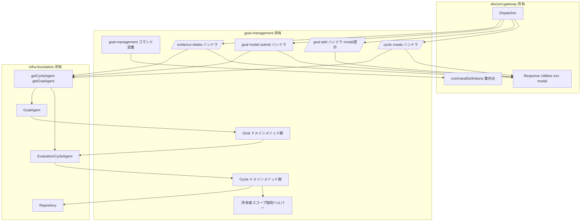
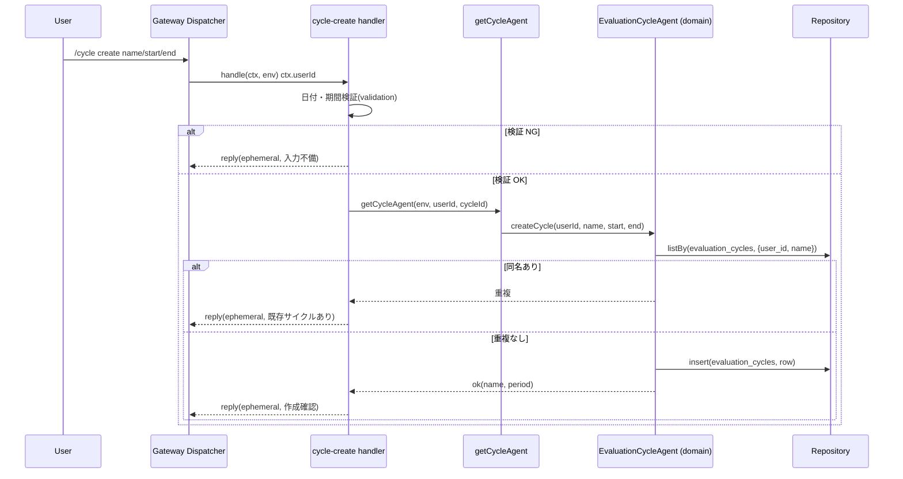
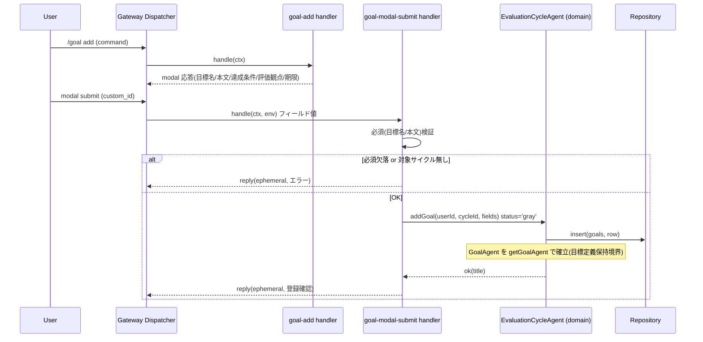
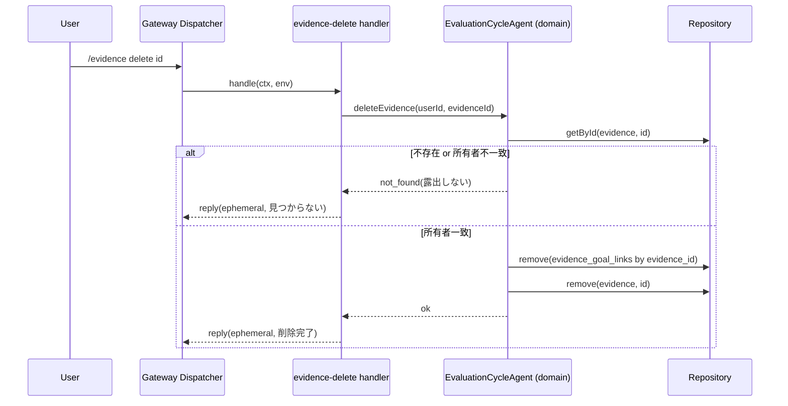

# Design Document: goal-management

## Overview

**Purpose**: 本スペックは評価目標フォロー Agent における「評価サイクル・目標・証跡の定義 CRUD」と「所有者スコープのアクセス制御」を提供する。`/cycle create` による半期サイクル作成、`/goal add`(modal)による目標定義登録、`/evidence delete` による証跡の安全な削除を実装し、後続スペック(checkin-classification / status-and-draft)が参照すべき「定義済みのサイクル・目標・証跡」を確立する。

**Users**: 直接の利用者は半期評価目標を複数持つ個人ユーザー(`/cycle create`・`/goal add`・`/evidence delete` を実行)と、本スペックが保存した定義を参照する後続スペックの実装者である。

**Impact**: グリーンフィールド。infra-foundation が確立した `Repository`・Agent ルーティング・EvaluationCycleAgent/GoalAgent 骨格・共有ドメイン型(§11)と、discord-gateway が確立した interaction ハンドラ登録規約・応答ユーティリティ・コマンド定義集約点の上に、ドメイン CRUD ロジックとコマンド/modal/button ハンドラを追加する。永続化スキーマ・Agent クラス骨格・Discord I/O 規約は再定義せず消費する。

### Goals
- `/cycle create` で所有者スコープの評価サイクルを作成し、EvaluationCycleAgent をデータ権威として確立する。
- `/goal add` の modal で目標定義(目標名・本文・達成条件・評価観点・期限)を受け、目標として保存し GoalAgent を確立する。
- `/evidence delete` で所有者の証跡を、紐づくリンクごと安全に削除する。
- 全 CRUD で実行ユーザーの所有データに限定する所有者スコープ制御を強制する。
- サイクル/目標の定義状態を単一権威(サイクル単位 SQLite)で保持し、後続スペックが取得可能にする。

### Non-Goals
- 雑入力の目標分類・証跡の自動生成(checkin-classification)。
- ステータス判定・評価文ドラフト生成・`/status`・`/goal status`・`/draft`・`/checkin`(checkin-classification / status-and-draft)。
- `/evidence list` 表示・定期通知・アラート(status-and-draft / notifications)。
- `/goal edit`・`/cycle archive`(MVP 任意。本スペック対象外)。
- Discord 署名検証・ディスパッチ規約・応答プロトコル・コマンド登録手段(discord-gateway)。
- 永続化スキーマ DDL・Agent クラス骨格・LLM クライアント(infra-foundation)。

## Boundary Commitments

### This Spec Owns
- コマンド/modal/button ハンドラ: `/cycle create` ハンドラ、`/goal add` ハンドラ(modal 提示)+ goal modal submit ハンドラ、`/evidence delete` ハンドラ。各ハンドラを discord-gateway のレジストリへ登録する規約適合の登録処理。
- コマンド定義の供給: `/cycle create`(name/start/end オプション)・`/goal add`・`/evidence delete`(id オプション)の application command 定義を discord-gateway の集約点へ追加。
- ドメイン CRUD ビジネスロジック: サイクル作成(検証・重複検出・所有者付与)、目標登録(必須検証・サイクル所属検証・初期ステータス gray)、証跡削除(所有者検証・リンク連動削除)。これらを EvaluationCycleAgent / GoalAgent の骨格メソッドに実装する。
- 所有者スコープ制御: 全 read/write で実行ユーザーの `user_id` 一致を強制し、不一致を「存在しない」として扱う規約。
- 定義状態管理: サイクル配下の目標一覧の保持・取得、目標定義の保持・取得(Agent ドメインメソッドとして)。

### Out of Boundary
- 永続化スキーマ DDL・`schema_migrations`・`Repository` の低レベル実装(infra-foundation 所有。本スペックは `Repository` を呼ぶのみ)。
- Agent クラス宣言・ルーティングヘルパー・ID 規約(infra-foundation 所有。本スペックは骨格メソッドの中身を実装し、`getCycleAgent`/`getGoalAgent` を呼ぶのみ)。
- Discord 署名検証・interaction ディスパッチ・modal/button への振り分け機構・応答ボディ生成・コマンド登録スクリプト(discord-gateway 所有。本スペックはハンドラ登録規約と応答ユーティリティを利用)。
- 分類・ステータス判定・ドラフト生成・証跡の自動生成・一覧表示・通知(後続スペック所有)。

### Allowed Dependencies
- infra-foundation 公開契約: `Repository`(insert/getById/listBy/update/remove)、`getCycleAgent`/`getGoalAgent`、共有ドメイン型(`EntityRow<'evaluation_cycles'|'goals'|'evidence'|'evidence_goal_links'>`、`GoalStatus` 等の enum)、`Env`。
- discord-gateway 公開契約: `registerHandler`、`InteractionContext`、`HandlerResult`(reply/ephemeral に加え modal を開く `HandlerResult { mode: "modal"; customId; title; components }` バリアント。Discord interaction response type 9 (MODAL) を発行)、コマンド定義集約点(`commandDefinitions`)。
- Cloudflare Workers ランタイム / DO(Agent 経由)。
- 依存方向: `commands(定義) → handlers → agents(ドメインメソッド) → infra Repository`。ハンドラは Discord 入出力のみ、Agent ドメインメソッドは Repository 経由のデータアクセスのみを扱う。

### Revalidation Triggers
- infra-foundation の `Repository` シグネチャ・§11 スキーマ・共有型・Agent ルーティングヘルパーの変更。
- discord-gateway の `InteractionContext`/`HandlerResult`/`registerHandler`/コマンド定義集約点/応答ユーティリティのシグネチャ変更。特に modal を開く `HandlerResult { mode: "modal", ... }`(type 9 MODAL)契約を discord-gateway が変更した場合に再検証する。
- サイクル/目標/証跡の所有者判定基準・重複判定基準の変更。
- `/cycle create`・`/goal add`・`/evidence delete` のコマンド名・オプション名・custom_id 規約の変更(後続スペックの参照に波及しうる)。

## Architecture

### Architecture Pattern & Boundary Map

採用パターンは「**薄いハンドラ層 + Agent ドメインメソッド**」。ハンドラは discord-gateway から渡る `InteractionContext` を解釈し、infra のルーティングヘルパーで Agent を取得し、Agent のドメインメソッドを呼び、`HandlerResult` を返す薄層に徹する。CRUD のビジネスルール(検証・所有者強制・リンク連動削除)は EvaluationCycleAgent(データ権威)と GoalAgent(目標単位)の骨格メソッドに実装する(research.md の Decision 参照)。



**Architecture Integration**:
- Selected pattern: 薄いハンドラ層 + Agent ドメインメソッド。Discord I/O と CRUD ビジネスロジックを分離し、上流の Agent 責務分担(§6: Cycle=目標一覧/サイクル管理、Goal=目標定義保持)を尊重。
- Domain/feature boundaries: ハンドラは入出力変換のみ、ドメインメソッドは Repository 経由のデータ権威操作のみ。所有者強制はドメイン層に集約。
- New components rationale: 各ハンドラとドメインメソッドは、対応する要件(`/cycle create`・`/goal add`・`/evidence delete`・所有者制御・定義状態管理)に直接対応。投機的抽象は導入しない。
- Steering compliance: roadmap の「ドメイン CRUD は本スペック、スキーマ/Agent/LLM は基盤所有、Discord 規約はゲートウェイ所有」に準拠。プライバシー §15 を所有者強制と ephemeral 応答で満たす。

### Technology Stack

| Layer | Choice / Version | Role in Feature | Notes |
|-------|------------------|-----------------|-------|
| Frontend / CLI | Discord slash command / modal / button(`discord-api-types` 型) | ユーザー入力と確認応答 | 定義は discord-gateway 集約点へ追加 |
| Backend / Services | Cloudflare `agents`(EvaluationCycleAgent / GoalAgent のドメインメソッド) | CRUD ビジネスロジック | infra の骨格メソッドを実装 |
| Data / Storage | Durable Object SQLite(infra `Repository` 経由) | サイクル/目標/証跡定義の永続化 | スキーマは infra §11、本スペックは読み書きのみ |
| Infrastructure / Runtime | Cloudflare Workers | ハンドラ実行 | discord-gateway の dispatch から呼ばれる |
| Language / Build | TypeScript(strict) | 型・ビルド | `any` 禁止。共有型を import |

## File Structure Plan

### Directory Structure
```
src/
└── goal-management/
    ├── commands.ts                 # /cycle create, /goal add, /evidence delete の application command 定義(Req 1.1, 2.1, 3.1)
    ├── register.ts                 # 上記ハンドラを discord-gateway レジストリへ登録 + コマンド定義を集約点へ追加(Req 1.1, 2.1, 3.1, 6.4)
    ├── ownership.ts                # 所有者スコープ強制ヘルパー(user_id 一致検証、不一致=不存在扱い)(Req 4.1-4.4)
    ├── validation.ts              # 入力検証: 日付パース/期間整合、目標必須項目、ID 形式(Req 1.4, 2.5)
    ├── handlers/
    │   ├── cycle-create.ts        # /cycle create コマンドハンドラ(即時 ephemeral 応答)(Req 1.1-1.6)
    │   ├── goal-add.ts            # /goal add コマンドハンドラ(modal を開く応答)(Req 2.1)
    │   ├── goal-modal-submit.ts   # goal modal submit ハンドラ(目標保存・確認応答)(Req 2.2-2.8)
    │   └── evidence-delete.ts     # /evidence delete コマンドハンドラ(削除・確認応答)(Req 3.1-3.5)
    └── domain/
        ├── cycle-operations.ts    # EvaluationCycleAgent のドメインメソッド: サイクル作成/重複検出/目標登録/目標一覧・取得/証跡削除+リンク連動(Req 1.1,1.2,1.5,2.2,2.6,2.8,3.1,3.2,5.1,5.2,5.3)
        └── goal-operations.ts     # GoalAgent のドメインメソッド: 目標定義保持/取得(親 Cycle へ委譲)(Req 2.3,5.2,5.3)
```

### Modified Files
- `src/agents/evaluation-cycle-agent.ts`(infra 所有の骨格)— 本スペックは骨格が宣言する責務メソッドの中身を `domain/cycle-operations.ts` の実装で埋める(クラス宣言・ルーティング・onStart は変更しない)。
- `src/agents/goal-agent.ts`(infra 所有の骨格)— 同様に目標定義保持/取得メソッドの中身を `domain/goal-operations.ts` で埋める。
- `src/discord/commands/definitions.ts`(discord-gateway 所有の集約点)— `register.ts` 経由で goal-management のコマンド定義を集約配列へ追加(配列への追加のみ、機構は変更しない)。

> 依存方向: `commands.ts` → `register.ts` → `handlers/*` → `domain/*` → infra `Repository`。`ownership.ts`/`validation.ts` は handlers/domain から参照される横断ヘルパー。各層は左方向のみ import する。

## System Flows

### `/cycle create` フロー(即時応答)

LLM 非依存のため deferred は使わず、初期応答(type4 ephemeral)で完結する。

### `/goal add` フロー(modal → submit)

対象サイクルの特定: 実行ユーザーが所有するアクティブな(最新の)サイクルを対象とする。サイクル未作成時はエラー応答(Req 2.6)。

### `/evidence delete` フロー

所有者不一致と不存在は同一の「見つからない」応答に正規化し、他ユーザーデータの存在を露出しない(Req 3.4, 4.2)。

## Requirements Traceability

| Requirement | Summary | Components | Interfaces | Flows |
|-------------|---------|------------|------------|-------|
| 1.1, 1.6 | `/cycle create` 受付・ephemeral 応答 | commands.ts, handlers/cycle-create.ts, register.ts | `CycleCreateHandler` | cycle create |
| 1.2 | EvaluationCycleAgent 確立 | handlers/cycle-create.ts, domain/cycle-operations.ts | `getCycleAgent`, `createCycle` | cycle create |
| 1.3 | 作成確認(name/期間)応答 | handlers/cycle-create.ts | `CycleCreateHandler` | cycle create |
| 1.4 | 日付/期間検証エラー | validation.ts, handlers/cycle-create.ts | `validateCyclePeriod` | cycle create |
| 1.5 | 同名重複検出 | domain/cycle-operations.ts | `createCycle` | cycle create |
| 2.1 | `/goal add` modal 提示 | commands.ts, handlers/goal-add.ts, register.ts | `GoalAddHandler` | goal add |
| 2.2, 2.4 | 目標保存(複数行 達成条件/評価観点) | handlers/goal-modal-submit.ts, domain/cycle-operations.ts | `addGoal` | goal add |
| 2.3 | GoalAgent 確立 | handlers/goal-modal-submit.ts, domain/goal-operations.ts | `getGoalAgent` | goal add |
| 2.5 | 必須項目検証 | validation.ts, handlers/goal-modal-submit.ts | `validateGoalFields` | goal add |
| 2.6 | サイクル不存在エラー | domain/cycle-operations.ts, handlers/goal-modal-submit.ts | `addGoal` | goal add |
| 2.7 | 登録確認(ephemeral)応答 | handlers/goal-modal-submit.ts | `GoalModalSubmitHandler` | goal add |
| 2.8 | 初期ステータス gray | domain/cycle-operations.ts | `addGoal` | goal add |
| 3.1, 3.5 | `/evidence delete` 受付・削除確認 | commands.ts, handlers/evidence-delete.ts, register.ts | `EvidenceDeleteHandler` | evidence delete |
| 3.2 | リンク連動削除 | domain/cycle-operations.ts | `deleteEvidence` | evidence delete |
| 3.3 | ID 不存在エラー | domain/cycle-operations.ts | `deleteEvidence` | evidence delete |
| 3.4 | 所有者不一致=不存在扱い | ownership.ts, domain/cycle-operations.ts | `assertOwned` | evidence delete |
| 4.1, 4.2 | 所有者スコープ強制・露出防止 | ownership.ts, domain/* | `assertOwned`, `scopedListBy` | all |
| 4.3 | 所有者識別子付与 | domain/cycle-operations.ts | `createCycle`, `addGoal` | cycle/goal |
| 4.4 | ephemeral 限定応答 | handlers/* | `HandlerResult` (ephemeral) | all |
| 5.1, 5.2 | 目標一覧/定義 保持・取得 | domain/cycle-operations.ts, domain/goal-operations.ts | `listGoals`, `getGoal` | — |
| 5.3 | 単一権威への反映 | domain/cycle-operations.ts, domain/goal-operations.ts | (Repository 委譲) | — |
| 5.4 | スキーマ再定義せず消費 | domain/* | `Repository` | — |
| 6.1, 6.2, 6.3, 6.4 | 境界維持 | (Boundary Commitments) | — | — |

## Components and Interfaces

| Component | Domain/Layer | Intent | Req Coverage | Key Dependencies (P0/P1) | Contracts |
|-----------|--------------|--------|--------------|--------------------------|-----------|
| Command Definitions + Register | commands | コマンド定義供給とハンドラ登録 | 1.1, 2.1, 3.1, 6.4 | discord-gateway registry/definitions (P0) | Service |
| Cycle Create Handler | handlers | `/cycle create` 入出力 | 1.1, 1.3, 1.4, 1.6 | validation (P0), getCycleAgent (P0), response (P0) | Service |
| Goal Add / Modal Submit Handlers | handlers | modal 提示と目標保存 | 2.1-2.8, 4.4 | validation (P0), getCycleAgent/getGoalAgent (P0), response (P0) | Service |
| Evidence Delete Handler | handlers | `/evidence delete` 入出力 | 3.1, 3.3, 3.4, 3.5, 4.4 | getCycleAgent (P0), response (P0) | Service |
| Cycle Domain Operations | domain | サイクル/目標/証跡 CRUD ビジネスロジック | 1.2, 1.5, 2.2, 2.6, 2.8, 3.1, 3.2, 5.1, 5.3 | Repository (P0), ownership (P0) | Service |
| Goal Domain Operations | domain | 目標定義保持/取得(親委譲) | 2.3, 5.2, 5.3 | EvaluationCycleAgent (P0) | Service |
| Ownership Scope Helper | shared | 所有者一致強制・不存在扱い | 4.1, 4.2, 4.3, 4.4, 3.4 | Repository types (P1) | Service |
| Input Validation | shared | 日付/期間/必須/ID 検証 | 1.4, 2.5 | — | Service |

### handlers

#### Cycle Create / Goal Add+Submit / Evidence Delete Handlers

| Field | Detail |
|-------|--------|
| Intent | discord-gateway 規約に従い、入力解釈→ドメイン呼び出し→応答整形を行う薄層 |
| Requirements | 1.1, 1.3, 1.4, 1.6, 2.1-2.8, 3.1, 3.3, 3.4, 3.5, 4.4 |

**Responsibilities & Constraints**
- `InteractionContext` から `userId`・コマンド引数 / modal フィールド / custom_id を取り出す。
- 入力検証(`validation.ts`)を通し、不備は ephemeral エラー応答。
- `getCycleAgent`/`getGoalAgent` で Agent を取得し、ドメインメソッドを呼ぶ。
- 結果を `HandlerResult`(`reply`、`ephemeral: true`)へ整形。`/goal add` のみ modal を開く応答を返す。
- ビジネスルール(重複検出・所有者強制・連動削除)はハンドラに持たず、ドメイン層へ委譲する。

**Dependencies**
- Inbound: discord-gateway Dispatcher — `handle(ctx, env)` 呼び出し(P0)
- Outbound: Cycle/Goal Domain Operations(P0)、Input Validation(P0)、Response Utilities(modal 含む)(P0)
- External: `getCycleAgent`/`getGoalAgent`(infra)(P0)

**Contracts**: Service [x]

##### Service Interface
```typescript
import type { InteractionContext, HandlerResult } from "../discord/types";
import type { Env } from "../env";

// /cycle create
interface CycleCreateHandler {
  handle(ctx: InteractionContext, env: Env): Promise<HandlerResult>;
}
// /goal add: modal を開く応答を返す
interface GoalAddHandler {
  handle(ctx: InteractionContext, env: Env): HandlerResult; // HandlerResult { mode: "modal", customId, title, components }(type 9 MODAL)
}
// goal modal submit
interface GoalModalSubmitHandler {
  handle(ctx: InteractionContext, env: Env): Promise<HandlerResult>;
}
// /evidence delete
interface EvidenceDeleteHandler {
  handle(ctx: InteractionContext, env: Env): Promise<HandlerResult>;
}
```
- Preconditions: `ctx` は署名検証済み・種別判定済みで、`ctx.userId` が供給されている(discord-gateway 保証)。
- Postconditions: 個人評価データを含む応答は ephemeral(Req 4.4)。
- Invariants: ハンドラはビジネスルールを持たず、所有者強制はドメイン層に委譲。

**Implementation Notes**
- Integration: `register.ts` が `registerHandler('command','cycle create',...)`、`registerHandler('command','goal add',...)`、`registerHandler('modal', GOAL_MODAL_ID, ...)`、`registerHandler('command','evidence delete',...)` を呼ぶ。custom_id 規約(goal modal の `GOAL_MODAL_ID`)は本スペックが定義。
- Validation: 日付・必須・ID は `validation.ts`。
- Modal 応答: `GoalAddHandler` は discord-gateway が提供する `HandlerResult { mode: "modal", customId, title, components }`(Discord interaction response type 9 (MODAL) を発行)を返す。この契約は discord-gateway により提供済みの満たされた依存であり、リスクではない。discord-gateway がこの modal-open 契約を変更した場合のみ revalidation trigger としてゲートウェイへ差し戻す。

### domain

#### Cycle Domain Operations(EvaluationCycleAgent メソッド実装)

| Field | Detail |
|-------|--------|
| Intent | サイクル/目標/証跡の CRUD ビジネスルールをデータ権威上で実装 |
| Requirements | 1.2, 1.5, 2.2, 2.6, 2.8, 3.1, 3.2, 5.1, 5.3 |

**Responsibilities & Constraints**
- `createCycle`: 所有者付与・重複(同一ユーザー内 name 一致)検出・`Repository.insert`。
- `addGoal`: 対象サイクル存在検証・必須前提・初期 `status='gray'`・`Repository.insert`。
- `listGoals` / `getGoal`: 所有者スコープ内の目標取得。
- `deleteEvidence`: 所有者検証(不一致/不存在を同一視)→ `evidence_goal_links` 連動削除 → `evidence` 削除。
- すべて `Repository` 経由で単一権威(サイクル単位 SQLite)へ反映。所有者強制は `ownership.ts` を用いる。

**Dependencies**
- Inbound: handlers / GoalAgent(委譲)(P0)
- Outbound: infra `Repository`(P0)、Ownership Scope Helper(P0)
- External: 共有ドメイン型(`EntityRow<...>`、`GoalStatus`)(P1)

**Contracts**: Service [x]

##### Service Interface
```typescript
import type { EntityRow } from "../persistence/repository";

type CreateCycleResult =
  | { ok: true; cycle: EntityRow<"evaluation_cycles"> }
  | { ok: false; reason: "duplicate" | "invalid_period" };

type AddGoalResult =
  | { ok: true; goal: EntityRow<"goals"> }
  | { ok: false; reason: "no_cycle" | "missing_fields" };

type DeleteEvidenceResult =
  | { ok: true }
  | { ok: false; reason: "not_found" }; // 所有者不一致も not_found に正規化

interface CycleDomainOperations {
  createCycle(userId: string, name: string, startDate: string, endDate: string): CreateCycleResult;
  addGoal(userId: string, cycleId: string, fields: GoalInput): AddGoalResult;
  listGoals(userId: string, cycleId: string): EntityRow<"goals">[];
  getGoal(userId: string, cycleId: string, goalId: string): EntityRow<"goals"> | null;
  deleteEvidence(userId: string, evidenceId: string): DeleteEvidenceResult;
}

interface GoalInput {
  title: string;
  description: string;
  successCriteria: string | null;   // 複数行 TEXT
  evaluationPoints: string | null;  // 複数行 TEXT
  dueDate: string | null;           // 期限。MVP は §11.2 `goals` に専用列が無いため `evaluation_points` テキストへ畳み込んで保持(Data Models 参照)。専用列・マイルストーン化は将来拡張
}
```
- Preconditions: マイグレーション適用済み(infra `onStart`)。`userId` は実行ユーザー。
- Postconditions: 書き込みは単一権威に反映。`deleteEvidence` はリンクを残さない(Req 3.2)。
- Invariants: 全操作で `user_id` 一致を強制し、不一致は不存在として扱う(Req 4.1, 4.2)。`goals.status` 既定 `'gray'`(Req 2.8)。

**Implementation Notes**
- Integration: EvaluationCycleAgent の骨格メソッドの実体としてこれらを実装(infra 骨格を変更せず中身を埋める)。
- Validation: 列挙(`status`)は共有 enum で保証。期間整合はハンドラ側 `validation.ts` で事前検証(Req 1.4)。
- dueDate 永続化: 期限(`dueDate`)は §11.2 `goals` に専用列がない。MVP では infra 所有の §11 スキーマを変更せず、`addGoal` が `dueDate` を既存の `evaluation_points` テキスト末尾へ畳み込んで永続化する(Data Models で確定)。専用 `goals.due_date` 列の追加・マイルストーン化は将来拡張(その場合のみ infra-foundation §11 への拡張が必要)。
- Note: 「対象サイクル」は実行ユーザーが所有する最新サイクル(`evaluation_cycles` を `user_id` で取得し最も新しいもの)。

#### Goal Domain Operations(GoalAgent メソッド実装)

| Field | Detail |
|-------|--------|
| Intent | 目標単位の定義保持/取得。データは親 Cycle Agent へ委譲 |
| Requirements | 2.3, 5.2, 5.3 |

**Responsibilities & Constraints**
- GoalAgent はステートレス。目標定義の保持/取得要求を親 EvaluationCycleAgent の `getGoal`/`addGoal` へ RPC 委譲する。
- 自前のスキーマ/権威を持たない(infra のデータ権威方針)。

**Dependencies**
- Inbound: handlers(目標確立時)(P0)
- Outbound: EvaluationCycleAgent(委譲)(P0)

**Contracts**: Service [x]

##### Service Interface
```typescript
interface GoalDomainOperations {
  getDefinition(): EntityRow<"goals"> | null; // 親 Cycle の getGoal へ委譲
}
```
- Postconditions: 取得結果は親権威と一致。
- Invariants: GoalAgent は書き込み権威を持たない。

### shared

#### Ownership Scope Helper / Input Validation

| Field | Detail |
|-------|--------|
| Intent | 所有者一致強制(不一致=不存在)と入力検証 |
| Requirements | 4.1, 4.2, 4.3, 4.4, 3.4, 1.4, 2.5 |

**Contracts**: Service [x]

##### Service Interface
```typescript
// ownership.ts
function assertOwned<E extends "evaluation_cycles" | "goals" | "evidence">(
  row: EntityRow<E> | null, userId: string,
): EntityRow<E> | null; // user_id 不一致なら null(不存在扱い)

// validation.ts
type PeriodCheck = { ok: true } | { ok: false; reason: "invalid_date" | "end_before_start" };
function validateCyclePeriod(start: string, end: string): PeriodCheck;

type GoalFieldsCheck = { ok: true } | { ok: false; missing: string[] };
function validateGoalFields(title: string, description: string): GoalFieldsCheck;
```
- Preconditions: `row` は Repository 取得行または null。
- Postconditions: `assertOwned` は所有者でなければ null を返し、呼び出し側が「見つからない」へ正規化(Req 3.4, 4.2)。
- Invariants: 他ユーザーデータの存在を応答へ露出しない。

## Data Models

### Domain Model
- 本スペックは infra-foundation §11 の `evaluation_cycles` / `goals` / `evidence` / `evidence_goal_links` を読み書きする。新規エンティティ・新規列は導入しない(Req 5.4)。
- 集約: EvaluationCycle が権威。Goal は Cycle に属し、Evidence は Cycle に属し EvidenceGoalLink で Goal と N:N。証跡削除時はリンクを連動削除(Req 3.2)。
- 不変条件: `goals.status` は `GoalStatus` enum(既定 `'gray'`)。全行に `user_id`(所有者)を付与(Req 4.3)。
- **期限(`dueDate`)の永続化(MVP 確定)**: `GoalInput.dueDate` は modal/ドメイン契約に存在するが、§11.2 `goals` には専用列が無い。infra-foundation が §11 スキーマを所有するため本スペックでは列を追加せず、MVP では `dueDate` を既存の `evaluation_points` テキスト列へ畳み込んで保持する(例: 評価観点本文に「期限: YYYY-MM-DD」を付記)。専用 `goals.due_date` 列は MVP では導入しない。将来、期限の構造化検索・マイルストーン化が必要になった時点で infra-foundation §11 への列追加を別途依頼する(本スペックでは列を追加しない)。

### Physical Data Model (DO SQLite)
infra-foundation が定義済みの §11 スキーマをそのまま利用する(本スペックは DDL を所有しない)。本スペックが操作する主な列:

| Table | 本スペックの操作 | 関連列 |
|-------|------------------|--------|
| evaluation_cycles | insert / listBy(user_id, name) | id, user_id, name, start_date, end_date, created_at, updated_at |
| goals | insert / listBy(cycle_id, user_id) / getById | id, cycle_id, user_id, title, description, success_criteria, evaluation_points(`dueDate` を畳み込んで保持), status(既定 gray), created_at, updated_at |
| evidence | getById / remove | id, user_id, cycle_id |
| evidence_goal_links | listBy(evidence_id) / remove | id, evidence_id, goal_id |

### Data Contracts & Integration
- 共有型は infra の `src/types/` から import(`EntityRow<E>`、`GoalStatus`)。本スペックは型を再定義しない(Req 5.4)。
- コマンド定義は `discord-api-types` の application command 形で `commands.ts` に定義し、`register.ts` 経由で discord-gateway の `commandDefinitions` 集約配列へ追加。
- modal フィールドの custom_id・goal modal の custom_id(`GOAL_MODAL_ID`)は本スペックが定義し、modal submit ハンドラの照合キーとする。

## Error Handling

### Error Strategy
- 入力検証(日付/期間/必須)は書き込み前にハンドラで実施し、ephemeral エラー応答(Req 1.4, 2.5)。
- ドメイン操作は例外を投げず判別可能な結果型(`duplicate`/`no_cycle`/`missing_fields`/`not_found`)を返し、ハンドラが文言へ整形。
- 所有者不一致・不存在は `not_found` に正規化し、他ユーザーデータを露出しない(Req 3.3, 3.4, 4.2)。

### Error Categories and Responses
- User Errors: 不正な日付/期間・必須欠落・存在しない/非所有の証跡 ID → ephemeral でユーザー向けガイダンス。
- System Errors: Repository/DO 例外は infra ポリシーに従い伝播(本スペックでラップしない)。
- Business Logic Errors: サイクル名重複(Req 1.5)・対象サイクル不存在(Req 2.6)→ 状態を説明する ephemeral 応答。

### Monitoring
- Workers ログ(`console`)へ検証失敗・重複・not_found を記録(steering baseline 準拠)。本スペック固有の追加監視要件はない。

## Testing Strategy

### Unit Tests
- `validateCyclePeriod`: 不正日付で `invalid_date`、終了<開始で `end_before_start`、正常で `ok`(1.4)。
- `validateGoalFields`: 目標名/本文の欠落で不足項目を返す(2.5)。
- `createCycle`: 所有者付与・同名重複で `duplicate`・正常 insert(1.2, 1.5, 4.3)。
- `addGoal`: 対象サイクル無しで `no_cycle`、保存時 `status='gray'`・複数行 達成条件/評価観点保持(2.2, 2.4, 2.6, 2.8)。
- `deleteEvidence`: 不存在で `not_found`、非所有で `not_found`(露出しない)、所有時にリンク連動削除→証跡削除(3.2, 3.3, 3.4)。
- `assertOwned`: user_id 不一致で null(4.1, 4.2)。

### Integration Tests
- `/cycle create` ハンドラ: 検証 OK で EvaluationCycleAgent が確立されサイクルが永続化、ephemeral 確認応答が返る(1.1, 1.2, 1.3, 1.6)。
- `/goal add` → modal submit: modal 応答が返り、submit で目標が対象サイクルに保存され GoalAgent が確立、ephemeral 確認応答(2.1, 2.2, 2.3, 2.7)。
- `/evidence delete`: 所有証跡がリンクごと削除され削除確認、非所有/不存在で「見つからない」応答(3.1, 3.2, 3.4, 3.5)。
- 所有者スコープ: 他ユーザー所有のサイクル/目標/証跡を対象とする操作が不存在として扱われ、データが露出しない(4.1, 4.2)。
- 定義取得: 同一サイクルの目標一覧・各目標定義が所有者スコープ内で取得できる(5.1, 5.2, 5.3)。

### E2E / Smoke Tests
- 登録後、`/cycle create` → `/goal add`(複数)→ `listGoals` で登録目標が単一権威に揃うこと(5.1, 5.3)。
- コマンド定義が discord-gateway の集約点へ追加され、登録対象に含まれること(1.1, 2.1, 3.1, 6.4)。

## Security Considerations
- プライバシー(§15、Req 4): 全 CRUD で所有者(`user_id`)一致を強制。Agent 名に `userId` を含む構造的分離(infra)に加え、行レベルの `assertOwned` で二重防御。所有者不一致・不存在を同一応答に正規化し、他ユーザーデータの存在を露出しない。
- 応答はすべて ephemeral(または DM/個人用非公開チャンネル文脈)に限定し、個人の評価データを公開文脈へ出さない(Req 4.4)。
- 削除コマンド(`/evidence delete`)を提供し、§15 の「削除コマンドを用意」を満たす。
- 評価データは平文で DO SQLite に保持(infra 設計準拠、暗号化は MVP スコープ外)。
