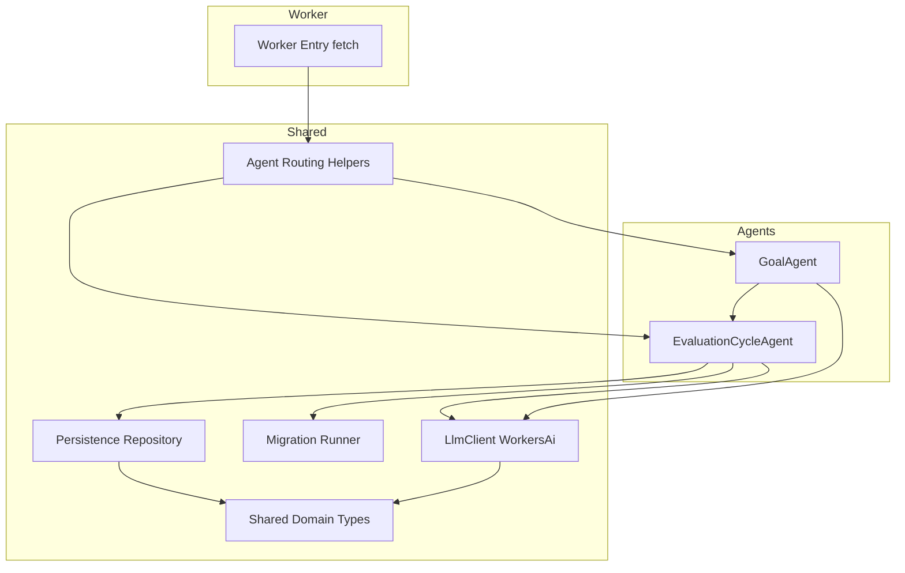
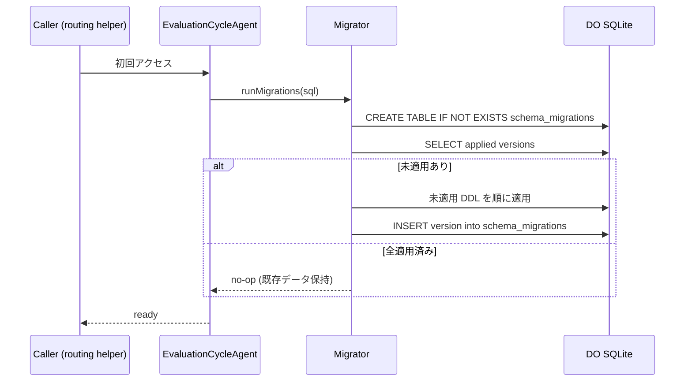
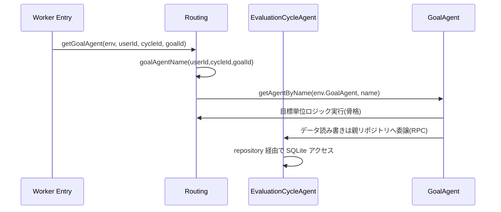
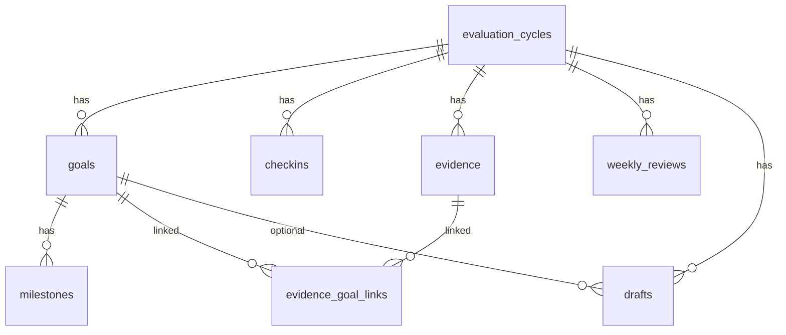

# Design Document: infra-foundation

## Overview

**Purpose**: 本スペックは評価目標フォロー Agent の全機能スペックが共有する実行基盤を提供する。デプロイ可能な Cloudflare Worker + Agents SDK プロジェクト雛形、仕様書 §11 全テーブルの永続化スキーマとマイグレーション、Agent トポロジ(EvaluationCycleAgent / GoalAgent)の骨格と ID ルーティング、差し替え可能な LLM 抽象化レイヤ、共有ドメイン型を一箇所に確立する。

**Users**: 直接の利用者は下位スペック(discord-gateway, goal-management, checkin-classification, status-and-draft, notifications)の実装者と、Worker をデプロイ・運用する運用者である。本基盤はエンドユーザー向け機能を持たず、それらが乗る土台のみを提供する。

**Impact**: グリーンフィールドのため既存システムへの変更はない。本スペックが確立する型・スキーマ・Agent 骨格・LLM 契約が、以降の全スペックの共通依存基盤となる。

### Goals
- `wrangler` で型チェック・ローカル起動・デプロイ可能なプロジェクト雛形を確立する。
- 仕様書 §11 の全 8 テーブルを冪等マイグレーションとして定義・適用する。
- §6 の ID 規約に基づく Agent 取得/ルーティングヘルパーと 2 Agent の責務骨格を確立する。
- プロバイダ差し替え可能な `LlmClient` 抽象化と Workers AI 実装を提供する。
- 全スペックが単一参照元から import できる共有ドメイン型を提供する。

### Non-Goals
- slash command の検証・ルーティング・UX 文言(discord-gateway)。
- サイクル/目標/証跡のドメイン CRUD ビジネスロジック(goal-management)。
- チェックイン分類・ステータス判定・評価文生成の各プロンプト本体と機能固有の構造化出力スキーマ(各機能スペック)。
- 定期通知のスケジュールロジック(notifications)。

## Boundary Commitments

### This Spec Owns
- プロジェクト雛形: `wrangler` 設定、TypeScript 設定、Worker エントリーポイント、ビルド/型チェック/ローカル開発の手順。
- 永続化スキーマ: 仕様書 §11 全テーブルの DDL、`schema_migrations` 台帳、冪等マイグレーションランナー、低レベルなリポジトリアクセス(型付き行アクセス)。
- Agent トポロジ: `EvaluationCycleAgent` / `GoalAgent` クラスの骨格(責務境界を示すメソッドシグネチャと状態保持の枠)、ID 文字列の組立/分解、Agent 取得ルーティングヘルパー。
- LLM 抽象化: `LlmClient` インターフェイス、`WorkersAiLlmClient` 実装、`createLlmClient(env)` ファクトリ、LLM エラー型。
- 共有ドメイン型: §11 エンティティ型、列挙値型、§13 共通基本型(関連度スコア・ステータス・有用度等)。

### Out of Boundary
- Discord interactions の Ed25519 署名検証・PING/PONG・コマンドルーティング(discord-gateway)。
- サイクル/目標/証跡の作成・更新・削除のビジネスルール(goal-management)。
- 機能固有の LLM プロンプト本文と機能固有の構造化出力スキーマ(checkin-classification / status-and-draft)。
- 週次通知・アラートのスケジューリングと判定ロジック(notifications)。
- ステータス判定ルール本体(§10)・分類スコアリングのプロンプト(§13.1)・評価文生成プロンプト(§13.3)。

### Allowed Dependencies
- Cloudflare `agents` パッケージ(`@cloudflare/agents` は使用しない)。
- Cloudflare Workers ランタイムと Durable Object SQLite(`this.sql`)。
- Workers AI バインディング(`env.AI`)。
- TypeScript / `wrangler` ツールチェーン。
- 依存方向の制約: `types → config → persistence → llm → agents → worker entry`。各層は左方向のみを import し、上位を import しない。

### Revalidation Triggers
- 共有型・`LlmClient` インターフェイス・ルーティングヘルパーのシグネチャ変更。
- §11 スキーマ(テーブル/カラム/列挙値)の変更・追加。
- Agent ID 規約の変更、または Agent トポロジ(どちらの Agent がデータ権威か)の変更。
- Durable Object バインディング名・Workers AI バインディング名の変更。
- マイグレーションランナーの起動契約(`onStart` での適用タイミング)の変更。

## Architecture

### Architecture Pattern & Boundary Map

採用パターンはレイヤード(依存方向固定)+ Agent トポロジは「**EvaluationCycleAgent をデータ権威**、GoalAgent を目標単位ロジックの論理 Agent」とするハイブリッド(research.md の Decision 参照)。



**Architecture Integration**:
- Selected pattern: レイヤード + Agent ハイブリッド。EvaluationCycleAgent のサイクル単位 SQLite が §11 全テーブルの単一権威。GoalAgent は目標単位ロジックの責務境界を持ち、データは親 Agent のリポジトリへ RPC 委譲する。
- Domain/feature boundaries: 永続化・LLM・ルーティング・型を `shared` 層に集約し、各機能スペックが再定義せず import する。Agent クラスは骨格のみで、ドメインロジックは下位スペックが埋める。
- New components rationale: 全コンポーネントは基盤として全下位スペックが依存するために必要。投機的抽象は導入しない。
- Steering compliance: roadmap の「データモデル/スキーマは基盤が単独所有」「LLM 抽象化レイヤを基盤が提供」「Agent トポロジは design で確定」に準拠。

### Technology Stack

| Layer | Choice / Version | Role in Feature | Notes |
|-------|------------------|-----------------|-------|
| Backend / Services | Cloudflare `agents`(`agents` パッケージ) | Agent 基底クラス・`this.sql`・ルーティング | `@cloudflare/agents` は非推奨のため不使用 |
| Data / Storage | Durable Object SQLite(`this.sql`) | §11 全テーブルの永続化 | EvaluationCycleAgent の DO が権威 |
| AI / LLM | Cloudflare Workers AI(`env.AI`) | `LlmClient` の初期実装 | モデル ID はファクトリで集約・差し替え可能 |
| Infrastructure / Runtime | Cloudflare Workers + `wrangler` | エントリーポイント・デプロイ・DO/AI バインディング | `migrations.new_sqlite_classes` で Agent を SQLite 対応宣言 |
| Language / Build | TypeScript(strict) | 型・ビルド | `any` 禁止 |

## File Structure Plan

### Directory Structure
```
.
├── wrangler.jsonc              # Worker 名・main・DO バインディング・migrations・ai バインディング
├── package.json                # agents/wrangler/typescript 依存とスクリプト(dev/typecheck/deploy)
├── tsconfig.json               # strict TypeScript 設定
├── README.md                   # ローカル開発・型チェック・デプロイ手順(Req 1.5)
└── src/
    ├── index.ts                # Worker エントリーポイント。ルーティングヘルパーへ委譲(Req 1.2, 1.3)
    ├── env.ts                  # Env 型(AI / DO バインディング)定義(Req 1.4)
    ├── types/
    │   ├── domain.ts           # §11 エンティティ共有型(Req 5.1, 5.2)
    │   ├── enums.ts            # 列挙値型: GoalStatus/MilestoneStatus/SourceType/Usefulness/DraftType(Req 2.5, 5.1)
    │   └── llm-shared.ts       # §13 共通基本型: RelevanceScore 等(Req 5.3)
    ├── persistence/
    │   ├── schema.ts           # §11 全テーブル DDL 定義(Req 2.1, 2.4, 2.5)
    │   ├── migrations.ts       # 順序付きマイグレーション配列 + schema_migrations 台帳(Req 2.1)
    │   ├── migrator.ts         # 冪等マイグレーションランナー(Req 2.2, 2.3)
    │   └── repository.ts       # 型付き行アクセス(this.sql ラッパ)。エンティティ単位の低レベル read/write
    ├── llm/
    │   ├── client.ts           # LlmClient インターフェイス(completeJson は zod スキーマ引数) + LlmError 型(Req 4.1, 4.5)
    │   ├── workers-ai.ts       # WorkersAiLlmClient 実装。JSON.parse → schema.safeParse 検証(Req 4.2, 4.3, 4.5)
    │   └── factory.ts          # createLlmClient(env): プロバイダ/モデル差し替え集約(Req 4.4)
    └── agents/
        ├── ids.ts              # ID 組立/分解: cycleAgentName/goalAgentName/parse(Req 3.2)
        ├── routing.ts          # getCycleAgent/getGoalAgent ルーティングヘルパー(Req 3.3, 3.4, 3.6)
        ├── evaluation-cycle-agent.ts  # EvaluationCycleAgent 骨格。onStart で migrate。リポジトリ権威(Req 3.1, 3.5)
        └── goal-agent.ts       # GoalAgent 骨格。目標単位ロジック境界。親へデータ委譲(Req 3.1, 3.5)
```

### Modified Files
- なし(グリーンフィールド)。

> 依存方向: `types` → `env`/`config` → `persistence` → `llm` → `agents` → `index.ts`。各層は左方向のみ import する。

## System Flows

### スキーマ初期化フロー(冪等マイグレーション)

適用は version 台帳で未適用分のみ実行し、再起動・再初期化で重複しない(Req 2.2, 2.3)。

### Agent ルーティングと委譲フロー


## Requirements Traceability

| Requirement | Summary | Components | Interfaces | Flows |
|-------------|---------|------------|------------|-------|
| 1.1, 1.2, 1.3, 1.4 | デプロイ可能な雛形 | Worker Entry, env.ts, wrangler.jsonc | `fetch`, `Env` | ルーティング |
| 1.5 | 開発者手順 | README.md | — | — |
| 2.1, 2.4, 2.5 | §11 全テーブル DDL/制約/列挙 | schema.ts, enums.ts | `TableSchema` | — |
| 2.2, 2.3 | 冪等マイグレーション | migrator.ts, migrations.ts | `runMigrations` | スキーマ初期化 |
| 3.1, 3.5 | 2 Agent 骨格と責務 | evaluation-cycle-agent.ts, goal-agent.ts | Agent メソッド骨格 | 委譲 |
| 3.2 | ID 規約 | ids.ts | `cycleAgentName`, `goalAgentName`, `parseAgentName` | — |
| 3.3, 3.4, 3.6 | ルーティングヘルパー | routing.ts | `getCycleAgent`, `getGoalAgent` | ルーティング |
| 4.1, 4.5 | LLM インターフェイス/エラー | client.ts | `LlmClient`, `LlmError` | — |
| 4.2, 4.3 | Workers AI 実装 | workers-ai.ts | `WorkersAiLlmClient` | — |
| 4.4 | 差し替え集約 | factory.ts | `createLlmClient` | — |
| 5.1, 5.2 | 共有エンティティ型 | domain.ts, enums.ts | エンティティ型 | — |
| 5.3 | §13 共通基本型 | llm-shared.ts | 基本型 | — |
| 5.4 | 単一参照元 | types/ | index re-export | — |
| 6.1, 6.2, 6.3, 6.4 | 境界維持 | (Boundary Commitments) | — | — |

## Components and Interfaces

| Component | Domain/Layer | Intent | Req Coverage | Key Dependencies (P0/P1) | Contracts |
|-----------|--------------|--------|--------------|--------------------------|-----------|
| Shared Domain Types | types | §11/§13 型を単一参照元として公開 | 5.1, 5.2, 5.3, 5.4, 2.5 | — | State |
| Persistence Schema + Migrator | persistence | §11 DDL と冪等適用 | 2.1, 2.2, 2.3, 2.4, 2.5 | types (P0), this.sql (P0) | Service, Batch |
| Repository | persistence | 型付き行アクセス | 2.1, 2.4 | schema (P0), types (P0) | Service |
| LlmClient + WorkersAi + Factory | llm | 差し替え可能 LLM 抽象化 | 4.1, 4.2, 4.3, 4.4, 4.5 | env.AI (P0), types (P1) | Service |
| Agent IDs + Routing | agents | §6 ID 規約と Agent 取得 | 3.2, 3.3, 3.4, 3.6 | agents pkg (P0) | Service |
| EvaluationCycleAgent / GoalAgent | agents | 責務骨格・データ権威/委譲 | 3.1, 3.5 | Repository (P0), Migrator (P0), LlmClient (P1) | State, Service |
| Worker Entry + Env | worker | エントリーと型付き Env | 1.1, 1.2, 1.3, 1.4 | routing (P0) | API |

### persistence

#### Persistence Schema + Migrator

| Field | Detail |
|-------|--------|
| Intent | §11 全テーブルを定義し、冪等に適用する |
| Requirements | 2.1, 2.2, 2.3, 2.4, 2.5 |

**Responsibilities & Constraints**
- §11 の 8 テーブルすべての DDL を保持(`CREATE TABLE IF NOT EXISTS`、型・NOT NULL・既定値を §11 通り)。
- `schema_migrations` 台帳で適用済み version を管理。未適用分のみ順に適用。
- 再初期化で重複適用やデータ消失を起こさない。
- データ権威は EvaluationCycleAgent の DO SQLite。GoalAgent は自前にスキーマを持たない。

**Dependencies**
- Inbound: EvaluationCycleAgent.onStart — マイグレーション起動(P0)
- Outbound: Shared Domain Types — 行型(P0)
- External: `this.sql`(DO SQLite)— DDL/DML 実行(P0)

**Contracts**: Service [x] / Batch [x]

##### Service Interface
```typescript
type SqlExecutor = <Row = Record<string, unknown>>(
  strings: TemplateStringsArray,
  ...values: (string | number | null)[]
) => Row[];

interface Migration {
  version: number;
  statements: string[];
}

interface Migrator {
  runMigrations(sql: SqlExecutor): void;
}
```
- Preconditions: `sql` は対象 DO の `this.sql` であること。
- Postconditions: 全 §11 テーブルが存在し、適用済み version が台帳に記録される。
- Invariants: 既存 version の DDL は不変。新規変更は新 version として追記。

##### Batch / Job Contract
- Trigger: EvaluationCycleAgent の `onStart()`。
- Input / validation: 現在の `schema_migrations` 内容。
- Output / destination: テーブル群 + 台帳更新。
- Idempotency & recovery: version 台帳により冪等。途中失敗時は次回起動で未適用分を再試行(各 version は `IF NOT EXISTS` を含み再実行安全)。

#### Repository

| Field | Detail |
|-------|--------|
| Intent | エンティティ単位の型付き低レベル read/write |
| Requirements | 2.1, 2.4 |

**Responsibilities & Constraints**
- `this.sql` をラップし、§11 行を共有ドメイン型へマッピングする read/write を提供。
- ビジネスルール(CRUD の妥当性検証・状態遷移)は持たない(下位スペックが所有)。

**Contracts**: Service [x]

##### Service Interface
```typescript
interface Repository {
  insert<E extends EntityName>(entity: E, row: EntityRow<E>): void;
  getById<E extends EntityName>(entity: E, id: string): EntityRow<E> | null;
  listBy<E extends EntityName>(entity: E, where: Partial<EntityRow<E>>): EntityRow<E>[];
  update<E extends EntityName>(entity: E, id: string, patch: Partial<EntityRow<E>>): void;
  remove<E extends EntityName>(entity: E, id: string): void;
}
```
- Preconditions: マイグレーション適用済み。
- Postconditions: 行が型付きで返る/書き込まれる。
- Invariants: `EntityRow<E>` は schema.ts の列定義と一致(Req 5.2)。

**Implementation Notes**
- Integration: EvaluationCycleAgent が唯一のインスタンス保持者。GoalAgent は親経由でアクセス。
- Validation: 入力の列存在は型で保証。値域(列挙値)は共有 enum 型で保証。
- Risks: クロス目標集計の効率は MVP 規模で許容。

### llm

#### LlmClient + WorkersAiLlmClient + Factory

| Field | Detail |
|-------|--------|
| Intent | プロバイダ非依存の LLM 呼び出し抽象化と Workers AI 実装 |
| Requirements | 4.1, 4.2, 4.3, 4.4, 4.5 |

**Responsibilities & Constraints**
- `LlmClient` はテキスト補完と構造化 JSON 出力を公開。プロバイダ固有 API を隠蔽。
- `WorkersAiLlmClient` が `env.AI.run(model, ...)` を呼ぶ初期実装。
- `createLlmClient(env)` がプロバイダ/モデル選択を集約(差し替えの単一点)。
- 機能固有プロンプト・スキーマは持たない(下位スペックが所有)。

**Dependencies**
- Inbound: Agents / 下位スペックのプロンプト処理 — LLM 呼び出し(P0)
- Outbound: Shared Domain Types — 共通基本型(P1)
- External: `env.AI`(Workers AI)— 推論(P0)

**Contracts**: Service [x]

##### Service Interface
```typescript
import type { ZodType } from "zod"; // zod v4

interface LlmCompletionRequest {
  system?: string;
  prompt: string;
  maxTokens?: number;
  temperature?: number;
}

type LlmResult<T> =
  | { ok: true; value: T }
  | { ok: false; error: LlmError };

interface LlmError {
  kind: "provider_error" | "timeout" | "invalid_output";
  message: string;
  cause?: unknown;
}

interface LlmClient {
  complete(request: LlmCompletionRequest): Promise<LlmResult<string>>;
  // 構造化出力は zod スキーマで検証する。戻り値の型は schema から導出(T = z.infer<S>)。
  completeJson<T>(
    request: LlmCompletionRequest,
    schema: ZodType<T>,
  ): Promise<LlmResult<T>>;
}

declare function createLlmClient(env: Env): LlmClient;
```
- Preconditions: `env.AI` バインディングが存在。`completeJson` は呼び出し側が **zod v4 スキーマ** を渡し、戻り値の型はそのスキーマから導出される(`T = z.infer<typeof schema>`)。
- Postconditions: 成功時は **スキーマ検証済みの値**、失敗時は判別可能な `LlmError`(Req 4.5)。
- Invariants: 利用側は `LlmClient` のみに依存し、プロバイダ実装を直接参照しない(Req 4.4)。型とランタイム検証を二重管理せず、zod スキーマを単一の真実とする。

**Implementation Notes**
- Integration: モデル ID とプロバイダは `factory.ts` の 1 箇所で決定。Claude API 等への差し替えは新実装 + ファクトリ変更のみ。
- Validation: `completeJson` は LLM 応答を `JSON.parse` → `schema.safeParse` で検証し、パース失敗・スキーマ不一致いずれも `invalid_output`(`cause` に zod の issue を格納)として返す。これにより下位スペックの手書き検証は「機能固有スキーマ定義 + ドメイン固有の追加判定」に縮小する。
- Risks: 構造化出力保証はプロバイダ差あり(特に Workers AI の日本語)。スキーマ検証で不正出力を確実に弾けるが、再試行戦略は利用側または将来拡張。zod スキーマ自体は各機能スペックが所有(本スペックは検証機構の契約のみ所有)。

### agents

#### Agent IDs + Routing

| Field | Detail |
|-------|--------|
| Intent | §6 ID 規約の組立/分解と Agent 取得 |
| Requirements | 3.2, 3.3, 3.4, 3.6 |

**Contracts**: Service [x]

##### Service Interface
```typescript
declare function cycleAgentName(userId: string, cycleId: string): string;
// => `evaluation:{userId}:{cycleId}`
declare function goalAgentName(userId: string, cycleId: string, goalId: string): string;
// => `evaluation:{userId}:{cycleId}:goal:{goalId}`
declare function parseAgentName(name: string):
  | { kind: "cycle"; userId: string; cycleId: string }
  | { kind: "goal"; userId: string; cycleId: string; goalId: string }
  | null;

declare function getCycleAgent(
  env: Env, userId: string, cycleId: string
): Promise<DurableObjectStub<EvaluationCycleAgent>>;
declare function getGoalAgent(
  env: Env, userId: string, cycleId: string, goalId: string
): Promise<DurableObjectStub<GoalAgent>>;
```
- Postconditions: 同一引数は同一論理 Agent インスタンスへ決定的に解決(Req 3.6)。
- Invariants: 生成名は §6 規約に厳密準拠(Req 3.2)。

#### EvaluationCycleAgent / GoalAgent

| Field | Detail |
|-------|--------|
| Intent | 責務境界を示す骨格。データ権威(Cycle)と目標単位ロジック(Goal) |
| Requirements | 3.1, 3.5 |

**Responsibilities & Constraints**
- EvaluationCycleAgent: サイクル単位 SQLite を権威として保持。`onStart()` でマイグレーション実行。Repository を保持し、サイクル全体の管理・分類委譲・全体集約の責務境界メソッドを骨格として宣言。
- GoalAgent: 目標単位の定義保持・判定・生成の責務境界メソッドを骨格として宣言。データ読み書きは親 Cycle Agent へ委譲。
- 骨格メソッドの実体(ドメインロジック・プロンプト)は下位スペックが実装する(本スペックは未実装スタブを残さず、ルーティング/初期化/委譲配線など基盤として完結する部分のみ実装)。

**Contracts**: State [x] / Service [x]

##### State Management
- State model: Cycle Agent = §11 全テーブル(DO SQLite)。Goal Agent = ステートレス(目標 ID をコンテキストとして親へ委譲)。
- Persistence & consistency: 単一権威(Cycle の SQLite)により分散一貫性問題を回避。
- Concurrency strategy: DO の単一実行モデル(per-instance シリアライズ)に依拠。

**Implementation Notes**
- Integration: `wrangler.jsonc` の `durable_objects.bindings` と `migrations.new_sqlite_classes` に両クラスを登録。
- Validation: 骨格メソッドの境界が責務分担(§6)と一致すること。
- Risks: Goal→Cycle の RPC 過多。research.md のフォローアップで監視。

### worker

#### Worker Entry + Env

| Field | Detail |
|-------|--------|
| Intent | エントリーポイントと型付き Env バインディング |
| Requirements | 1.1, 1.2, 1.3, 1.4 |

**Contracts**: API [x]

##### API Contract
| Method | Endpoint | Request | Response | Errors |
|--------|----------|---------|----------|--------|
| ALL | `/*` | `Request` | `Response` | 404 |

- `fetch(request, env)` がルーティングヘルパーへ委譲。基盤段階では Agent 配線と疎通確認のみ(具体コマンドは discord-gateway)。
- `Env` は `AI`(Workers AI)・`EvaluationCycleAgent`・`GoalAgent`(DO バインディング)を型として宣言(Req 1.4)。

## Data Models

### Domain Model
- **集約ルート**: EvaluationCycle(サイクル)。Goal/Milestone/Checkin/Evidence/EvidenceGoalLink/WeeklyReview/Draft は全てサイクル(または目標)に属し、サイクル単位 SQLite で一貫性を保つ。
- **関係**: Cycle 1—N Goal、Goal 1—N Milestone、Cycle 1—N Checkin/Evidence/WeeklyReview/Draft、Evidence N—N Goal(`evidence_goal_links` 経由)、Draft は Goal 任意参照。
- **不変条件**: 列挙カラムは共有 enum の値域に限定(`goals.status`, `milestones.status`, `evidence.source_type`, `evidence.usefulness`, `drafts.type`)。



### Physical Data Model (DO SQLite)
仕様書 §11 の DDL をそのまま採用する。テーブル一覧と要点:

| Table | 主キー | 主な NOT NULL / 既定値 / 列挙 |
|-------|--------|------------------------------|
| evaluation_cycles | id | user_id, name, start_date, end_date, created_at, updated_at NOT NULL |
| goals | id | cycle_id, user_id, title, description NOT NULL; status 既定 `'gray'` |
| milestones | id | goal_id, title NOT NULL; status 既定 `'todo'`(todo/doing/done/dropped) |
| checkins | id | cycle_id, user_id, raw_text, week_start_date, created_at NOT NULL |
| evidence | id | source_type, body, evidence_date NOT NULL; usefulness 既定 `'medium'`(low/medium/high); source_type(manual_checkin/discord_message/github_pr/meeting_note/calendar_event/other) |
| evidence_goal_links | id | evidence_id, goal_id, relevance_score(REAL) NOT NULL |
| weekly_reviews | id | cycle_id, user_id, week_start_date, summary NOT NULL |
| drafts | id | cycle_id, user_id, type, body NOT NULL; type(self_evaluation/one_on_one/manager_summary/short_summary) |

加えて基盤管理用に `schema_migrations(version INTEGER PRIMARY KEY, applied_at TEXT NOT NULL)` を定義する。

### Data Contracts & Integration
- 共有型は `EntityRow<E>` 群と enum 型として `src/types/` から re-export し、全下位スペックが単一参照元から import する(Req 5.4)。
- §13 共通基本型(例: `RelevanceScore = number`(0..1)、`GoalStatus`、`Usefulness`)は `llm-shared.ts`/`enums.ts` に置き、機能固有の I/O スキーマは各機能スペックが自前で組み立てる(Req 5.3、境界 6.3)。

## Error Handling

### Error Strategy
- 永続化: マイグレーションは冪等。失敗は呼び出し元へ伝播し、次回 `onStart` で再試行(各 version は再実行安全)。
- LLM: `LlmClient` は例外を投げず判別可能な `LlmResult`/`LlmError` を返す(`provider_error`/`timeout`/`invalid_output`)。利用側がフォールバックを決定。
- ルーティング: 不正な ID は `parseAgentName` が `null` を返す。Worker Entry は未対応パスに 404。

### Error Categories and Responses
- System Errors: Workers AI 障害 → `LlmError(provider_error)`。DO/SQLite 例外 → 伝播(基盤はラップせず可視化)。
- Business Logic Errors: 本スペックはドメインルールを持たないため該当なし(下位スペック所有)。

### Monitoring
- 基盤は `console`/Workers ログに移譲(baseline は steering 準拠)。本スペック固有の監視要件はなし。

## Testing Strategy

### Unit Tests
- `migrator.runMigrations`: 空 DB から全 §11 テーブル + `schema_migrations` を生成すること(2.1, 2.2)。
- `migrator.runMigrations` 冪等性: 適用済み DB に再実行してもエラーなく既存データを保持すること(2.3)。
- `cycleAgentName`/`goalAgentName`/`parseAgentName`: §6 規約の往復一致と不正入力で `null`(3.2)。
- `WorkersAiLlmClient.completeJson`: JSON パース失敗時に `invalid_output` を返すこと(4.5)。
- 共有型 ↔ schema 整合: `EntityRow<'goals'>` の必須/列挙が schema.ts と一致すること(5.2, 2.5)。

### Integration Tests
- `getCycleAgent`/`getGoalAgent`: 同一引数で同一論理インスタンスに解決し、`onStart` でスキーマが初期化済みになること(3.3, 3.4, 3.6, 2.2)。
- GoalAgent → EvaluationCycleAgent データ委譲: Goal 側操作が親 Repository 経由で同一 SQLite に反映されること(3.5)。
- `createLlmClient(env)`: 返る `LlmClient` が `env.AI` を用いて `complete` を成功させること(モック AI)(4.2, 4.3, 4.4)。

### E2E / Smoke Tests
- `wrangler` 型チェックがエラーなく完了すること(1.1)。
- ローカル起動後、ルートへのリクエストで Worker が応答し Agent 配線が疎通すること(1.2, 1.3)。

## Security Considerations
- 本基盤はデータの所有者分離(user_id をキーに含む ID 規約)を構造として提供するが、アクセス制御(他ユーザー不可・DM/非公開限定)の強制は discord-gateway/各機能スペックが所有する(§15、境界 6.1)。
- 評価データは個人情報性が高い。基盤はドラフト/証跡を平文で DO SQLite に保持する設計とし、暗号化等の追加要件は MVP スコープ外(roadmap 準拠)。
