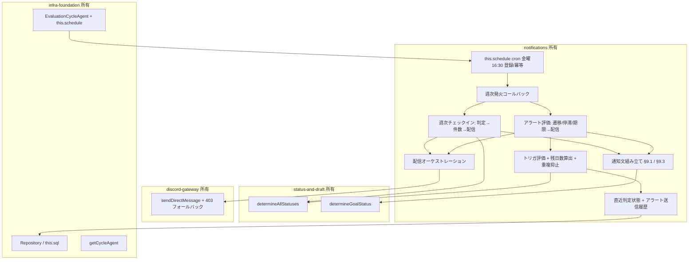
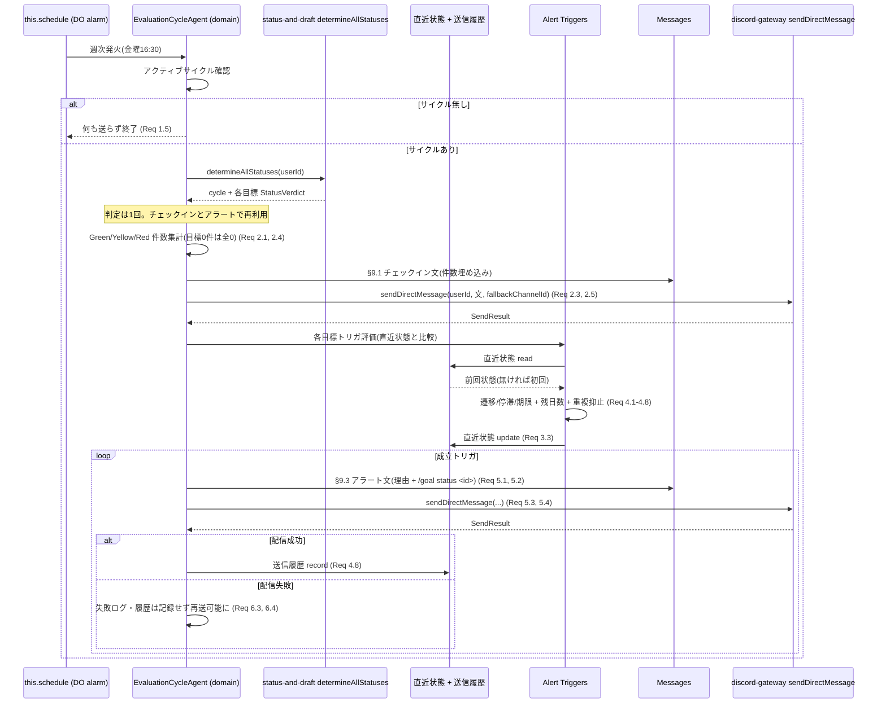
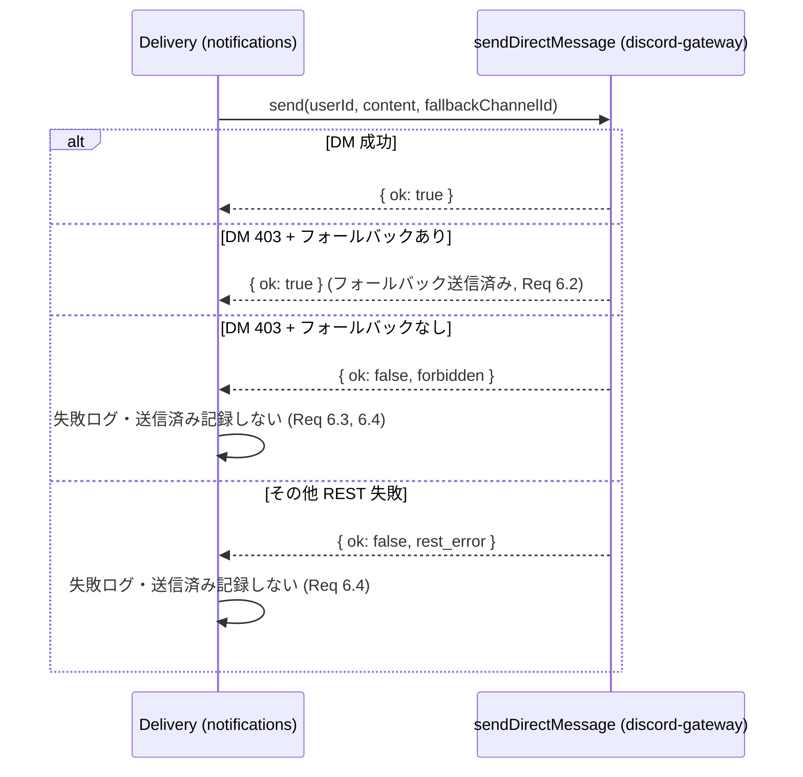
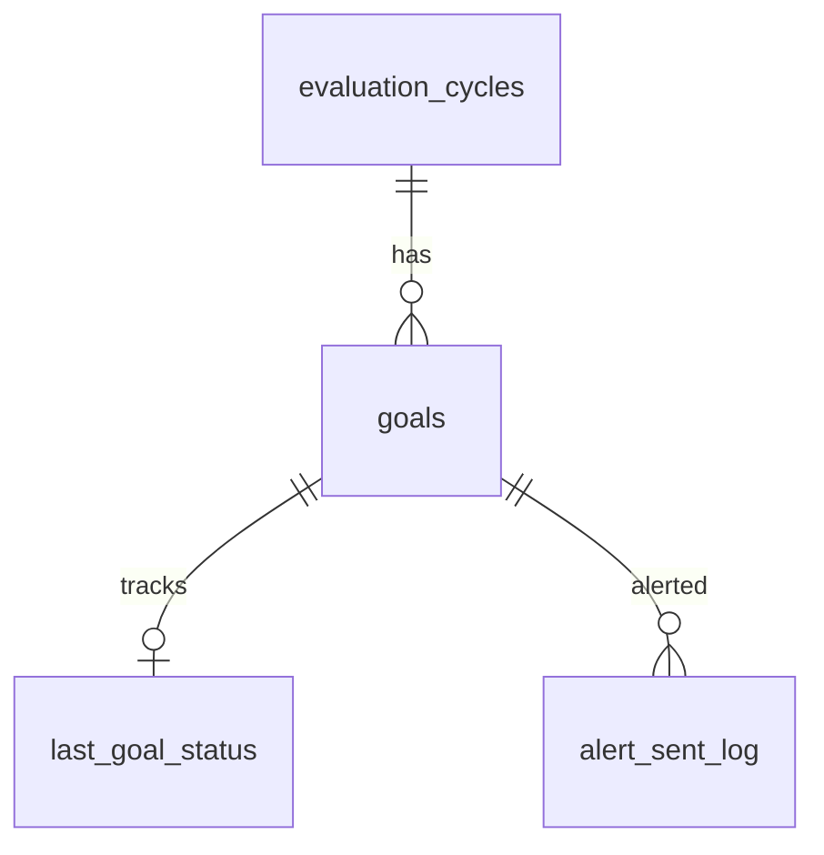

# Design Document: notifications

## Overview

**Purpose**: 本スペックは「毎週聞いてくれる」中心仮説を支える定期通知層を実装する。毎週金曜 16:30 に現在の Green/Yellow/Red 件数を含むチェックイン通知を配信し(§9.1)、状態悪化(Green→Yellow / Yellow→Red)・証跡なし2週間継続・半期終了30/14日前のトリガで Red/Yellow アラートを理由と改善導線(`/goal status <id>`)付きで配信する(§9.3)。ステータス判定は status-and-draft の公開メソッドを消費し、配信は discord-gateway の送信ヘルパーを利用する。状態遷移検出に必要な「目標ごとの直近判定状態」とアラート送信履歴は本スペックが所有・永続化する。

**Users**: 直接の利用者は半期評価目標を持つ個人ユーザー(週次チェックイン通知と Red/Yellow アラートを DM または個人用非公開チャンネルで受け取る)と、Worker を運用する運用者である。本スペックはユーザー向けの新規 slash command を追加せず、定期発火を起点とするプロアクティブ配信のみを提供する。

**Impact**: グリーンフィールド。infra-foundation(EvaluationCycleAgent 権威・`this.schedule()`・DO SQLite・Repository・Agent ルーティング)、discord-gateway(`sendDirectMessage` プロアクティブ送信ヘルパー・403 フォールバック)、status-and-draft(`determineAllStatuses` / `determineGoalStatus` / `StatusVerdict`)が確立した契約の上に、スケジューリング・状態遷移検出・アラート評価・通知文組み立ての責務を追加する。永続化スキーマ・Agent クラス骨格・LLM クライアント・Discord I/O 規約・ステータス判定ロジックは再定義せず消費する。

### Goals
- 毎週金曜 16:30 の週次チェックイン通知を冪等にスケジュールし、Green/Yellow/Red 件数付き(§9.1)で配信する。
- §9.3 の全トリガ(Green→Yellow / Yellow→Red / 証跡なし2週継続 / 半期終了30日前 / 14日前)を評価し、成立分のアラートを理由 + 改善導線付きで配信する。
- 状態遷移検出のため、目標ごとの直近判定状態を本スペックが永続化し、status-and-draft の非永続判定と独立に比較元を保持する。
- 重複した週次通知・重複したアラートを抑止する(冪等スケジュール + 送信履歴)。

### Non-Goals
- ステータス判定ロジック本体(status-and-draft 所有。本スペックは判定メソッドを呼ぶのみ)。
- プロアクティブ送信の REST 機構・DM open・403 フォールバックの実装(discord-gateway 所有。本スペックは送信ヘルパーを呼ぶのみ)。
- `this.schedule()` / Agent クラス骨格 / §11 永続化スキーマ / LLM クライアントの実装(infra-foundation 所有)。
- `/checkin` の会話・分類・証跡化(checkin-classification)。
- Google Calendar 連携・`/prepare 1on1`(§9.2、MVP 対象外・将来枠)。

## Boundary Commitments

### This Spec Owns
- 週次チェックインスケジューリング: EvaluationCycleAgent ライフサイクルに結合した `this.schedule()` cron(初期 毎週金曜 16:30)の登録・維持・冪等化と、発火コールバック(週次評価の起動点)。
- 直近判定状態の保持: 目標ごとの直近判定状態(Green/Yellow/Red/Gray)を所有ユーザーと対応づけて永続化する状態(本スペック所有の追加テーブル)。比較・更新ロジック。
- アラート評価エンジン: 状態遷移(Green→Yellow / Yellow→Red)・証跡なし2週継続・半期終了30/14日前のトリガ判定。残り日数算出。送信済み履歴による重複抑止。
- 通知文組み立て: §9.1 チェックイン文(件数埋め込み)・§9.3 アラート文(理由 + `/goal status <id>` 改善導線)の組み立て。
- 配信オーケストレーション: discord-gateway 送信ヘルパーの呼び出し(個人用フォールバックチャンネル指定)と `SendResult` に基づく成功/失敗処理・送信履歴更新。
- 通知用 `Env` 拡張: フォールバックチャンネル ID 等、本機能が必要とする設定の型宣言(discord-gateway が既に宣言していればそれを利用)。

### Out of Boundary
- ステータス判定ルール本体(§10.2)・LLM 見立て(§13.2)・`StatusVerdict` 算出(status-and-draft 所有。本スペックは `determineAllStatuses`/`determineGoalStatus` を呼ぶのみ)。
- DM open・403 フォールバックの REST 実装・`SendResult` 型(discord-gateway 所有。本スペックは `sendDirectMessage` を呼ぶのみ)。
- §11 永続化スキーマ・`Repository` 実装・Agent クラス宣言・ルーティングヘルパー・`this.schedule()` 基盤・`LlmClient`(infra-foundation 所有)。
- `/checkin` フロー・分類・証跡化(checkin-classification)。
- Google Calendar 連携・`/prepare 1on1`(将来枠)。

### Allowed Dependencies
- infra-foundation 公開契約: `EvaluationCycleAgent`(骨格メソッドの中身を実装)、`this.schedule()`(DO alarm cron)、`this.sql` / `Repository`(§11 行の読み取り。証跡なし2週継続トリガ用に §11.5 `evidence` / §11.6 `evidence_goal_links` を読み取り専用で参照し最新 `evidence_date` を取得。§11 列追加・スキーマ変更はしない)、`getCycleAgent`/`getGoalAgent`、共有ドメイン型(`EntityRow<'evaluation_cycles'|'goals'|'evidence'|'evidence_goal_links'>`、`GoalStatus`)、`Env`。
- discord-gateway 公開契約: `sendDirectMessage(env, userId, content, fallbackChannelId?)`、`SendResult`、Discord 用 `Env` 拡張(フォールバックチャンネル設定)。
- status-and-draft 公開契約: `determineAllStatuses(userId)`(全目標集約判定 + cycle)、`determineGoalStatus(userId, cycleId, goalId)`、`StatusVerdict`(status/reason/risks/nextActions/reasonMissing)。
- 依存方向: `state(直近状態/履歴の永続) → alert(トリガ評価) → messages(文組み立て) → delivery(配信) → schedule(発火配線) → Agent ドメインメソッド`。各層は左方向のみ import する。

### Revalidation Triggers
- status-and-draft の `determineAllStatuses`/`determineGoalStatus` シグネチャ・`StatusVerdict` 型の変更(本スペックが消費)。
- discord-gateway の `sendDirectMessage`/`SendResult`・フォールバックチャンネル設定の変更。
- infra-foundation の `EvaluationCycleAgent` 骨格・`this.schedule()` 契約・`Repository`・`Env`・§11 スキーマ・Agent ルーティングの変更。
- 本スペックが所有する直近判定状態・アラート送信履歴の状態スキーマ(列・キー)の変更。
- §9.1 通知文・§9.3 トリガ条件/アラート文・初期スケジュール(金曜 16:30)の変更。

## Architecture

### Existing Architecture Analysis
- infra-foundation: EvaluationCycleAgent がサイクル単位 DO SQLite の単一権威。`onStart` で冪等マイグレーション。`this.schedule()` は DO alarm ベースの分粒度 cron。GoalAgent はステートレスで親へ委譲。
- discord-gateway: `sendDirectMessage(env, userId, content, fallbackChannelId?)` が DM open → 送信 → 403 で個人用フォールバックチャンネル → 判別可能 `SendResult` を返す。公開チャンネル宛任意送信は提供しない。
- status-and-draft: `determineAllStatuses(userId)` / `determineGoalStatus(userId, cycleId, goalId)` を Agent メソッドとして公開し `StatusVerdict` を返す。**判定は読み取りのみで永続化しない**(本スペックの状態保持が必要な根拠)。
- 本スペックはこれらの契約・パターン(薄い起動層 + Agent ドメインメソッド)を尊重し、スケジューリング・状態保持・アラート評価・通知文・配信の責務のみを追加する。

### Architecture Pattern & Boundary Map

採用パターンは「**定期発火起点 + Agent ドメインメソッド**」。EvaluationCycleAgent の `this.schedule()` 発火コールバックが週次評価を起動し、ドメインメソッド(判定取得 → 件数集計 → チェックイン配信、状態遷移/停滞/期限のアラート評価 → アラート配信)を呼ぶ。直近判定状態とアラート送信履歴は本スペックが所有する権威 DO SQLite 上の状態として保持する。



**Architecture Integration**:
- Selected pattern: 定期発火起点 + Agent ドメインメソッド。週次発火を判定 1 回の単一評価点に集約し、チェックイン通知とアラート評価の両方を駆動する。判定/配信は上流契約へ委譲し、本スペックは状態保持・トリガ評価・文組み立て・配信オーケストレーションに徹する。
- Domain/feature boundaries: スケジュール・状態保持・アラート評価・通知文・配信を本スペックが所有。判定は status-and-draft、配信機構は discord-gateway、基盤は infra-foundation へ委譲。
- New components rationale: 各コンポーネントは Req 1〜7 に直接対応。直近判定状態の永続化は status-and-draft が判定を永続化しないことの直接的帰結(投機的抽象ではない)。
- Steering compliance: roadmap の「定期通知は notifications 所有」「判定/配信/基盤は上流所有」に準拠。§15(DM/個人用非公開限定)を配信経路の限定で満たす。

### Technology Stack

| Layer | Choice / Version | Role in Feature | Notes |
|-------|------------------|-----------------|-------|
| Frontend / CLI | Discord プロアクティブメッセージ(DM/個人用非公開チャンネル) | チェックイン通知・アラート通知の出力 | 新規 slash command は追加しない |
| Backend / Services | Cloudflare `agents`(EvaluationCycleAgent ドメインメソッド) | スケジュール登録・週次評価・状態保持・アラート評価 | infra の骨格メソッドを実装 |
| Data / Storage | Durable Object SQLite(infra `Repository` / `this.sql` 経由) | 直近判定状態・アラート送信履歴の永続化 | infra §11 既存 8 テーブルは変更せず、本スペック所有の追加テーブルを冪等マイグレーションで追加 |
| Messaging / Events | `this.schedule()`(DO alarm ベース cron) | 毎週金曜 16:30 の定期発火 | 分粒度 cron。週次に十分 |
| Infrastructure / Runtime | Cloudflare Workers + DO 単一実行モデル | 週次バックグラウンド評価・配信 | 対話応答ではないためレイテンシ許容 |
| Language / Build | TypeScript(strict) | 型・ビルド | `any` 禁止。共有型を import |

## File Structure Plan

### Directory Structure
```
src/
└── notifications/
    ├── register.ts                 # EvaluationCycleAgent の週次スケジュール起動配線を集約(発火→週次評価ドメインメソッド)(Req 1.1, 1.2)
    ├── schedule/
    │   └── weekly-checkin.ts        # this.schedule() cron 登録(金曜16:30)・冪等化・登録済み判定(Req 1.1, 1.3, 1.4, 1.5)
    ├── state/
    │   ├── migrations.ts            # 本スペック所有の追加テーブル DDL(直近判定状態・アラート送信履歴)。infra マイグレーションと共存する独立 version(Req 3.1, 4.8)
    │   └── alert-state.ts           # 直近判定状態の read/update・アラート送信履歴の read/record(Repository/this.sql 経由)(Req 3.1, 3.2, 3.3, 3.5, 4.8, 6.4)
    ├── alert/
    │   ├── triggers.ts              # §9.3 トリガ評価: 遷移(Green→Yellow/Yellow→Red)・証跡なし2週継続・半期終了30/14日前・残日数算出(Req 4.1-4.7)
    │   └── dedup.ts                 # 送信済み履歴に基づく重複抑止判定(目標×トリガ種別×サイクル)(Req 4.8, 6.4)
    ├── messages.ts                  # §9.1 チェックイン文(件数埋め込み)・§9.3 アラート文(理由 + /goal status 改善導線)組み立て(Req 2.2, 5.1, 5.2)
    ├── delivery.ts                  # sendDirectMessage 呼び出し(フォールバックチャンネル指定)・SendResult 処理・失敗ログ(Req 2.3, 2.5, 5.3, 5.4, 6.1-6.4)
    └── domain/
        └── notification-operations.ts # EvaluationCycleAgent: scheduleWeeklyCheckin / runWeeklyCheckin / evaluateAndSendAlerts(Req 1.2, 2.1, 2.4, 3.*, 4.1, 5.*)
```

### Modified Files
- `src/agents/evaluation-cycle-agent.ts`(infra 所有の骨格)— 週次スケジュール登録(`onStart` または初期化時)・発火コールバック・週次チェックイン実行・アラート評価/配信の責務メソッドの中身を `domain/notification-operations.ts` の実装で埋める(クラス宣言・ルーティング・既存 onStart マイグレーション呼び出しは変更しない。本スペックの追加マイグレーションは既存ランナーと共存する形で適用する)。

> 依存方向: `state(migrations/alert-state) → alert(triggers/dedup) → messages → delivery → schedule(weekly-checkin) → domain(notification-operations) → register`。`domain` は infra `Repository`/`getCycleAgent`、status-and-draft `determineAllStatuses`/`determineGoalStatus`、discord-gateway `sendDirectMessage` を消費する。各層は左方向のみ import する。

## System Flows

### 週次発火フロー(チェックイン通知 + アラート評価)

週次発火は判定を1回だけ実行し、件数集計(チェックイン)とトリガ評価(アラート)の双方に再利用する。直近状態は比較後に更新し、初回は悪化遷移とみなさない(Req 3.4)。アラートは配信成功時のみ送信履歴へ記録し、失敗時は再送可能状態を保つ(Req 6.4)。

### 配信フロー(フォールバック)

フォールバック機構自体は discord-gateway の `sendDirectMessage` が内包する。本スペックは個人用フォールバックチャンネル ID を渡し、`SendResult` で成功/失敗を受けて履歴更新の可否を決める。

## Requirements Traceability

| Requirement | Summary | Components | Interfaces | Flows |
|-------------|---------|------------|------------|-------|
| 1.1 | 金曜16:30 スケジュール登録 | schedule/weekly-checkin.ts, domain/notification-operations.ts | `scheduleWeeklyCheckin` | 週次発火 |
| 1.2 | 発火で週次評価起動 | register.ts, domain/notification-operations.ts | `runWeeklyCheckin` | 週次発火 |
| 1.3 | 繰り返し維持 | schedule/weekly-checkin.ts | `scheduleWeeklyCheckin` | 週次発火 |
| 1.4 | 冪等(重複登録防止) | schedule/weekly-checkin.ts | `scheduleWeeklyCheckin` | 週次発火 |
| 1.5 | サイクル無しは送らない | domain/notification-operations.ts | `runWeeklyCheckin` | 週次発火 |
| 2.1 | 全目標判定 + 件数集計 | domain/notification-operations.ts | `runWeeklyCheckin`, `determineAllStatuses` | 週次発火 |
| 2.2 | §9.1 件数付きチェックイン文 | messages.ts | `buildCheckinMessage` | 週次発火 |
| 2.3 | 送信ヘルパーで配信 | delivery.ts | `deliver` | 週次発火 / 配信 |
| 2.4 | 目標0件は全0件 | domain/notification-operations.ts, messages.ts | `runWeeklyCheckin` | 週次発火 |
| 2.5 | 本人限定経路 | delivery.ts | `deliver` | 配信 |
| 3.1 | 直近判定状態の保持 | state/alert-state.ts, state/migrations.ts | `getLastStatuses`, `upsertLastStatus` | 週次発火 |
| 3.2 | 新旧比較で遷移判定 | alert/triggers.ts, state/alert-state.ts | `evaluateTriggers` | 週次発火 |
| 3.3 | 比較後に直近状態更新 | state/alert-state.ts | `upsertLastStatus` | 週次発火 |
| 3.4 | 初回は悪化遷移としない | alert/triggers.ts | `evaluateTriggers` | 週次発火 |
| 3.5 | 比較元は本機能保持状態のみ | state/alert-state.ts, alert/triggers.ts | `getLastStatuses` | 週次発火 |
| 4.1 | 各目標の最新判定取得 | domain/notification-operations.ts | `evaluateAndSendAlerts`, `determineAllStatuses` | 週次発火 |
| 4.2 | Green→Yellow トリガ | alert/triggers.ts | `evaluateTriggers` | 週次発火 |
| 4.3 | Yellow→Red トリガ | alert/triggers.ts | `evaluateTriggers` | 週次発火 |
| 4.4 | 証跡なし2週継続トリガ | domain/notification-operations.ts(最新 evidence_date を Repository 読取・経過算出), alert/triggers.ts(判定) | `evaluateAndSendAlerts`(Repository `listBy`/`getById` で §11.5/§11.6 読取), `evaluateTriggers` | 週次発火 |
| 4.5 | 半期終了30日前トリガ | alert/triggers.ts | `evaluateTriggers` | 週次発火 |
| 4.6 | 半期終了14日前トリガ | alert/triggers.ts | `evaluateTriggers` | 週次発火 |
| 4.7 | 残り日数算出 | alert/triggers.ts | `daysUntilCycleEnd` | 週次発火 |
| 4.8 | 同一トリガ重複抑止 | alert/dedup.ts, state/alert-state.ts | `isAlreadySent`, `recordSent` | 週次発火 |
| 5.1 | §9.3 アラート文(理由) | messages.ts | `buildAlertMessage` | 週次発火 |
| 5.2 | /goal status 改善導線 | messages.ts | `buildAlertMessage` | 週次発火 |
| 5.3 | 送信ヘルパーで配信 | delivery.ts | `deliver` | 配信 |
| 5.4 | 本人限定経路 | delivery.ts | `deliver` | 配信 |
| 6.1 | フォールバック指定で配信 | delivery.ts | `deliver` | 配信 |
| 6.2 | 403 でフォールバック | delivery.ts | `deliver` | 配信 |
| 6.3 | フォールバック無しは失敗記録・継続 | delivery.ts | `deliver` | 配信 |
| 6.4 | 失敗は送信済みにしない | delivery.ts, state/alert-state.ts | `deliver`, `recordSent` | 週次発火 / 配信 |
| 7.1 | 判定は status-and-draft 消費 | domain/notification-operations.ts | `determineAllStatuses`/`determineGoalStatus` | 週次発火 |
| 7.2 | 配信は discord-gateway 消費 | delivery.ts | `sendDirectMessage` | 配信 |
| 7.3 | 基盤/スキーマ/LLM は infra 消費 | (Boundary Commitments) | — | — |
| 7.4 | checkin/Calendar を実装しない | (Boundary Commitments) | — | — |

## Components and Interfaces

| Component | Domain/Layer | Intent | Req Coverage | Key Dependencies (P0/P1) | Contracts |
|-----------|--------------|--------|--------------|--------------------------|-----------|
| Weekly Checkin Scheduler | schedule | 金曜16:30 cron 登録・冪等化 | 1.1, 1.3, 1.4 | this.schedule (P0) | Service, Batch |
| Alert State Store + Migrations | state | 直近判定状態・送信履歴の永続 | 3.1, 3.3, 3.5, 4.8, 6.4 | Repository/this.sql (P0), GoalStatus (P1) | Service, State, Batch |
| Alert Triggers + Dedup | alert | §9.3 トリガ評価・残日数・重複抑止 | 3.2, 3.4, 4.1-4.8 | alert-state (P0), GoalStatus (P1) | Service |
| Message Builder | messages | §9.1/§9.3 文組み立て | 2.2, 2.4, 5.1, 5.2 | StatusVerdict types (P1) | Service |
| Delivery Orchestrator | delivery | 送信ヘルパー呼び出し・SendResult 処理 | 2.3, 2.5, 5.3, 5.4, 6.1-6.4 | sendDirectMessage (P0), Env (P0) | Service |
| Notification Domain Operations | domain | 週次評価・チェックイン・アラート起動・最新 evidence_date 読取 + 経過算出(Req 4.4) | 1.2, 1.5, 2.1, 2.4, 3.*, 4.1, 4.4, 5.* | determineAllStatuses/determineGoalStatus (P0), Repository (P0, §11.5/§11.6 読取), triggers (P0), messages (P0), delivery (P0) | Service, State |
| Schedule Registration | schedule/register | 発火→ドメインメソッド配線 | 1.1, 1.2 | EvaluationCycleAgent (P0), scheduler (P0) | Service |

### schedule

#### Weekly Checkin Scheduler

| Field | Detail |
|-------|--------|
| Intent | 毎週金曜 16:30 の cron を冪等に登録・維持 |
| Requirements | 1.1, 1.3, 1.4 |

**Responsibilities & Constraints**
- `this.schedule()` の cron 表現で金曜 16:30 を登録する(Req 1.1)。
- 既存スケジュール照会または登録済みフラグで再初期化時の重複登録を防ぐ(Req 1.4)。
- 登録後は毎週同一曜日・時刻に繰り返し発火する(Req 1.3)。
- 発火コールバックは週次評価ドメインメソッドへ委譲するのみ(評価ロジックは持たない)。

**Dependencies**
- Inbound: EvaluationCycleAgent ライフサイクル(`onStart` / 初期化)— スケジュール登録(P0)
- External: `this.schedule()`(infra / DO alarm)(P0)

**Contracts**: Service [x] / Batch [x]

##### Service Interface
```typescript
interface WeeklyCheckinScheduler {
  // 既存スケジュールが無ければ金曜16:30 cron を登録。あれば no-op(冪等)。
  scheduleWeeklyCheckin(): Promise<void>;
}
```
- Preconditions: EvaluationCycleAgent インスタンス(`this.schedule()` 利用可能)。
- Postconditions: 金曜16:30 の週次スケジュールが1つだけ登録される。
- Invariants: 同一サイクル Agent に対し週次スケジュールは高々1つ。

##### Batch / Job Contract
- Trigger: `this.schedule()` の cron 発火(毎週金曜 16:30)。
- Input / validation: 発火時に対象ユーザー/サイクルのコンテキスト(Agent ID から導出)。
- Output / destination: 週次評価ドメインメソッド起動。
- Idempotency & recovery: 登録は冪等(重複登録しない)。発火処理は判定取得から組み立て直すためステートレスに再実行安全。

### state

#### Alert State Store + Migrations

| Field | Detail |
|-------|--------|
| Intent | 直近判定状態とアラート送信履歴を本スペック所有の状態として永続化 |
| Requirements | 3.1, 3.3, 3.5, 4.8, 6.4 |

**Responsibilities & Constraints**
- 目標ごとの直近判定状態(`GoalStatus`)を所有ユーザー・サイクル・目標と対応づけて read/update(Req 3.1, 3.3, 3.5)。
- アラート送信履歴(目標 × トリガ種別 × サイクル)を read/record し、重複抑止の根拠とする(Req 4.8, 6.4)。
- 物理的には infra-foundation の単一権威 DO SQLite(EvaluationCycleAgent)に同居する本スペック所有の追加テーブルとして配置。infra §11 既存テーブルは変更しない。追加マイグレーションは独立 version・`IF NOT EXISTS` で既存ランナーと共存し冪等に適用する。
- 比較元は本スペック保持状態のみ(status-and-draft の非永続判定に依存しない、Req 3.5)。

**Dependencies**
- Inbound: Alert Triggers / Notification Domain Operations(P0)
- Outbound: infra `Repository` / `this.sql`(P0)
- External: 共有型(`GoalStatus`)(P1)

**Contracts**: Service [x] / State [x] / Batch [x]

##### Service Interface
```typescript
import type { GoalStatus } from "../types/enums";

type AlertTriggerKind =
  | "green_to_yellow"
  | "yellow_to_red"
  | "no_evidence_2w"
  | "cycle_end_30d"
  | "cycle_end_14d";

interface LastStatusRecord {
  goalId: string;
  status: GoalStatus;     // 直近の判定状態
  updatedAt: string;
}

interface AlertStateStore {
  // 直近判定状態
  getLastStatuses(userId: string, cycleId: string): Map<string, GoalStatus>; // goalId -> status
  upsertLastStatus(userId: string, cycleId: string, goalId: string, status: GoalStatus): void;
  // アラート送信履歴(重複抑止)
  isAlreadySent(userId: string, cycleId: string, goalId: string, kind: AlertTriggerKind): boolean;
  recordSent(userId: string, cycleId: string, goalId: string, kind: AlertTriggerKind): void;
}

interface NotificationMigrator {
  runNotificationMigrations(): void; // 追加テーブル DDL を冪等適用(独立 version)
}
```
- Preconditions: infra のマイグレーション適用済み(`onStart`)。本スペックの追加マイグレーションも適用済み。
- Postconditions: 直近状態は最新判定で更新される。送信履歴は配信成功時のみ記録される(Req 6.4)。
- Invariants: 全行に `user_id` を付与し所有者スコープを維持。比較元は本テーブルのみ(Req 3.5)。

##### State Management
- State model: `last_goal_status(user_id, cycle_id, goal_id, status, updated_at)` と `alert_sent_log(user_id, cycle_id, goal_id, trigger_kind, sent_at)`(本スペック所有、DO SQLite)。
- Persistence & consistency: 単一権威(EvaluationCycleAgent の DO SQLite)。揮発メモリは使わない(DO 再起動を跨ぐため)。
- Concurrency strategy: DO の per-instance シリアライズに依拠。

##### Batch / Job Contract
- Trigger: EvaluationCycleAgent 初期化時(infra `onStart` と共存)。
- Input / validation: 現在の追加テーブル適用状況。
- Output / destination: 追加テーブル生成。
- Idempotency & recovery: 独立 version + `IF NOT EXISTS` で冪等。infra の §11 マイグレーションを上書き/破壊しない。

### alert

#### Alert Triggers + Dedup

| Field | Detail |
|-------|--------|
| Intent | §9.3 トリガ評価・残日数算出・重複抑止判定 |
| Requirements | 3.2, 3.4, 4.1-4.8 |

**Responsibilities & Constraints**
- `evaluateTriggers`: 各目標について、保持中の直近状態と新判定状態を比較し Green→Yellow / Yellow→Red を検出(Req 3.2, 4.2, 4.3)。証跡なし2週継続(Req 4.4)、半期終了30/14日前(Req 4.5, 4.6)を判定。直近状態が無い初回は悪化遷移としない(Req 3.4)。
- `daysUntilCycleEnd`: サイクル終了日と現在日付から残り日数を算出(Req 4.7)。
- 重複抑止: `isAlreadySent` で送信済みトリガを除外(Req 4.8)。期限トリガは「その週の発火で閾値を跨いだか」を残日数 + 送信履歴で冪等に判定。
- 証跡なし2週継続(Req 4.4)の判定に用いる `latestEvidenceAgeDays` は、**本スペックが infra `Repository` 経由で目標ごとの最新 `evidence.evidence_date` を直接読み取り(読み取り専用)、現在日付との差から自前で算出**する。status-and-draft の `StatusVerdict` は本値を公開しないため、判定契約には依存しない(`StatusVerdict` を拡張しない)。読み取りは §11.5 `evidence` と §11.6 `evidence_goal_links`(`goal_id` で対象目標に紐づく証跡)の既存列のみを用い、§11 への列追加は行わない。証跡 0 件の目標は `latestEvidenceAgeDays = null`(証跡なし)として扱う。判定ロジック本体(`StatusVerdict` 算出)は再実装しない。

**Dependencies**
- Inbound: Notification Domain Operations(P0)
- Outbound: Alert State Store(P0)
- External: 共有型(`GoalStatus`、`EntityRow<'evaluation_cycles'>`)(P1)

**Contracts**: Service [x]

##### Service Interface
```typescript
import type { GoalStatus } from "../types/enums";

interface TriggerInput {
  goalId: string;
  goalTitle: string;
  newStatus: GoalStatus;
  previousStatus: GoalStatus | null;          // null = 初回(Req 3.4)
  latestEvidenceAgeDays: number | null;        // domain が Repository 経由で evidence.evidence_date(§11.5/§11.6)を読み自前算出。証跡なしは null
  daysUntilCycleEnd: number;
}

interface FiredTrigger {
  goalId: string;
  goalTitle: string;
  kind: AlertTriggerKind;
  newStatus: GoalStatus;
  reasons: string[];        // §9.3 理由行(状態悪化/証跡なし継続/残り日数 等)
}

declare function daysUntilCycleEnd(cycleEndDate: string, now: Date): number;
declare function evaluateTriggers(input: TriggerInput): FiredTrigger[];
```
- Preconditions: `previousStatus` は Alert State Store から取得済み(本スペック保持状態)。
- Postconditions: 成立したトリガのみ返す。初回(`previousStatus === null`)は遷移トリガを返さない(Req 3.4)。
- Invariants: 残日数は `daysUntilCycleEnd` で一意に算出(Req 4.7)。トリガ種別は `AlertTriggerKind` 列挙に限定。

**Implementation Notes**
- Integration: `evaluateAndSendAlerts` が `getLastStatuses` → 目標ごとに Repository から最新 `evidence.evidence_date` を読んで `latestEvidenceAgeDays` を算出 → `evaluateTriggers`(`TriggerInput` に同値を渡す)→ `isAlreadySent` フィルタ → 配信 → 成功時 `recordSent` + `upsertLastStatus` を呼ぶ。`evaluateTriggers` 自体は証跡読み取りを行わず、入力された `latestEvidenceAgeDays` を `no_evidence_2w`(Req 4.4)判定に用いる純関数として保つ。
- Validation: 期限トリガ30/14日前は残日数が閾値以下かつ未送信のときのみ成立(週次評価で跨ぎを検出)。証跡経過は §11.5/§11.6 の読み取りのみで算出し、§11 への列追加・status-and-draft 契約の変更を伴わない。
- Risks: 週次粒度のため厳密な「ちょうど30日前」ではなく「その週で30日以内に入った」検出。MVP の通知目的に十分。

### messages

#### Message Builder

| Field | Detail |
|-------|--------|
| Intent | §9.1 チェックイン文・§9.3 アラート文の組み立て |
| Requirements | 2.2, 2.4, 5.1, 5.2 |

**Responsibilities & Constraints**
- `buildCheckinMessage`: §9.1 のチェックイン文(今週やったことの入力促し)に Green/Yellow/Red 件数を埋め込む。目標0件は全0件として整形(Req 2.2, 2.4)。
- `buildAlertMessage`: §9.3 のアラート文(目標名・新状態・理由行)に改善導線 `/goal status <id>` を含めて整形(Req 5.1, 5.2)。
- 文面のみを所有。判定・配信は持たない。

**Dependencies**
- Inbound: Notification Domain Operations(P0)
- External: 共有型(`GoalStatus`、`StatusVerdict` の必要フィールド)(P1)

**Contracts**: Service [x]

##### Service Interface
```typescript
interface StatusCounts { green: number; yellow: number; red: number; }

declare function buildCheckinMessage(counts: StatusCounts): string;
declare function buildAlertMessage(args: {
  goalId: string;
  goalTitle: string;
  newStatus: GoalStatus;
  reasons: string[];
}): string;
```
- Postconditions: チェックイン文は §9.1 構造 + 件数、アラート文は §9.3 構造 + `/goal status <goalId>` 導線を含む。
- Invariants: 個人評価データを含む文は本人限定経路でのみ配信される(呼び出し側 Delivery が保証)。

### delivery

#### Delivery Orchestrator

| Field | Detail |
|-------|--------|
| Intent | discord-gateway 送信ヘルパー呼び出しと SendResult 処理 |
| Requirements | 2.3, 2.5, 5.3, 5.4, 6.1, 6.2, 6.3, 6.4 |

**Responsibilities & Constraints**
- `deliver`: `sendDirectMessage(env, userId, content, fallbackChannelId)` を呼び、`SendResult` を返す。フォールバックチャンネル ID は env 設定から渡す(Req 6.1)。
- 403 フォールバックは送信ヘルパーが内包(本スペックは指定するのみ、Req 6.2)。フォールバック未指定/失敗時は失敗を判別可能にログし処理を中断しない(Req 6.3)。
- 配信経路は DM または本人の個人用非公開フォールバックチャンネルに限定(公開チャンネル宛送信はしない、Req 2.5, 5.4)。
- 配信失敗時は呼び出し側が送信履歴を記録しないよう `SendResult` をそのまま返す(Req 6.4)。

**Dependencies**
- Inbound: Notification Domain Operations(P0)
- Outbound: discord-gateway `sendDirectMessage`(P0)
- External: `Env`(フォールバックチャンネル設定 / bot token は discord-gateway 経由)(P0)

**Contracts**: Service [x]

##### Service Interface
```typescript
import type { SendResult } from "../discord/proactive";
import type { Env } from "../env";

declare function deliver(env: Env, userId: string, content: string): Promise<SendResult>;
```
- Preconditions: env にフォールバックチャンネル設定・bot token が供給されている(discord-gateway 拡張)。
- Postconditions: DM 成功またはフォールバック成功で `{ ok: true }`、失敗で判別可能 `SendResult`。失敗時も例外を投げず処理継続(Req 6.3)。
- Invariants: 送信先は DM または個人用フォールバックチャンネルに限定(Req 2.5, 5.4)。

**Implementation Notes**
- Integration: `runWeeklyCheckin` と `evaluateAndSendAlerts` が `deliver` を呼ぶ。アラートは `deliver` 成功時のみ `recordSent`(Req 6.4)。
- Risks: 429 等は discord-gateway が `rest_error` として返す(MVP では再送はしないがログ。次回週次で再評価)。

### domain

#### Notification Domain Operations(EvaluationCycleAgent メソッド実装)

| Field | Detail |
|-------|--------|
| Intent | 週次評価・チェックイン配信・アラート評価/配信を権威上で実装 |
| Requirements | 1.2, 1.5, 2.1, 2.4, 3.1-3.5, 4.1, 5.1-5.4 |

**Responsibilities & Constraints**
- `scheduleWeeklyCheckin`(委譲): スケジューラに金曜16:30 cron 登録を委譲(Req 1.1)。
- `runWeeklyCheckin`: アクティブサイクル確認(無ければ何もしない、Req 1.5)→ `determineAllStatuses(userId)` で全目標判定(Req 2.1)→ 件数集計(目標0件は全0、Req 2.4)→ `buildCheckinMessage` → `deliver`(Req 2.2, 2.3, 2.5)。続けて `evaluateAndSendAlerts` を起動。
- `evaluateAndSendAlerts`: `determineAllStatuses` の結果(再利用)+ `getLastStatuses` + 各目標の `latestEvidenceAgeDays`(infra `Repository` 経由で §11.5 `evidence` / §11.6 `evidence_goal_links` から最新 `evidence_date` を読み取り自前算出。Req 4.4 の証跡なし2週継続用、読み取り専用・§11 列追加なし)で各目標トリガ評価(Req 4.1)→ 直近状態 `upsertLastStatus`(Req 3.3)→ 成立トリガを `isAlreadySent` で除外 → `buildAlertMessage` → `deliver` → 成功時 `recordSent`(Req 4.8, 6.4)。証跡経過は本スペックが所有して算出し、status-and-draft の `StatusVerdict` には依存しない。
- 判定は status-and-draft へ委譲し再実装しない(Req 7.1)。配信は discord-gateway へ委譲(Req 7.2)。

**Dependencies**
- Inbound: スケジュール発火コールバック(P0)
- Outbound: status-and-draft `determineAllStatuses`/`determineGoalStatus`(P0)、Alert State Store(P0)、Alert Triggers(P0)、Message Builder(P0)、Delivery(P0)、infra `Repository`(P0)
- External: 共有型(`EntityRow<'evaluation_cycles'|'goals'|'evidence'|'evidence_goal_links'>`、`GoalStatus`、`StatusVerdict`)(P1)

**Contracts**: Service [x] / State [x]

##### Service Interface
```typescript
interface NotificationDomainOperations {
  scheduleWeeklyCheckin(): Promise<void>;                  // Req 1.1
  runWeeklyCheckin(): Promise<void>;                       // Req 1.2, 1.5, 2.*
  evaluateAndSendAlerts(): Promise<void>;                  // Req 3.*, 4.*, 5.*, 6.4
}
```
- Preconditions: マイグレーション適用済み。Agent はユーザー×サイクル文脈を ID から導出。
- Postconditions: チェックイン通知は1週1回配信(冪等スケジュール)。アラートは成立 + 未送信のみ配信し成功時に履歴記録。直近状態は毎回更新。
- Invariants: 判定は週次発火あたり1回(`determineAllStatuses` を両用途で再利用)。全操作で `user_id` 一致を強制。

**Implementation Notes**
- Integration: EvaluationCycleAgent 骨格メソッドに実装。発火コールバックは `runWeeklyCheckin`(内部で `evaluateAndSendAlerts` を呼ぶ)。
- Validation: アクティブサイクルは infra/goal-management の対象サイクル決定規約に従う(最新サイクル)。残日数は cycle.end_date と現在日付。
- Risks: 全目標 × LLM 判定のレイテンシ。週次バックグラウンドのため許容。

## Data Models

### Domain Model
- 本スペックは infra-foundation §11 の `evaluation_cycles`・`goals`、および証跡なし2週継続トリガ(Req 4.4)算出のため §11.5 `evidence`・§11.6 `evidence_goal_links`(目標ごとの最新 `evidence_date`)を **読み取り専用** で参照し、status-and-draft の判定結果を消費する。これらの §11 テーブルへの列追加・スキーマ変更は行わない。新規に永続化するのは**本スペック所有の状態**(直近判定状態・アラート送信履歴)のみ。
- 集約: EvaluationCycle が権威。直近状態・送信履歴はサイクル × 目標に属し、サイクル単位 DO SQLite で一貫性を保つ。
- 不変条件: `last_goal_status.status` は `GoalStatus` enum(green/yellow/red/gray)。`alert_sent_log.trigger_kind` は `AlertTriggerKind` 列挙。全行に `user_id`(所有者)。



### Physical Data Model (DO SQLite)
infra-foundation §11 の既存 8 テーブルは変更しない。本スペックが所有する追加テーブルを冪等マイグレーション(独立 version、`IF NOT EXISTS`)で追加する:

| Table | 主キー | 主な列 / 制約 |
|-------|--------|---------------|
| last_goal_status | (user_id, cycle_id, goal_id) | status(GoalStatus 列挙) NOT NULL, updated_at NOT NULL。目標ごとの直近判定状態 |
| alert_sent_log | id | user_id, cycle_id, goal_id, trigger_kind(AlertTriggerKind 列挙), sent_at NOT NULL。(user_id, cycle_id, goal_id, trigger_kind) で重複抑止判定 |

> これらは infra の §11 コアスキーマではなく、notifications が所有する派生状態である。infra のマイグレーションランナーと共存する形(別 version、既存テーブルへの変更なし)で適用する。スキーマ所有権は本スペックに閉じる。

### Data Contracts & Integration
- 共有型は infra の `src/types/` から import(`GoalStatus`、`EntityRow<'evaluation_cycles'|'goals'|'evidence'|'evidence_goal_links'>`)。証跡なし2週継続トリガ(Req 4.4)用の最新 `evidence_date` は `evidence`/`evidence_goal_links` 行を Repository 経由で読み取り専用参照して算出(§11 列追加なし)。`StatusVerdict` は status-and-draft の公開型を消費。`SendResult` は discord-gateway の公開型を消費。
- 本スペックは新規 slash command を追加しないため、discord-gateway の `commandDefinitions` 集約点へは追加しない。
- 直近判定状態・送信履歴のスキーマ変更は revalidation trigger(本スペック内に閉じる)。

## Error Handling

### Error Strategy
- 配信失敗: `deliver` は例外を投げず `SendResult` を返す。失敗時はログし、アラートの送信履歴を記録しない(再送可能、Req 6.3, 6.4)。週次チェックインは次週発火で再試行。
- 判定失敗: `determineAllStatuses` 内部の LLM 失敗は status-and-draft がルール候補へフォールバックし `StatusVerdict` を返す契約(本スペックはその結果をそのまま件数集計/トリガ評価に使う)。
- サイクル不在: `runWeeklyCheckin` は何も送らず終了(Req 1.5)。
- スケジュール重複: 登録は冪等(既存照会、Req 1.4)。

### Error Categories and Responses
- User-facing(配信)Errors: DM 403 → フォールバックチャンネル(指定時)。未指定 → 失敗ログのみ(ユーザーには届かないが処理は継続)。
- System Errors: 送信 REST 失敗(`rest_error`)→ ログ。送信履歴は記録せず次回再評価。DO/SQLite 例外は infra ポリシーに従い伝播。
- Business Logic Errors: 初回判定での誤った悪化遷移を防ぐため `previousStatus === null` は遷移トリガ非成立(Req 3.4)。

### Monitoring
- Workers ログ(`console`)へ配信失敗・フォールバック・サイクル不在・トリガ成立/抑止を記録(steering baseline 準拠)。本スペック固有の追加監視要件はない。

## Testing Strategy

### Unit Tests
- `daysUntilCycleEnd`: cycle.end_date と現在日付から残日数を正しく算出する(4.7)。
- `evaluateTriggers`: Green→Yellow / Yellow→Red で対応トリガ成立、`previousStatus === null` で遷移トリガ非成立、証跡なし2週で `no_evidence_2w`、残日数30/14以下で期限トリガ成立(3.2, 3.4, 4.2-4.6)。
- `buildCheckinMessage`: §9.1 構造 + Green/Yellow/Red 件数、目標0件で全0件表記(2.2, 2.4)。
- `buildAlertMessage`: §9.3 構造 + 理由行 + `/goal status <goalId>` 導線を含む(5.1, 5.2)。
- `dedup`(`isAlreadySent`/`recordSent`): 送信済みトリガを除外し、未送信は通す(4.8)。

### Integration Tests
- `scheduleWeeklyCheckin`: 未登録時に金曜16:30 cron を1つ登録、再呼び出しで重複登録しない(1.1, 1.3, 1.4)。
- `runWeeklyCheckin`(サイクルあり): `determineAllStatuses` を呼び件数集計 → §9.1 文を `sendDirectMessage` で配信。サイクル無しで何も送らない(1.2, 1.5, 2.1, 2.3, 2.4)。
- `evaluateAndSendAlerts`: 直近状態 Green→今回 Yellow で Yellow アラート配信 + 履歴記録 + 直近状態更新。同週同トリガ再評価で重複送信しない(3.2, 3.3, 4.1-4.3, 4.8)。
- 配信フォールバック: DM 403 + フォールバック指定で配信成功扱い、フォールバック無しで失敗ログ + 送信履歴を記録しない(再送可能)(6.1-6.4)。
- 状態保持の独立性: status-and-draft が判定を永続化しなくても、本スペック保持の直近状態で遷移が検出できる(3.1, 3.5)。

### E2E / Smoke Tests
- サイクル + 目標 + 証跡蓄積済みで週次発火 → チェックイン通知(件数付き)とアラート(成立分)が本人経路へ配信されること(critical path)。
- `determineAllStatuses`/`determineGoalStatus`(status-and-draft)と `sendDirectMessage`(discord-gateway)を消費して通知が成立し、本スペックは判定/配信機構を再実装していないこと(7.1, 7.2)。
- 本スペックの追加マイグレーションが infra の §11 マイグレーションと共存し、両テーブル群が初期化されること(3.1)。

## Security Considerations
- プライバシー(§15、Req 2.5, 5.4): 通知・アラートの配信を DM または本人の個人用非公開チャンネルに限定。公開チャンネル宛送信は行わない(discord-gateway の送信ヘルパーが構造的に保証)。全状態行に `user_id` を付与し所有者スコープを維持。
- 本スペックが保持する直近判定状態・送信履歴は個人の進捗状態を含む。infra 設計に準じ平文で DO SQLite に保持(暗号化は MVP スコープ外)。
- ステータス判定・配信機構を再実装せず上流契約を消費することで、所有者強制・配信経路限定の責務を上流の保証に委ねる(Req 7.1, 7.2)。
