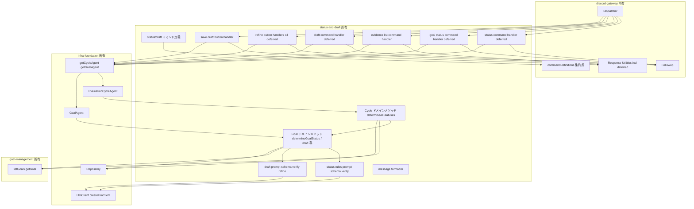
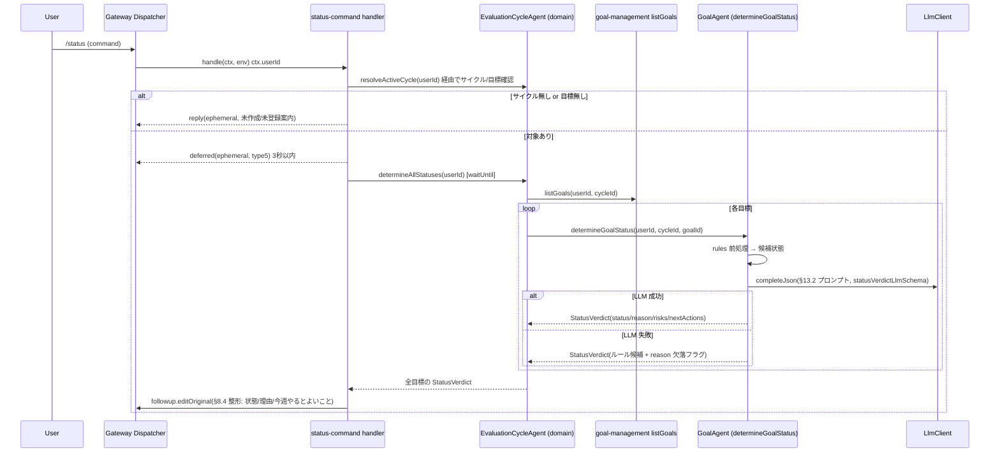
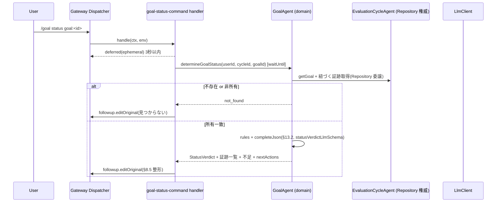
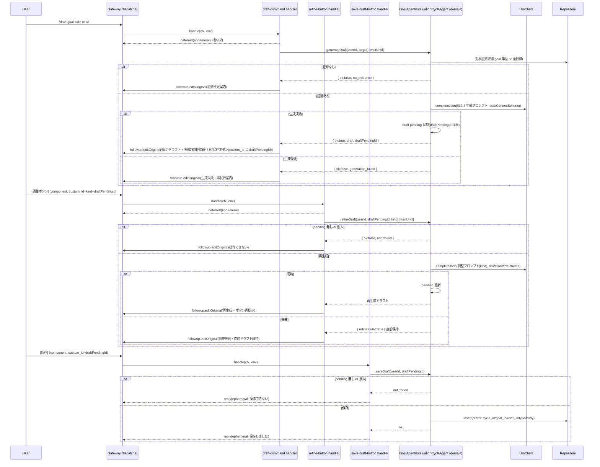
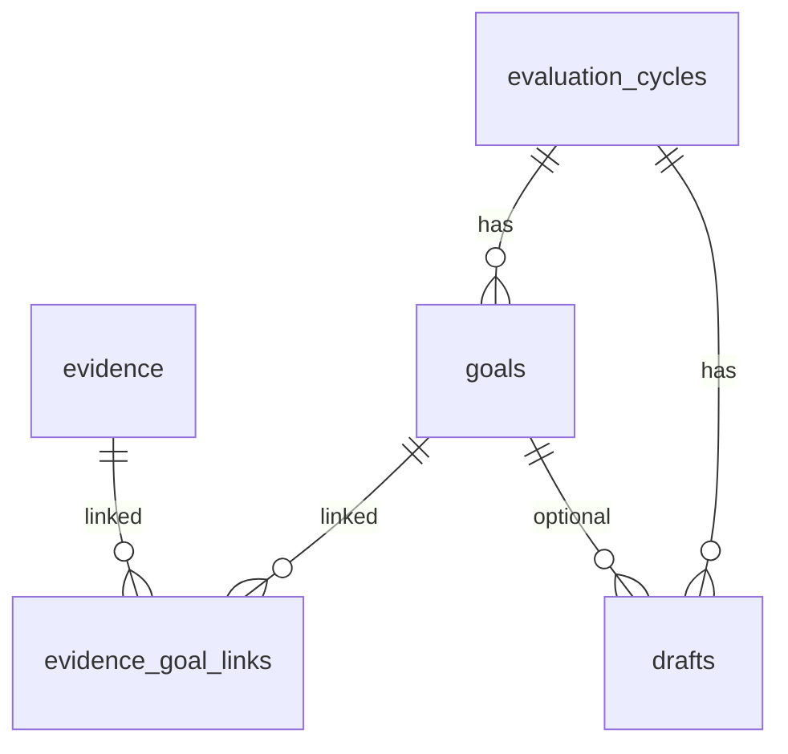

# Design Document: status-and-draft

## Overview

**Purpose**: 本スペックは蓄積された証跡を「現状把握」と「自己評価文」に変換する価値提供層を実装する。各評価目標の状態(Green/Yellow/Red/Gray)を §10.2 のルール前処理 + §13.2 の LLM 見立てで判定し、`/status`・`/goal status`・`/evidence list` で進捗を閲覧させ、`/draft`(goal/all)で §13.3 の事実/解釈/課題/次アクション分離・誇張なし・推測明示のドラフトを生成し、調整ボタンで再生成、[保存]で drafts(§11.8)へ保存する。ステータス判定は notifications が再利用する安定契約として Agent メソッドで公開する。

**Users**: 直接の利用者は半期評価目標を持つ個人ユーザー(`/status`・`/goal status`・`/evidence list`・`/draft` を実行し、ドラフトを調整・保存)と、本スペックのステータス判定結果を Red/Yellow アラートに再利用する下流スペック(notifications)の実装者である。

**Impact**: グリーンフィールド。infra-foundation(Repository・Agent 権威・LlmClient・§11 スキーマ + drafts)、discord-gateway(検証・ディスパッチ・deferred/follow-up/ephemeral/ボタン)、goal-management(目標一覧 + 達成条件・所有者スコープ・対象サイクル決定)、checkin-classification(蓄積された evidence/evidence_goal_links/weekly_reviews)が確立した契約の上に、ステータス判定・閲覧コマンド・ドラフト生成/調整/保存の責務を追加する。永続化スキーマ・Agent クラス骨格・LLM クライアント実装・Discord I/O 規約・目標定義 CRUD・証跡生成は再定義せず消費する。

### Goals
- §10.2 ルール前処理 + §13.2 LLM 見立てによる状態判定(status/reason/risks/nextActions)を、notifications が再利用できる Agent メソッドとして確立する。
- `/status`(全目標集約)・`/goal status`(単一目標詳細)・`/evidence list`(証跡閲覧)を所有者スコープ・本人限定文脈で提供する。
- `/draft`(goal/all)で §13.3 構成のドラフトを生成し、4 種の調整ボタンで再生成、[保存]で drafts へ保存する。
- 誇張なし・証跡にない内容を推測明示するプロンプト規約を本スペックが所有する。

### Non-Goals
- 証跡・週次レビューの生成/分類(checkin-classification)。
- サイクル/目標/証跡の定義 CRUD・削除(goal-management)。
- 状態変化を起点とする通知/アラートの送信スケジューリング(notifications。本スペックは判定結果を提供する側)。
- 永続化スキーマ DDL・Agent クラス宣言・LlmClient 実装・Discord 署名検証/ディスパッチ/登録手段(infra-foundation / discord-gateway)。

## Boundary Commitments

### This Spec Owns
- 閲覧/ドラフト系ハンドラ: `/status`・`/goal status`・`/evidence list` コマンドハンドラ(`/status`・`/goal status` は deferred + follow-up、`/evidence list` は所有者スコープの読み取りのみ)、`/draft` コマンドハンドラ(deferred + follow-up)、調整ボタン([短くする][成果を強める][課題を明確にする][上司向けにする])ハンドラ、[保存]ボタンハンドラ。各ハンドラを discord-gateway レジストリへ登録する規約適合処理。
- コマンド定義の供給: `/status`・`/goal status`(goal オプション)・`/evidence list`・`/draft`(goal オプション / all サブ)の application command 定義を discord-gateway 集約点へ追加。各調整/保存ボタンの custom_id 規約(draft pending ID 埋め込み)を定義。
- ステータス判定エンジン: §10.2 ルール前処理、§13.2 LLM プロンプト本体・zod 構造化出力スキーマ(`statusVerdictLlmSchema`)・ルール候補と LLM 見立ての統合(`combineVerdict`)、Gray フォールバック。EvaluationCycleAgent(全目標集約)/ GoalAgent(単一目標)のドメインメソッドとして実装し、notifications が再利用する公開契約として確定。
- ドラフト生成エンジン: §13.3 準拠の生成プロンプト本体・zod 構造化出力スキーマ(`draftContentSchema`)、誇張抑制と推測明示の規約、4 種調整(再生成)プロンプト、ドラフト pending の揮発的作業状態保持。
- ドラフト保存: drafts(§11.8)への type 付き保存(self_evaluation / manager_summary / short_summary)。
- メッセージ整形: §8.4/§8.5/§8.6/§8.7 の応答整形。

### Out of Boundary
- 永続化スキーマ DDL・`schema_migrations`・`Repository` 実装(infra-foundation 所有。本スペックは `Repository` を呼ぶのみ)。
- Agent クラス宣言・ルーティングヘルパー・ID 規約・`LlmClient`/`createLlmClient` 実装(infra-foundation 所有。本スペックは骨格メソッドの中身を実装し `getCycleAgent`/`getGoalAgent`・`createLlmClient` を呼ぶのみ)。
- Discord 署名検証・interaction ディスパッチ・modal/button 振り分け機構・応答ボディ生成・deferred/follow-up 配線・コマンド登録スクリプト(discord-gateway 所有。本スペックはハンドラ登録規約・応答ユーティリティ・`Followup` を利用)。
- 目標/サイクル/証跡の定義 CRUD・削除(goal-management。本スペックは `listGoals`/`getGoal` を呼ぶのみ)。
- 証跡・週次レビューの生成/分類(checkin-classification。本スペックは蓄積済みデータを読み取るのみ)。
- 通知/アラートのトリガ・送信スケジューリング(notifications。本スペックは判定結果を提供する側)。

### Allowed Dependencies
- infra-foundation 公開契約: `Repository`(insert/getById/listBy/update/remove)、`getCycleAgent`/`getGoalAgent`、`createLlmClient`/`LlmClient`(`complete`/`completeJson`)・`LlmError`、共有ドメイン型(`EntityRow<'evaluation_cycles'|'goals'|'evidence'|'evidence_goal_links'|'weekly_reviews'|'drafts'>`、`GoalStatus`、`Usefulness`、`DraftType`、`RelevanceScore`)、`Env`。
- discord-gateway 公開契約: `registerHandler`、`InteractionContext`、`HandlerResult`(reply/ephemeral/deferred)、`Followup`、コマンド定義集約点(`commandDefinitions`)。
- goal-management 公開契約: `CycleDomainOperations.listGoals`/`getGoal`(目標一覧 + 達成条件 + 評価観点取得)、対象サイクル決定規約(実行ユーザーの最新サイクル)、所有者スコープ規約。
- checkin-classification が蓄積したデータ(evidence/evidence_goal_links/weekly_reviews)を `Repository` 経由で読み取る(API ではなくデータ経由の消費)。
- 依存方向: `commands(定義) → handlers → agents(ドメインメソッド) → infra Repository / LlmClient & goal-management listGoals/getGoal`。`status(ルール/プロンプト/スキーマ/検証)`・`draft(プロンプト/スキーマ/検証)`・`messages(整形)`・`ownership` は handlers/domain から参照される横断ヘルパー。各層は左方向のみ import する。

### Revalidation Triggers
- 本スペックが公開する `StatusVerdict` 型・`determineGoalStatus`/`determineAllStatuses` のシグネチャ変更(notifications が再利用するため)。
- infra-foundation の `Repository`/`LlmClient`/`createLlmClient` シグネチャ・§11 スキーマ(evidence/evidence_goal_links/weekly_reviews/drafts/goals)・共有型・Agent ルーティングの変更。
- discord-gateway の `InteractionContext`/`HandlerResult`/`Followup`/`registerHandler`/コマンド定義集約点のシグネチャ変更。
- goal-management の `listGoals`/`getGoal`・対象サイクル決定規約の変更。
- §10.2 判定ルール・§13.2 判定出力形式・§13.3 ドラフト構成・§8.4-8.7 メッセージ仕様・§15 プライバシー要件・§11.8 drafts type の変更。
- `/status`・`/goal status`・`/evidence list`・`/draft` のコマンド名・オプション名・調整/保存ボタンの custom_id 規約の変更。

## Architecture

### Existing Architecture Analysis
- infra-foundation: EvaluationCycleAgent がサイクル単位 DO SQLite の単一権威。GoalAgent はステートレスで親へ委譲。`Repository` が型付き行アクセス、`LlmClient` がプロバイダ非依存の `complete`/`completeJson` を提供。drafts を含む §11 全テーブルが定義済み。
- discord-gateway: 薄いエントリー + ハンドラレジストリ。`(kind, name)` で command/component を振り分け、`HandlerResult` の `deferred` で type5 即返 + `Followup` 継続。応答は ephemeral 可。
- goal-management: 薄いハンドラ層 + Agent ドメインメソッドのパターン。`listGoals`/`getGoal`(達成条件・評価観点含む)と所有者スコープ・対象サイクル決定を確立。
- checkin-classification: 同型パターン。evidence(source/body/usefulness/evidence_date)・evidence_goal_links(relevance_score/reason)・weekly_reviews(summary/risks/next_actions)を所有者スコープで蓄積。本スペックはこれらを読み取り入力とする。
- 本スペックはこれらのパターン・契約を尊重し、状態判定/閲覧/ドラフトの責務のみを追加する。

### Architecture Pattern & Boundary Map

採用パターンは goal-management / checkin-classification と同型の「**薄いハンドラ層 + Agent ドメインメソッド**」。ハンドラは discord-gateway から渡る `InteractionContext` を解釈し、`getCycleAgent`/`getGoalAgent` で Agent を取得し、ドメインメソッド(状態判定/集約/ドラフト生成/保存)を呼び、`HandlerResult` を返す薄層に徹する。状態判定ルール/プロンプト/スキーマ/検証は `status` ヘルパー、ドラフトプロンプト/スキーマ/検証は `draft` ヘルパー、メッセージ整形は `messages` ヘルパーに分離する。

状態判定の責務配置: 単一目標判定(`determineGoalStatus`)は GoalAgent ドメインメソッド、全目標集約(`determineAllStatuses`)は EvaluationCycleAgent ドメインメソッド。どちらも notifications が `getGoalAgent`/`getCycleAgent` 経由で再利用できる公開契約とする(コマンドハンドラ内インライン実装にしない)。



**Architecture Integration**:
- Selected pattern: 薄いハンドラ層 + Agent ドメインメソッド。Discord I/O と判定/生成ロジックを分離し、データ権威(EvaluationCycleAgent)と所有者強制を尊重。判定/生成は Agent メソッドに集約し、notifications からの再利用と本スペックのコマンドハンドラからの利用を同一契約で満たす。
- Domain/feature boundaries: ハンドラは入出力変換のみ。判定ルール/プロンプト/スキーマ/検証は `status`、ドラフト生成/調整は `draft`、整形は `messages` に集約。判定/集約/生成/保存/draft pending 保持は Agent ドメインメソッド。
- New components rationale: 各ハンドラ・ドメインメソッド・ヘルパーは Req 1〜8 に直接対応。投機的抽象は導入しない。`determineGoalStatus`/`determineAllStatuses` の公開は Req 1.6/8.5(notifications 再利用)に対応。
- Steering compliance: roadmap の「判定/生成は本スペック所有・スキーマ/Agent/LLM は基盤・Discord 規約はゲートウェイ・目標定義は goal-management・証跡は checkin-classification」に準拠。§15 を所有者強制・ephemeral・ドラフト扱い・誇張抑制で満たす。日本語生成品質リスクは infra の `createLlmClient` によるモデル差し替えで吸収。

### Technology Stack

| Layer | Choice / Version | Role in Feature | Notes |
|-------|------------------|-----------------|-------|
| Frontend / CLI | Discord slash command / button(`discord-api-types` 型) | `/status`・`/goal status`・`/evidence list`・`/draft`・調整/保存ボタン | 定義は discord-gateway 集約点へ追加 |
| Backend / Services | Cloudflare `agents`(EvaluationCycleAgent / GoalAgent のドメインメソッド) | 状態判定・集約・ドラフト生成/調整/保存・draft pending 保持 | infra 骨格メソッドを実装 |
| AI / LLM | Cloudflare Workers AI(`LlmClient.completeJson`/`complete` 経由) | §13.2 状態見立て・§13.3 ドラフト生成/調整 | プロンプト/スキーマは本スペック所有。モデル差し替えは factory |
| Data / Storage | Durable Object SQLite(infra `Repository` 経由) | evidence/evidence_goal_links/weekly_reviews/goals 読取、drafts 書込 | スキーマは infra §11、本スペックは読み書きのみ |
| Infrastructure / Runtime | Cloudflare Workers + `ExecutionContext.waitUntil` | deferred 後の判定/生成処理継続 | gateway の deferred 経路が `Followup` を供給 |
| Language / Build | TypeScript(strict) | 型・ビルド | `any` 禁止。共有型を import |

## File Structure Plan

### Directory Structure
```
src/
└── status-and-draft/
    ├── commands.ts                 # /status・/goal status・/evidence list・/draft の application command 定義(Req 2.1, 3.1, 4.1, 5.1, 5.2)
    ├── register.ts                 # 全ハンドラを discord-gateway レジストリへ登録 + コマンド定義を集約点へ追加(Req 2.1, 3.1, 4.1, 5.1, 8.3)
    ├── custom-ids.ts               # custom_id 規約: SHORTEN_BTN / STRENGTHEN_BTN / CLARIFY_BTN / MANAGER_BTN / SAVE_DRAFT_BTN(draftPendingId 埋め込み)(Req 5.5, 6.*, 7.1)
    ├── handlers/
    │   ├── status-command.ts       # /status: サイクル/目標確認 → deferred → determineAllStatuses → §8.4 follow-up(Req 2.*)
    │   ├── goal-status-command.ts  # /goal status: deferred → determineGoalStatus + 証跡/不足/次アクション → §8.5 follow-up(Req 3.*)
    │   ├── evidence-list-command.ts# /evidence list: 所有者スコープ証跡取得 → §8.6 即時 ephemeral 応答(Req 4.*)
    │   ├── draft-command.ts        # /draft goal|all: deferred → generateDraft → §8.7 + 調整/保存ボタン follow-up(Req 5.*)
    │   ├── refine-button.ts        # 調整ボタン4種: deferred → refineDraft(kind) → 再提示(Req 6.*)
    │   └── save-draft-button.ts    # [保存]: saveDraft → 保存通知(Req 7.*)
    ├── status/
    │   ├── rules.ts                # §10.2 ルール前処理(直近2週/3週なし/着手/期限近/不足)→ 候補状態(Req 1.2, 1.4)
    │   ├── schema.ts               # zod スキーマ statusVerdictLlmSchema + 公開型 StatusVerdict(status/reason/risks/nextActions[+reasonMissing]) §13.2(Req 1.3)
    │   ├── prompt.ts               # §13.2 入力(定義/達成条件/マイルストーン/証跡/残日数)からプロンプト組立(Req 1.1, 1.3)
    │   └── verify.ts               # zod 検証済み LLM 見立てとルール候補の統合 + LLM 失敗時フォールバック(combineVerdict)(Req 1.3, 1.5)
    ├── draft/
    │   ├── schema.ts               # zod スキーマ draftContentSchema + 型 DraftContent = z.infer<...>(facts/interpretation/issues/nextActions + speculativeNotes) §13.3(Req 5.1, 5.4)
    │   ├── prompt.ts               # §13.3 生成プロンプト(事実/解釈/課題/次アクション分離・誇張抑制・推測明示)+ 調整プロンプト4種(Req 5.1, 5.4, 6.1-6.4)
    │   └── verify.ts               # zod 検証後のドメイン判定(空証跡ガード・推測マーク保持)(Req 5.4, 5.7)
    ├── messages.ts                 # §8.4/§8.5/§8.6/§8.7 応答整形・ドラフト本文の Discord メッセージ化(Req 2.2, 3.1, 4.1, 5.5)
    └── domain/
        ├── status-operations.ts    # GoalAgent: determineGoalStatus / collectGoalContext。EvaluationCycleAgent: determineAllStatuses(Req 1.*, 2.1, 3.1)
        ├── evidence-view.ts         # EvaluationCycleAgent: listEvidenceWithLinks(所有者スコープ証跡 + 紐づく目標)(Req 4.*)
        └── draft-operations.ts      # GoalAgent/Cycle: generateDraft / refineDraft / saveDraft / draft pending 保持・取得(Req 5.*, 6.*, 7.*)
```

### Modified Files
- `src/agents/evaluation-cycle-agent.ts`(infra 所有の骨格)— 全目標集約判定(`determineAllStatuses`)・証跡閲覧(`listEvidenceWithLinks`)・全体ドラフト(`/draft all`)・draft pending 保持の責務メソッドの中身を `domain/*` の実装で埋める(クラス宣言・ルーティング・onStart は変更しない)。
- `src/agents/goal-agent.ts`(infra 所有の骨格)— 単一目標判定(`determineGoalStatus`)・単一目標ドラフト生成/調整(`generateDraft`/`refineDraft`)の責務メソッドの中身を `domain/*` の実装で埋める。データ読み書きは親 Cycle へ委譲。
- `src/discord/commands/definitions.ts`(discord-gateway 所有の集約点)— `register.ts` 経由で status-and-draft のコマンド定義を集約配列へ追加(配列への追加のみ、機構は変更しない)。

> 依存方向: `commands.ts`・`custom-ids.ts` → `register.ts` → `handlers/*` → `domain/*` → infra `Repository`/`LlmClient` & goal-management `listGoals/getGoal`。`status/*`・`draft/*`・`messages.ts` は domain から参照される横断ヘルパー。各層は左方向のみ import する。

## System Flows

### `/status` 全目標集約(deferred)

deferred は 3 秒以内に type5 を返し、判定は `waitUntil` で継続して follow-up で本応答を送る(Req 2.3)。LLM 失敗時はルール候補で状態を成立させ、見立て文欠落を識別可能にする(Req 1.5)。

### `/goal status` 単一目標(deferred)

証跡が無い場合は判断材料不足(Gray)として扱い、証跡未保存を提示する(Req 3.5)。所有者不一致・不存在は同一の「見つからない」に正規化(Req 3.4)。

### `/draft` 生成 → 調整 → 保存

draft pending は確定保存前の揮発状態(draftPendingId→{userId, target, draftType, content, cycleId, goalId})。調整は pending 内容を入力に再生成し更新する(Req 6.5)。保存は drafts へ type 付きで永続化(Req 7.1, 7.2)。誇張せず証跡にない内容は推測明示(Req 5.4, 6.2)。

## Requirements Traceability

| Requirement | Summary | Components | Interfaces | Flows |
|-------------|---------|------------|------------|-------|
| 1.1 | 判定入力集約 | status/prompt.ts, domain/status-operations.ts | `collectGoalContext`, `determineGoalStatus` | status/goal status |
| 1.2 | §10.2 ルール前処理 | status/rules.ts | `evaluateRules` | status/goal status |
| 1.3 | §13.2 LLM 見立て構造化 | status/prompt.ts, status/schema.ts, status/verify.ts | `statusVerdictLlmSchema`, `buildStatusPrompt`, `combineVerdict` | status/goal status |
| 1.4 | Gray 判定 | status/rules.ts, status/verify.ts | `evaluateRules`, `combineVerdict` | status/goal status |
| 1.5 | LLM 失敗フォールバック | status/verify.ts, domain/status-operations.ts | `combineVerdict` | status/goal status |
| 1.6 | 再利用可能 Agent メソッド | domain/status-operations.ts | `determineGoalStatus`, `determineAllStatuses` | status/goal status |
| 1.7 | 所有者スコープ判定 | domain/status-operations.ts, ownership | `determineGoalStatus` | status/goal status |
| 2.1 | 全目標判定集約 | domain/status-operations.ts, handlers/status-command.ts | `determineAllStatuses`, `listGoals` | status |
| 2.2 | §8.4 整形 | messages.ts | `formatStatusOverview` | status |
| 2.3 | deferred + follow-up | handlers/status-command.ts | `deferred`, `Followup` | status |
| 2.4 | サイクル無し案内 | handlers/status-command.ts, domain/status-operations.ts | `resolveActiveCycle` | status |
| 2.5 | 目標未登録案内 | handlers/status-command.ts | `StatusCommandHandler` | status |
| 2.6 | 本人限定文脈 | handlers/status-command.ts, messages.ts | `HandlerResult` (ephemeral) | status |
| 3.1 | §8.5 詳細整形 | domain/status-operations.ts, messages.ts | `determineGoalStatus`, `formatGoalStatus` | goal status |
| 3.2 | 証跡一覧提示 | domain/status-operations.ts, domain/evidence-view.ts | `collectGoalContext` | goal status |
| 3.3 | deferred + follow-up | handlers/goal-status-command.ts | `deferred`, `Followup` | goal status |
| 3.4 | 不存在/非所有=見つからない | domain/status-operations.ts, ownership | `determineGoalStatus` (not_found) | goal status |
| 3.5 | 証跡無しは Gray | status/rules.ts, domain/status-operations.ts | `evaluateRules` | goal status |
| 3.6 | 本人限定文脈 | handlers/goal-status-command.ts | `HandlerResult` (ephemeral) | goal status |
| 4.1 | §8.6 証跡閲覧 | domain/evidence-view.ts, messages.ts, handlers/evidence-list-command.ts | `listEvidenceWithLinks`, `formatEvidenceList` | evidence list |
| 4.2 | 紐づく目標名解決 | domain/evidence-view.ts | `listEvidenceWithLinks` | evidence list |
| 4.3 | 証跡無し案内 | handlers/evidence-list-command.ts, messages.ts | `formatEvidenceList` | evidence list |
| 4.4 | 所有者スコープ・本人限定 | domain/evidence-view.ts, ownership, handlers/evidence-list-command.ts | `listEvidenceWithLinks` | evidence list |
| 5.1 | §13.3 目標ドラフト生成 | draft/prompt.ts, draft/schema.ts, domain/draft-operations.ts | `buildDraftPrompt`, `DraftContent`, `generateDraft` | draft |
| 5.2 | /draft all 全体生成 | domain/draft-operations.ts | `generateDraft` (all) | draft |
| 5.3 | deferred + follow-up | handlers/draft-command.ts | `deferred`, `Followup` | draft |
| 5.4 | 誇張抑制・推測明示 | draft/prompt.ts, draft/schema.ts, draft/verify.ts | `buildDraftPrompt`, `draftContentSchema` | draft |
| 5.5 | ドラフト扱い + 調整/保存ボタン | messages.ts, custom-ids.ts, handlers/draft-command.ts | custom_id 規約, `formatDraft` | draft |
| 5.6 | 不存在/非所有=見つからない | domain/draft-operations.ts, ownership | `generateDraft` (not_found) | draft |
| 5.7 | 証跡不足案内 | draft/verify.ts, domain/draft-operations.ts | `generateDraft` (no_evidence) | draft |
| 5.8 | 生成失敗・保存しない | draft/verify.ts, domain/draft-operations.ts | `generateDraft` (generation_failed) | draft |
| 5.9 | 本人限定文脈 | handlers/draft-command.ts | `HandlerResult` (ephemeral) | draft |
| 6.1 | 短縮再生成 | draft/prompt.ts, handlers/refine-button.ts, domain/draft-operations.ts | `refineDraft` (shorten) | draft |
| 6.2 | 成果強調再生成(誇張なし) | draft/prompt.ts, domain/draft-operations.ts | `refineDraft` (strengthen) | draft |
| 6.3 | 課題明確化再生成 | draft/prompt.ts, domain/draft-operations.ts | `refineDraft` (clarify) | draft |
| 6.4 | 上司向け再生成 | draft/prompt.ts, domain/draft-operations.ts | `refineDraft` (manager) | draft |
| 6.5 | 再生成後もボタン再提示 | messages.ts, handlers/refine-button.ts | `formatDraft` | draft |
| 6.6 | pending 無し/別人=操作不可 | domain/draft-operations.ts, custom-ids.ts | `refineDraft` (not_found) | draft |
| 6.7 | 調整失敗で直前保持 | domain/draft-operations.ts, handlers/refine-button.ts | `refineDraft` (refineFailed) | draft |
| 7.1 | drafts 保存(本文/対象/種別/所有者) | domain/draft-operations.ts | `saveDraft` | draft |
| 7.2 | type 対応保存 | domain/draft-operations.ts, draft/schema.ts | `saveDraft`, `DraftType` | draft |
| 7.3 | 保存通知(本人限定) | handlers/save-draft-button.ts, messages.ts | `SaveDraftButtonHandler` | draft |
| 7.4 | pending 無し/別人=保存しない | domain/draft-operations.ts | `saveDraft` (not_found) | draft |
| 7.5 | ドラフト扱い保持 | domain/draft-operations.ts | `saveDraft` | draft |
| 8.1 | 所有者スコープ正規化 | ownership, domain/* | `assertOwned` | all |
| 8.2 | 本人限定文脈応答 | handlers/* | `HandlerResult` (ephemeral) | all |
| 8.3 | スキーマ/Agent/LLM/Discord 消費 | (Boundary Commitments) | — | — |
| 8.4 | 上流/下流責務を実装しない | (Boundary Commitments) | — | — |
| 8.5 | 判定結果を notifications へ提供 | domain/status-operations.ts | `determineGoalStatus`, `determineAllStatuses` | status/goal status |

## Components and Interfaces

| Component | Domain/Layer | Intent | Req Coverage | Key Dependencies (P0/P1) | Contracts |
|-----------|--------------|--------|--------------|--------------------------|-----------|
| Command Definitions + Register | commands | コマンド定義供給とハンドラ登録 | 2.1, 3.1, 4.1, 5.1, 5.2, 8.3 | discord-gateway registry/definitions (P0) | Service |
| Status Command Handler | handlers | `/status` deferred・集約・整形 | 2.1-2.6 | getCycleAgent (P0), Followup (P0), messages (P0) | Service |
| Goal Status Command Handler | handlers | `/goal status` deferred・詳細整形 | 3.1-3.6 | getGoalAgent (P0), Followup (P0), messages (P0) | Service |
| Evidence List Command Handler | handlers | `/evidence list` 所有者スコープ閲覧 | 4.1-4.4 | getCycleAgent (P0), response (P0), messages (P0) | Service |
| Draft Command Handler | handlers | `/draft` deferred・生成・ボタン提示 | 5.1-5.9 | getGoalAgent/getCycleAgent (P0), Followup (P0), messages (P0) | Service |
| Refine / Save Draft Button Handlers | handlers | 調整再生成・保存 | 6.1-6.7, 7.1-7.5 | getGoalAgent/getCycleAgent (P0), Followup/response (P0), custom-ids (P0) | Service |
| Status Rules + Prompt + Schema + Verify | status | §10.2 ルール + §13.2 見立て・統合 | 1.1-1.5, 3.5 | LlmClient (P0), goal types (P1) | Service |
| Draft Prompt + Schema + Verify | draft | §13.3 生成・調整・推測明示・検証 | 5.1, 5.4, 5.7, 6.1-6.4 | LlmClient (P0) | Service |
| Message Formatter | messages | §8.4/§8.5/§8.6/§8.7 整形 | 2.2, 3.1, 4.1, 4.3, 5.5, 6.5 | status/draft schema (P1) | Service |
| Status Domain Operations | domain | 単一/全目標判定・再利用契約 | 1.1-1.7, 2.1, 3.1-3.5, 8.5 | Repository (P0), LlmClient (P0), listGoals/getGoal (P0), status helpers (P0), ownership (P0) | Service, State |
| Evidence View Operations | domain | 所有者スコープ証跡 + 目標名解決 | 4.1-4.4 | Repository (P0), ownership (P0) | Service |
| Draft Domain Operations | domain | 生成/調整/保存/pending 保持 | 5.1-5.8, 6.1-6.7, 7.1-7.5 | Repository (P0), LlmClient (P0), draft helpers (P0), ownership (P0) | Service, State |

### handlers

#### Status / Goal Status / Evidence List / Draft / Refine / Save Draft Handlers

| Field | Detail |
|-------|--------|
| Intent | discord-gateway 規約に従い、入力解釈 → ドメイン呼び出し → 応答整形を行う薄層 |
| Requirements | 2.1-2.6, 3.1-3.6, 4.1-4.4, 5.1-5.9, 6.1-6.7, 7.1-7.5, 8.2 |

**Responsibilities & Constraints**
- `InteractionContext` から `userId`・コマンド引数(goal オプション / all)・custom_id(draftPendingId 埋め込み + 調整 kind)を取り出す。
- LLM 非依存の `/evidence list`・[保存] は即時応答。LLM を伴う `/status`・`/goal status`・`/draft`・調整ボタンは `deferred` を宣言し `Followup` で本応答。
- 結果を `HandlerResult`(`reply`/`deferred`、`ephemeral: true`)へ整形。
- ビジネスルール(判定・生成・所有者強制・pending 検証)はハンドラに持たず、ドメイン層へ委譲する。

**Dependencies**
- Inbound: discord-gateway Dispatcher — `handle(ctx, env)`(P0)
- Outbound: Status / Evidence View / Draft Domain Operations(P0)、Message Formatter(P0)、Response/Followup ユーティリティ(P0)
- External: `getCycleAgent`/`getGoalAgent`(infra)(P0)

**Contracts**: Service [x]

##### Service Interface
```typescript
import type { InteractionContext, HandlerResult } from "../discord/types";
import type { Env } from "../env";

interface StatusCommandHandler {
  handle(ctx: InteractionContext, env: Env): Promise<HandlerResult>; // deferred: 全目標判定 → §8.4
}
interface GoalStatusCommandHandler {
  handle(ctx: InteractionContext, env: Env): Promise<HandlerResult>; // deferred: 単一判定 → §8.5
}
interface EvidenceListCommandHandler {
  handle(ctx: InteractionContext, env: Env): Promise<HandlerResult>; // 即時 ephemeral: §8.6
}
interface DraftCommandHandler {
  handle(ctx: InteractionContext, env: Env): Promise<HandlerResult>; // deferred: 生成 → §8.7 + ボタン
}
interface RefineButtonHandler {
  handle(ctx: InteractionContext, env: Env): Promise<HandlerResult>; // deferred: kind 再生成 → 再提示
}
interface SaveDraftButtonHandler {
  handle(ctx: InteractionContext, env: Env): Promise<HandlerResult>; // 保存 → 通知
}
```
- Preconditions: `ctx` は署名検証済み・種別判定済みで `ctx.userId` が供給されている(discord-gateway 保証)。
- Postconditions: 個人評価データを含む応答は ephemeral(Req 2.6, 3.6, 4.4, 5.9, 8.2)。保存は [保存] 操作時のみ(Req 7.1)。
- Invariants: ハンドラはビジネスルールを持たず、所有者強制と pending 検証はドメイン層に委譲。

**Implementation Notes**
- Integration: `register.ts` が `registerHandler('command','status',...)`、`registerHandler('command','goal status',...)`、`registerHandler('command','evidence list',...)`、`registerHandler('command','draft',...)`、`registerHandler('component', SHORTEN_BTN+pending, ...)` 等を登録。調整 kind と draftPendingId はボタン custom_id に埋め、抽出する。
- Validation: goal オプションの存在・空入力はハンドラで確認。pending 存在/所有者はドメイン層。
- Risks: deferred(type5)はゲートウェイ応答契約に依存。未提供時は revalidation trigger としてゲートウェイへ差し戻す。

### status

#### Status Rules + Prompt + Schema + Verify

| Field | Detail |
|-------|--------|
| Intent | §10.2 ルール前処理・§13.2 LLM 見立ての組立/型/検証/統合 |
| Requirements | 1.1, 1.2, 1.3, 1.4, 1.5, 3.5 |

**Responsibilities & Constraints**
- `evaluateRules`: §10.2 のルール(直近2週間以内の証跡有無、3週間以上証跡なし、達成条件の着手状況、半期終了の近さ、定義/証跡の不足)を入力コンテキストに適用し、候補状態(Green/Yellow/Red/Gray)と根拠フラグを返す(Req 1.2, 1.4, 3.5)。
- `buildStatusPrompt`: §13.2 の入力(目標定義・達成条件・マイルストーン・保存済み証跡・半期終了までの日数)からプロンプトを組み立てる(Req 1.1, 1.3)。
- `statusVerdictLlmSchema`(zod v4): §13.2 LLM 出力(status/reason/risks/nextActions)を zod スキーマで定義。`completeJson(req, statusVerdictLlmSchema)` に渡し、status 列挙・配列型・構造の検証を LLM クライアントに委ねる(Req 1.3)。`reasonMissing` は LLM 出力ではなく `combineVerdict` が付与するため、公開型 `StatusVerdict` はスキーマ infer 型に `reasonMissing` を加えた形(notifications との共有契約のため形状不変)。
- `combineVerdict`: ルール候補と **zod 検証済みの** LLM 見立て(`completeJson` の `LlmResult`)を統合。`{ ok:false }`(`invalid_output`)時はルール候補で status を成立させ `reasonMissing: true` とする(Req 1.5)。判断材料不足は Gray(Req 1.4)。構造再検証は行わない(zod 済み)。
- 機能固有ルール/プロンプト/zod スキーマのみ所有。LLM 呼び出し機構・JSON パース + スキーマ検証は `LlmClient.completeJson` に委譲。

**Dependencies**
- Inbound: Status Domain Operations(P0)
- Outbound: `LlmClient.completeJson`(zod スキーマ引数)(infra)(P0)
- External: 共有型(`GoalStatus`、`EntityRow<'goals'|'evidence'>`)、`zod`(P1)

**Contracts**: Service [x]

##### Service Interface
```typescript
import { z } from "zod"; // v4
import { goalStatusSchema } from "../types/enums"; // 共有 enum の zod スキーマ
import type { GoalStatus } from "../types/enums";

interface GoalStatusContext {
  goalId: string;
  title: string;
  description: string;
  successCriteria: string | null;
  evaluationPoints: string | null;
  evidence: ReadonlyArray<{ body: string; evidenceDate: string; usefulness: string }>;
  daysUntilCycleEnd: number;
  latestEvidenceAgeDays: number | null; // 証跡なしは null
}

interface RuleOutcome {
  candidate: GoalStatus;        // green | yellow | red | gray
  insufficientMaterial: boolean; // Gray 根拠(証跡少/達成条件未設定/定義曖昧)
}

// §13.2 LLM 出力(reasonMissing を含まない)を zod で検証
export const statusVerdictLlmSchema = z.object({
  status: goalStatusSchema,           // green | yellow | red | gray
  reason: z.string(),
  risks: z.array(z.string()),
  nextActions: z.array(z.string()),
});

// 公開契約(notifications と共有): LLM 出力 + reasonMissing。形状は不変。
export type StatusVerdict = z.infer<typeof statusVerdictLlmSchema> & {
  reasonMissing: boolean; // LLM 見立て欠落時 true(ルールのみで成立)
};

declare function evaluateRules(ctx: GoalStatusContext): RuleOutcome;
declare function buildStatusPrompt(ctx: GoalStatusContext): { system: string; prompt: string };

// completeJson が返す zod 検証済み LlmResult をルール候補と統合
declare function combineVerdict(
  rule: RuleOutcome,
  llm: LlmResult<z.infer<typeof statusVerdictLlmSchema>>,
): StatusVerdict;
```
- Preconditions: `ctx` は所有者スコープ済みの目標コンテキスト。`combineVerdict` の `llm` は `completeJson(req, statusVerdictLlmSchema)` の戻り値(成功時は zod 検証済み)。
- Postconditions: `combineVerdict` は常に有効な `StatusVerdict` を返す(LLM 失敗時もルール候補で status を確定し `reasonMissing: true`)。
- Invariants: 判断材料不足は Gray(Req 1.4)。status は `GoalStatus` 列挙に限定(zod スキーマで保証)。

**Implementation Notes**
- Integration: `determineGoalStatus` が `collectGoalContext` → `evaluateRules` → `buildStatusPrompt` → `completeJson(req, statusVerdictLlmSchema)` → `combineVerdict` を順に呼ぶ。
- Validation: status enum・risks/nextActions の文字列配列・構造は zod スキーマが保証。期間計算は cycle.end_date と現在日付から算出。
- Risks: Workers AI の日本語/JSON 品質。`invalid_output`(zod 不一致含む)時はルール候補へフォールバック(モデル差し替えは infra factory、Req 8.3)。

### draft

#### Draft Prompt + Schema + Verify

| Field | Detail |
|-------|--------|
| Intent | §13.3 ドラフト生成/調整プロンプト組立・zod 構造化出力スキーマ・検証後ドメイン判定 |
| Requirements | 5.1, 5.4, 5.7, 6.1, 6.2, 6.3, 6.4 |

**Responsibilities & Constraints**
- `buildDraftPrompt`: 対象証跡から §13.3 の事実/解釈/課題/次アクションを分離生成するプロンプトを組み立てる。誇張抑制と「証跡にない内容は推測明示」を指示(Req 5.1, 5.4)。
- `buildRefinePrompt`: 直前ドラフトと調整 kind(shorten/strengthen/clarify/manager)から再生成プロンプトを組み立てる。strengthen でも誇張せず推測明示を維持(Req 6.1-6.4)。
- `draftContentSchema`(zod v4): §13.3 構成(facts/interpretation/issues/nextActions + speculativeNotes)を zod スキーマで定義し、`DraftContent = z.infer<...>` で型導出。4 セクション必須・speculativeNotes 配列の構造検証は `completeJson(req, draftContentSchema)` の `safeParse` に委ねる(Req 5.4)。
- `verifyDraft`: **zod 検証済みの** `DraftContent` に対するドメイン判定のみ — 空証跡ガードは呼び出し側(`generateDraft`)が担うため、ここでは推測マーク保持等の軽微なドメイン整形に縮小(Req 5.4, 5.7)。
- 機能固有プロンプト/zod スキーマのみ所有。LLM 呼び出し機構・JSON パース + スキーマ検証は `LlmClient.completeJson` に委譲。

**Dependencies**
- Inbound: Draft Domain Operations(P0)
- Outbound: `LlmClient.completeJson`(zod スキーマ引数)(infra)(P0)
- External: 共有型(`DraftType`、`EntityRow<'evidence'>`)、`zod`(P1)

**Contracts**: Service [x]

##### Service Interface
```typescript
import { z } from "zod"; // v4
import type { DraftType } from "../types/enums";

type RefineKind = "shorten" | "strengthen" | "clarify" | "manager";

export const draftContentSchema = z.object({
  facts: z.string(),          // 事実: 何をしたか(証跡ベース)
  interpretation: z.string(), // 解釈: 目標にどう効いたか
  issues: z.string(),         // 課題: 何が不足しているか
  nextActions: z.string(),    // 次アクション: 今後どうするか
  speculativeNotes: z.array(z.string()), // 証跡にない内容を推測として明示
});
export type DraftContent = z.infer<typeof draftContentSchema>;

interface DraftEvidenceInput {
  goalTitle: string | null; // all は null(全体)
  evidence: ReadonlyArray<{ body: string; evidenceDate: string; usefulness: string }>;
}

declare function buildDraftPrompt(input: DraftEvidenceInput): { system: string; prompt: string };
declare function buildRefinePrompt(prev: DraftContent, kind: RefineKind): { system: string; prompt: string };

declare function refineKindToDraftType(kind: RefineKind | null): DraftType;
// null(初期生成)=self_evaluation, manager=manager_summary, shorten=short_summary, strengthen/clarify=self_evaluation
```
- Preconditions: `input.evidence` は所有者スコープ済み。空配列は呼び出し側(`generateDraft`)が事前に弾く(Req 5.7)。`completeJson(req, draftContentSchema)` の戻り値は成功時 zod 検証済み。
- Postconditions: 構造検証済みの `DraftContent`。推測内容は `speculativeNotes` に保持(Req 5.4)。
- Invariants: 誇張せず証跡を超える主張は推測として分離。strengthen でも事実を捏造しない(Req 6.2)。構造/必須セクションは zod が保証。

**Implementation Notes**
- Integration: `generateDraft` が `buildDraftPrompt` → `completeJson(req, draftContentSchema)`、`refineDraft` が `buildRefinePrompt` → `completeJson(req, draftContentSchema)` を呼ぶ。`{ ok:false }`(`invalid_output`)は生成失敗として扱う。
- Validation: 4 セクション必須・speculativeNotes 配列・構造は zod スキーマが保証。DraftType は `refineKindToDraftType` で決定。
- Risks: Workers AI の日本語生成品質(roadmap の既知リスク)。`invalid_output`(zod 不一致含む)時は再試行案内。誇張抑制はプロンプト + ドラフト扱い・本人確認で緩和(構造は zod、内容の誇張は完全保証不可)。

### domain

#### Status Domain Operations(GoalAgent / EvaluationCycleAgent メソッド実装)

| Field | Detail |
|-------|--------|
| Intent | 単一/全目標の状態判定を権威上で実装し、notifications 再利用契約として公開 |
| Requirements | 1.1-1.7, 2.1, 3.1-3.5, 8.5 |

**Responsibilities & Constraints**
- `collectGoalContext`(GoalAgent): 目標定義(`getGoal` 経由)・紐づく証跡(evidence_goal_links → evidence)・半期終了までの日数・最新証跡経過を集約して `GoalStatusContext` を構成(Req 1.1, 3.2)。
- `determineGoalStatus`(GoalAgent): `collectGoalContext` → `evaluateRules` → `buildStatusPrompt` → `completeJson(req, statusVerdictLlmSchema)` → `combineVerdict`。所有者不一致/不存在は `not_found`(Req 1.2-1.7, 3.4)。証跡無しは Gray(Req 3.5)。
- `determineAllStatuses`(EvaluationCycleAgent): `listGoals` の全目標について各 GoalAgent の `determineGoalStatus` を集約(Req 2.1)。
- 公開: `determineGoalStatus`/`determineAllStatuses` は notifications が `getGoalAgent`/`getCycleAgent` 経由で呼べる安定契約(Req 1.6, 8.5)。
- すべて `Repository`/`listGoals`/`getGoal` 経由でデータアクセス。所有者強制を強制。

**Dependencies**
- Inbound: handlers / notifications(再利用)(P0)
- Outbound: infra `Repository`(P0)、`LlmClient`(P0)、goal-management `listGoals`/`getGoal`(P0)、Status helpers(P0)、ownership(P0)
- External: 共有型(`EntityRow<...>`、`GoalStatus`)(P1)

**Contracts**: Service [x] / State [x]

##### Service Interface
```typescript
import type { EntityRow } from "../persistence/repository";
import type { StatusVerdict } from "../status/schema";

type GoalStatusResult =
  | { ok: true; verdict: StatusVerdict; goal: EntityRow<"goals">;
      evidence: ReadonlyArray<EntityRow<"evidence">>; shortfalls: string[] }
  | { ok: false; reason: "not_found" };

interface StatusDomainOperations {
  // GoalAgent
  collectGoalContext(userId: string, cycleId: string, goalId: string): GoalStatusContext | null;
  determineGoalStatus(userId: string, cycleId: string, goalId: string): Promise<GoalStatusResult>;
  // EvaluationCycleAgent
  resolveActiveCycle(userId: string): EntityRow<"evaluation_cycles"> | null;
  determineAllStatuses(userId: string): Promise<
    | { ok: true; cycle: EntityRow<"evaluation_cycles">;
        results: ReadonlyArray<{ goal: EntityRow<"goals">; verdict: StatusVerdict }> }
    | { ok: false; reason: "no_cycle" | "no_goals" }>;
}
```
- Preconditions: マイグレーション適用済み(infra `onStart`)。`userId` は実行ユーザー。
- Postconditions: 判定は読み取りのみで永続化しない。`not_found` は所有者不一致と不存在を正規化(Req 1.7, 3.4)。
- Invariants: 全操作で `user_id` 一致を強制。`StatusVerdict` 型・メソッドシグネチャは notifications との共有契約(Req 1.6, 8.5)。

##### State Management
- State model: 判定は read-only。状態は §11(goals/evidence/evidence_goal_links、DO SQLite)から導出し、本スペックは status を永続化しない(`goals.status` の更新は本スペックの責務外。MVP では判定は都度算出)。
- Persistence & consistency: 読み取りは単一権威(Cycle の SQLite)。
- Concurrency strategy: DO の per-instance シリアライズに依拠。Goal→Cycle はデータ読み取り委譲。

**Implementation Notes**
- Integration: GoalAgent 骨格メソッドに単一判定、EvaluationCycleAgent 骨格メソッドに集約判定を実装。GoalAgent はデータを親 Cycle の Repository から読み取る(infra 委譲方針)。
- Validation: 半期終了までの日数は cycle.end_date と現在日付。証跡経過は最新 evidence.evidence_date。
- Risks: 全目標 × LLM 呼び出しのレイテンシ。deferred + follow-up(最大 15 分 token)で吸収。MVP 規模では許容。

#### Evidence View Operations(EvaluationCycleAgent メソッド実装)

| Field | Detail |
|-------|--------|
| Intent | 所有者スコープの証跡一覧 + 紐づく目標名を読み取る |
| Requirements | 4.1, 4.2, 4.3, 4.4 |

**Responsibilities & Constraints**
- `listEvidenceWithLinks`: 実行ユーザー所有の evidence を取得し、evidence_goal_links → goals で紐づく目標名を解決して返す(Req 4.1, 4.2)。
- 所有者スコープ強制。他ユーザーの証跡を含めない(Req 4.4)。証跡無しは空配列(Req 4.3、案内はハンドラ/メッセージ層)。

**Dependencies**
- Inbound: handlers(P0)
- Outbound: infra `Repository`(P0)、ownership(P0)

**Contracts**: Service [x]

##### Service Interface
```typescript
import type { EntityRow } from "../persistence/repository";

interface EvidenceWithLinks {
  evidence: EntityRow<"evidence">;
  linkedGoalTitles: string[];
}
interface EvidenceViewOperations {
  listEvidenceWithLinks(userId: string): EvidenceWithLinks[];
}
```
- Postconditions: 返却は実行ユーザー所有の証跡のみ。
- Invariants: 所有者スコープ外データを露出しない(Req 4.4)。

#### Draft Domain Operations(GoalAgent / EvaluationCycleAgent メソッド実装)

| Field | Detail |
|-------|--------|
| Intent | ドラフト生成/調整/保存・draft pending 保持を権威上で実装 |
| Requirements | 5.1-5.8, 6.1-6.7, 7.1-7.5 |

**Responsibilities & Constraints**
- `generateDraft`: 対象証跡取得(goal 単位 = GoalAgent / all = EvaluationCycleAgent 全目標)→ 空証跡は `no_evidence`(Req 5.7)→ `buildDraftPrompt` → `completeJson(req, draftContentSchema)`(`{ ok:false }` は `generation_failed`、保存しない、Req 5.8)→ draft pending 保持(draftPendingId 採番、Req 5.1, 5.2)。所有者不一致/不存在は `not_found`(Req 5.6)。
- `refineDraft`: draftPendingId + 所有者検証(不在/別人は `not_found`、Req 6.6)→ `buildRefinePrompt(kind)` → `completeJson(req, draftContentSchema)` → pending 更新(Req 6.1-6.5)。失敗は直前 pending 保持 + `refineFailed`(Req 6.7)。
- `saveDraft`: draftPendingId + 所有者検証(不在/別人は `not_found`、Req 7.4)→ `refineKindToDraftType` で type 決定 → drafts へ insert(cycle_id/goal_id(all は null)/user_id/type/body、Req 7.1, 7.2)→ ドラフト扱いを保持(Req 7.5)。
- `discardable pending`: draft pending は揮発(Agent インスタンスメモリ)。

**Dependencies**
- Inbound: handlers(P0)
- Outbound: infra `Repository`(P0)、`LlmClient`(P0)、Draft helpers(P0)、goal-management `listGoals`/`getGoal`(P0)、ownership(P0)
- External: 共有型(`EntityRow<'evidence'|'drafts'>`、`DraftType`)(P1)

**Contracts**: Service [x] / State [x]

##### Service Interface
```typescript
import type { EntityRow } from "../persistence/repository";
import type { DraftContent, RefineKind } from "../draft/schema";

type DraftTarget = { kind: "goal"; goalId: string } | { kind: "all" };

type GenerateDraftResult =
  | { ok: true; draftPendingId: string; content: DraftContent }
  | { ok: false; reason: "not_found" | "no_evidence" | "generation_failed" };

type RefineDraftResult =
  | { ok: true; content: DraftContent }
  | { ok: false; reason: "not_found" | "refine_failed" }; // refine_failed は直前 pending 保持

type SaveDraftResult =
  | { ok: true; draft: EntityRow<"drafts"> }
  | { ok: false; reason: "not_found" };

interface DraftDomainOperations {
  generateDraft(userId: string, target: DraftTarget): Promise<GenerateDraftResult>;
  refineDraft(userId: string, draftPendingId: string, kind: RefineKind): Promise<RefineDraftResult>;
  saveDraft(userId: string, draftPendingId: string): SaveDraftResult;
}
```
- Preconditions: マイグレーション適用済み。`userId` は実行ユーザー。証跡・目標は所有者スコープ。
- Postconditions: 生成/調整は永続化しない(pending のみ)。[保存] のみ drafts へ書き込む(Req 7.1)。`not_found` は所有者不一致/不在を正規化(Req 5.6, 6.6, 7.4)。
- Invariants: 全操作で `user_id` 一致を強制。保存は確定済み評価ではなくドラフト(Req 7.5)。生成文は誇張せず推測明示(Req 5.4、ヘルパー検証で担保)。

##### State Management
- State model: 確定データ = drafts(§11.8、DO SQLite)。draft pending = Agent インスタンスメモリ(揮発、draftPendingId→{userId, target, draftType, content, cycleId, goalId})。
- Persistence & consistency: 保存は単一権威 DO SQLite に反映。pending は永続化しない(DO 再起動で消失 → 再生成、確定済み drafts に影響なし)。
- Concurrency strategy: DO の per-instance シリアライズに依拠。

**Implementation Notes**
- Integration: goal 単位生成/調整は GoalAgent、全体生成は EvaluationCycleAgent に実装。pending はどちらの Agent が保持するか統一(全体=Cycle、目標=該当 GoalAgent)し、custom_id の draftPendingId で再取得。
- Validation: DraftType は調整 kind から決定(self_evaluation/manager_summary/short_summary)。goal_id は all で null。
- Risks: pending 揮発による再生成(MVP 許容)。LLM 生成のばらつきはドラフト扱い・調整 UX・検証で吸収。

### shared

#### Message Formatter / Ownership 利用

| Field | Detail |
|-------|--------|
| Intent | §8.4/§8.5/§8.6/§8.7 の整形と所有者強制の利用 |
| Requirements | 2.2, 3.1, 4.1, 4.3, 5.5, 6.5, 8.1 |

**Responsibilities & Constraints**
- `formatStatusOverview`: 全目標の `StatusVerdict` を §8.4 形式(目標ごと状態/理由 + 今週やるとよいこと)へ整形(Req 2.2)。
- `formatGoalStatus`: 単一目標の状態・見立て・証跡一覧・不足・次アクションを §8.5 形式へ整形(Req 3.1)。
- `formatEvidenceList`: 証跡 + 紐づく目標 + usefulness + 補足を §8.6 形式へ整形。空は未保存案内(Req 4.1, 4.3)。
- `formatDraft`: `DraftContent` を §8.7 のドラフト本文へ整形し、調整/保存ボタン提示用テキストを返す(Req 5.5, 6.5)。
- 所有者強制は goal-management と同様の方針(`user_id` 一致、不一致=不存在)をドメイン層で適用(Req 8.1)。本スペックは infra/goal-management の所有者規約を消費し独自定義しない。

**Contracts**: Service [x]

##### Service Interface
```typescript
import type { StatusVerdict } from "../status/schema";
import type { DraftContent } from "../draft/schema";
import type { EntityRow } from "../persistence/repository";

declare function formatStatusOverview(
  results: ReadonlyArray<{ goal: EntityRow<"goals">; verdict: StatusVerdict }>,
): string;
declare function formatGoalStatus(
  goal: EntityRow<"goals">, verdict: StatusVerdict,
  evidence: ReadonlyArray<EntityRow<"evidence">>, shortfalls: string[],
): string;
declare function formatEvidenceList(
  items: ReadonlyArray<{ evidence: EntityRow<"evidence">; linkedGoalTitles: string[] }>,
): string;
declare function formatDraft(content: DraftContent): string;
```
- Postconditions: 各応答は仕様 §8 の構造を満たす。
- Invariants: 個人評価データを含む文言は ephemeral 応答にのみ使われる(呼び出し側ハンドラが保証、Req 8.2)。

## Data Models

### Domain Model
- 本スペックは infra-foundation §11 の `goals`・`evidence`・`evidence_goal_links`・`weekly_reviews`・`evaluation_cycles` を読み取り、`drafts` を書き込む。新規エンティティ・新規列は導入しない(Req 8.3)。
- 集約: EvaluationCycle が権威。状態判定は goals + 紐づく evidence(evidence_goal_links 経由)+ cycle.end_date から都度導出する読み取り操作。Draft は Cycle に属し Goal を任意参照(all は goal_id=null)。
- 不変条件: `drafts.type` は `DraftType` enum(self_evaluation/one_on_one/manager_summary/short_summary)。`StatusVerdict.status` は `GoalStatus` enum。全行に `user_id`(所有者)を付与。draft pending は永続モデルに含めない(揮発状態)。



### Physical Data Model (DO SQLite)
infra-foundation 定義済みの §11 スキーマをそのまま利用する(本スペックは DDL を所有しない)。操作する主な列:

| Table | 本スペックの操作 | 関連列 |
|-------|------------------|--------|
| goals | getById / listBy(cycle_id, user_id)(読取) | id, cycle_id, user_id, title, description, success_criteria, evaluation_points, status |
| evidence | listBy(user_id) / getById(読取) | id, cycle_id, user_id, source_type, title, body, evidence_date, usefulness |
| evidence_goal_links | listBy(goal_id / evidence_id)(読取) | id, evidence_id, goal_id, relevance_score, reason |
| weekly_reviews | listBy(cycle_id, user_id)(読取、補助入力) | id, cycle_id, user_id, week_start_date, summary, risks, next_actions |
| evaluation_cycles | getById / listBy(user_id)(読取、残日数算出) | id, user_id, start_date, end_date |
| drafts | insert(書込) | id, cycle_id, goal_id, user_id, type, body, created_at, updated_at |

### Data Contracts & Integration
- 共有型は infra の `src/types/` から import(`EntityRow<E>`、`GoalStatus`、`Usefulness`、`DraftType`)。本スペックは型を再定義しない(Req 8.3)。
- ステータス判定の構造化出力(`StatusVerdict`)・ドラフト構成(`DraftContent`)は §13.2/§13.3 準拠の機能固有スキーマとして `status/schema.ts`・`draft/schema.ts` に所有(infra の §13 共通基本型を組み合わせて構築)。
- `StatusVerdict` 型と `determineGoalStatus`/`determineAllStatuses` シグネチャは notifications との共有契約。変更は revalidation trigger。
- 目標一覧 + 達成条件 + 評価観点は goal-management の `listGoals`/`getGoal` から取得(本スペックは取得 API を再実装しない)。
- コマンド定義は discord-gateway の `commandDefinitions` 集約点へ追加。調整/保存ボタンの custom_id(draftPendingId + kind 埋め込み)は本スペックが定義し照合キーとする。

## Error Handling

### Error Strategy
- ステータス判定 LLM 失敗: `completeJson(req, statusVerdictLlmSchema)` が `invalid_output`(JSON 不整合 or zod スキーマ不一致)を返した場合、`combineVerdict` がルール候補へフォールバックし、status を成立させ `reasonMissing: true` を返す(Req 1.5)。判断材料不足は Gray(Req 1.4)。
- 所有者不一致/不存在: `not_found` に正規化し、他ユーザーデータを露出しない(Req 1.7, 3.4, 5.6)。
- サイクル/目標不在: `/status` は `no_cycle`/`no_goals` を案内し判定しない(Req 2.4, 2.5)。
- ドラフト証跡不足: `no_evidence` を案内し、誇張で補完しない(Req 5.7)。
- ドラフト生成失敗: `generation_failed` を案内し保存しない(Req 5.8)。調整失敗は直前 pending を保持し `refine_failed` を通知(Req 6.7)。
- pending 不在/別人: 調整・保存とも `not_found` に正規化(Req 6.6, 7.4)。

### Error Categories and Responses
- User Errors: サイクル未作成・目標未登録・証跡未保存・別人/不在 pending・存在しない目標 → ephemeral でガイダンス(Req 2.4, 2.5, 4.3, 5.7)。
- System Errors: Workers AI 障害 → 状態判定はルールへフォールバック、ドラフトは再試行案内。Repository/DO 例外は infra ポリシーに従い処理。
- Business Logic Errors: 判断材料不足 → Gray + 説明。誇張防止違反は検証 + ドラフト扱いで緩和(Req 5.4)。

### Monitoring
- Workers ログ(`console`)へ LLM 失敗・フォールバック・pending 不在・保存失敗を記録(steering baseline 準拠)。本スペック固有の追加監視要件はない。

## Testing Strategy

### Unit Tests
- `evaluateRules`: 直近2週内証跡で Green 候補、3週以上証跡なしで Red 候補、証跡少/達成条件未設定で Gray(insufficientMaterial)、調査偏重で Yellow 候補(1.2, 1.4, 3.5)。
- `combineVerdict`: LLM 成功で見立て採用、LLM 失敗でルール候補 + `reasonMissing: true`(1.3, 1.5)。
- `statusVerdictLlmSchema`(zod): §13.2 構造を `safeParse` で受理、status 非列挙/配列欠落/JSON 不整合で `completeJson` が `invalid_output`(1.3)。
- `combineVerdict`: LLM 成功時は見立てを採用、`invalid_output` 時はルール候補 + `reasonMissing: true`(1.5)。
- `draftContentSchema`(zod): 4 セクション + speculativeNotes ありで `safeParse` 受理、セクション欠落は `invalid_output`(5.4)。
- `refineKindToDraftType`: null→self_evaluation、manager→manager_summary、shorten→short_summary、strengthen/clarify→self_evaluation(7.2)。
- `formatStatusOverview`/`formatGoalStatus`/`formatEvidenceList`/`formatDraft`: §8.4/§8.5/§8.6/§8.7 構造を満たす(2.2, 3.1, 4.1, 5.5)。
- `saveDraft`: pending 不在/別人で `not_found`、保存時 user_id/type/body 付与(7.1, 7.4)。

### Integration Tests
- `/status`(deferred): サイクル + 目標ありで type5 即返 → `waitUntil` 後に全目標の状態/理由/今週やるとよいことが §8.4 で follow-up。サイクル無し/目標無しで案内(2.1-2.5)。
- `/goal status`(deferred): 所有目標で状態 + 証跡 + 不足 + 次アクションが §8.5 で follow-up。非所有/不存在で「見つからない」。証跡無しで Gray + 未保存案内(3.1-3.5)。
- `/evidence list`: 所有証跡が紐づく目標名 + usefulness + 補足付きで §8.6 即時提示。証跡無しで案内。非所有を含めない(4.1-4.4)。
- `/draft goal`/`/draft all`(deferred): 証跡ありで §13.3 構成ドラフト + 調整/保存ボタンが follow-up。証跡無しで `no_evidence` 案内。生成失敗で再試行案内 + 未保存(5.1-5.8)。
- 調整ボタン: 4 種それぞれで再生成され、推測明示維持、ボタン再提示。pending 別人/不在で操作不可。調整失敗で直前保持(6.1-6.7)。
- [保存]: drafts に type 付きで保存され保存通知。pending 別人/不在で保存しない(7.1-7.5)。
- LLM フォールバック: `completeJson` が `invalid_output` を返すと状態判定がルール候補で成立し見立て欠落が識別できる(1.5)。

### E2E / Smoke Tests
- サイクル + 目標 + 証跡蓄積済み状態で `/status` → `/goal status` → `/evidence list` → `/draft goal` → 調整 → [保存] を通し、判定・閲覧・ドラフト保存が単一権威で成立すること(critical path)。
- `determineGoalStatus`/`determineAllStatuses` が `getGoalAgent`/`getCycleAgent` 経由で外部(notifications 想定)から呼べ、`StatusVerdict` を返すこと(1.6, 8.5)。
- status-and-draft のコマンド定義が discord-gateway の集約点へ追加され、登録対象に含まれること(2.1, 3.1, 4.1, 5.1, 8.3)。

## Security Considerations
- プライバシー(§15、Req 8): 状態判定・閲覧・ドラフトの全データアクセスを実行ユーザーの所有スコープに限定し、所有者不一致・不存在を `not_found` に正規化(他ユーザーデータ非露出)。draft pending も userId に紐付け別人操作を `not_found` に正規化。全応答は ephemeral(または DM/個人用非公開チャンネル文脈)。
- 生成評価文は必ずドラフト扱い(§15)。誇張せず証跡にない内容は推測として `speculativeNotes` に明示(§13.3、Req 5.4)。プロンプト + 検証で担保するが完全保証はできないため、ドラフト扱い + 本人確認で緩和。
- 本スペックはプロンプト/構造化出力のみを所有し、モデル/プロバイダ差し替えは infra-foundation の LLM 抽象化レイヤ(`createLlmClient`)に委ねる(Req 8.3)。日本語生成品質不足時の対応は実装/検証で確認する(roadmap 既知リスク)。
- 評価データ・ドラフトは平文で DO SQLite に保持(infra 設計準拠、暗号化は MVP スコープ外)。
